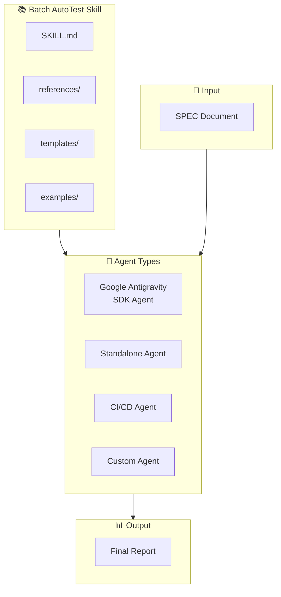
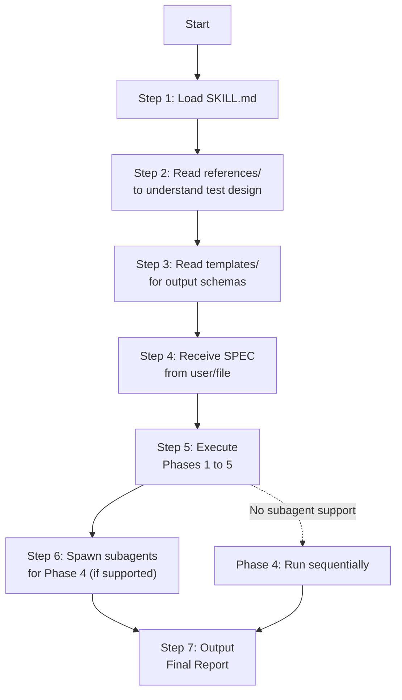
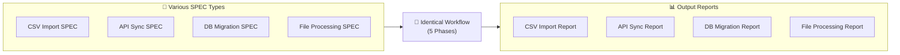

# 🔌 Batch AutoTest Agent Integration Guide

> **Version**: 1.1.0  
> **Last Updated**: 2026-06-05  
> **Author**: AutoTest Team

---

## Table of Contents

1. [Integration Overview](#1-integration-overview)
2. [Integration with Google Antigravity SDK Agent](#2-integration-with-google-antigravity-sdk-agent)
3. [Integration with Standalone Agents (via SKILL.md)](#3-integration-with-standalone-agents-via-skillmd)
4. [Integration with CI/CD Pipelines](#4-integration-with-cicd-pipelines)
5. [Extending to Various Batch Types](#5-extending-to-various-batch-types)
6. [Platform-Specific Agent Tips](#6-platform-specific-agent-tips)
7. [Troubleshooting](#7-troubleshooting)
8. [Appendix](#8-appendix)

---

## 1. Integration Overview

### 1.1 Integration Architecture

The Batch AutoTest skill is designed around an **instruction-driven** pattern. This allows it to be easily integrated into any AI agent framework. The skill provides detailed **instructions** (SKILL.md + references), and the agent reads and executes those instructions.



### 1.2 Minimum Capabilities Required

Any agent attempting to utilize this skill must support the following capabilities:

| Capability | Mandatory | Description |
|---|---|---|
| **File Read** | Yes | Read SKILL.md, references, and SPEC documents. |
| **File Write** | Yes | Write output files (analysis, test cases, JSON data, reports). |
| **Text Generation** | Yes | Synthesize and structure test scenarios based on instructions. |
| **JSON Handling** | Yes | Parse and generate JSON test datasets. |
| **SubAgent Support** | Optional | Spawn subagents for Phase 4 (if unsupported, runs sequentially). |
| **Dynamic Language Alignment** | Yes | Detect the language of the prompt/SPEC and think, log, and reply in that language. |

---

## 2. Integration with Google Antigravity SDK Agent

### 2.1 Configuration and Setup

#### Step 1: Project Directory Structure

```
my-autotest-agent/
├── agent.py                    # Agent entry point
├── config.py                   # Agent configuration
├── skills/
│   └── batch-autotest/         # ← Symlinked or copied from autotest/skills/batch-autotest/
│       ├── SKILL.md
│       ├── references/
│       ├── templates/
│       └── examples/
├── specs/                      # Input SPEC files directory
│   └── batch_csv_import.md
└── test_runs/                  # Centralized test run outputs
```

#### Step 2: Configuring the Agent

Include the critical rules in the agent's system instructions:

```python
# config.py
from google.antigravity import types

AGENT_CONFIG = {
    "name": "batch-autotest-agent",
    "description": "Agent specializing in SPEC-driven batch automation testing.",
    "skills_paths": ["./skills"],
    "system_instructions": """
You are a batch processing automation testing expert.

When requested to test a batch application:
1. Read SKILL.md in skills/batch-autotest/ to understand the workflow.
2. Read the provided SPEC document.
3. Execute the 5 phases sequentially.
4. Pauses at each review gate and brainstorms with the user.
5. In Phase 4, spawn subagents to execute tests in parallel.
6. Generate the Final Report in the designated directory.

CRITICAL RULES:
- **Language Alignment Rule**: Dynamically inspect the language of the input SPEC or user prompt. You must think, log, write files, and reply strictly in the detected language (e.g., if the user prompts in Japanese, your thoughts, logs, and answers must be entirely in Japanese).
- **Source Code Integrity**: Only test the application's source code. You must not modify the production source code or inject mocks into production files to pass tests. Report bugs transparently in the test report without attempting to fix them.
- **Centralized Output Storage**: Save all output documents (analysis, testcases, test data JSON, execution results, and final reports) under a single run directory for each execution: `test_runs/run_<timestamp>_<run_id>/`.
""",
    "capabilities": types.CapabilitiesConfig(
        enable_subagents=True,       # Enable subagents for Phase 4
        enable_file_operations=True, # Read/write files
    ),
}
```

#### Step 3: Agent Entry Point Script

```python
# agent.py
import asyncio
import time
from pathlib import Path
from google.antigravity import Agent, LocalAgentConfig, types

async def run_autotest(spec_path: str, base_output_dir: str = "./test_runs"):
    """
    Executes the full Batch AutoTest pipeline.
    """
    timestamp = int(time.time())
    run_id = f"run_{timestamp}"
    run_dir = Path(base_output_dir) / run_id
    run_dir.mkdir(parents=True, exist_ok=True)
    
    config = LocalAgentConfig(
        name="batch-autotest-agent",
        skills_paths=["./skills"],
        system_instructions=f"""
You are a batch processing automation testing expert.
Inspect the input language from the SPEC/prompt, and set it as the execution language.
You must think, log, write files, and reply strictly in the execution language.
Do not modify the application source code; only report bugs.
Save all outputs inside the run directory: {run_dir}
        """,
        capabilities=types.CapabilitiesConfig(
            enable_subagents=True,
            enable_file_operations=True,
        ),
    )
    
    spec_content = Path(spec_path).read_text(encoding="utf-8")
    
    prompt = f"""
Please execute the full Batch AutoTest pipeline for the following SPEC.

## SPEC Document
{spec_content}

## Output Run Directory
Save all generated files here:
- {run_dir}/1_spec_analysis.md
- {run_dir}/2_testcases.md
- {run_dir}/3_testdata.json
- {run_dir}/4_execution_results.json
- {run_dir}/4_execution_log.txt
- {run_dir}/5_final_report.md
- {run_dir}/5_report_raw.json

## Instructions
1. Dynamically identify the SPEC/prompt language and execute the entire workflow in that language.
2. Follow phases 1 to 5 sequentially.
3. Pause for user reviews at each review gate.
4. Execute tests in Phase 4 using parallel subagents.
"""
    
    async with Agent(config) as agent:
        response = await agent.chat(prompt)
        print(f"AutoTest completed. Report saved at: {run_dir}/5_final_report.md")
        return response

if __name__ == "__main__":
    import sys
    spec_file = sys.argv[1] if len(sys.argv) > 1 else "./specs/batch_csv_import.md"
    asyncio.run(run_autotest(spec_file))
```

---

## 3. Integration with Standalone Agents (via SKILL.md)

### 3.1 Principle

Any standalone agent with **file read** and **text generation** capabilities can adopt this skill by:
1. Reading `SKILL.md` to understand the workflow.
2. Reading references to understand specific techniques.
3. Reading templates to align output formats.
4. Processing each phase sequentially, adhering to the critical rules.

### 3.2 Workflow Process



### 3.3 Example: ChatGPT / Claude / Gemini Chat

For chat-based models without tool integrations, paste the instructions directly in the system prompt:

```markdown
## System Prompt

You are a batch processing automation testing expert.

### Critical Rules
1. **Language Alignment**: Dynamically detect the language of the SPEC or user prompt. You must reason/think, write outputs, and reply strictly in that language.
2. **Testing Only**: Do not modify application code or expected outputs to force a pass. Only report errors.
3. **Centralized Storage**: Save output files in a unified run directory: `test_runs/run_<timestamp>_<run_id>/`.

### Workflow Guidelines
Follow the 5-phase workflow described below:
[... paste SKILL.md content ...]

### Input SPEC
[... paste SPEC document ...]

### Request
Please execute Phase 1 (SPEC Analysis). Provide a detailed analysis. Pause for my review before moving to Phase 2.
```

---

## 4. Integration with CI/CD Pipelines

### 4.1 GitHub Actions

```yaml
# .github/workflows/batch-autotest.yml
name: Batch AutoTest Pipeline

on:
  push:
    paths:
      - 'specs/**'
  pull_request:
    paths:
      - 'specs/**'
  workflow_dispatch:
    inputs:
      spec_file:
        description: 'Path to SPEC file'
        required: true
        default: 'specs/batch_csv_import.md'

jobs:
  autotest:
    runs-on: ubuntu-latest
    
    steps:
      - name: Checkout
        uses: actions/checkout@v4
      
      - name: Setup Python
        uses: actions/setup-python@v5
        with:
          python-version: '3.11'
      
      - name: Install Dependencies
        run: |
          pip install google-antigravity-sdk
      
      - name: Run Batch AutoTest
        env:
          GOOGLE_API_KEY: ${{ secrets.GOOGLE_API_KEY }}
        run: |
          python run_autotest.py \
            --spec "${{ github.event.inputs.spec_file || 'specs/batch_csv_import.md' }}" \
            --output-dir "test_runs/"
      
      - name: Verify Quality Gate
        run: |
          # Parse final report under test_runs/run_latest/ and verify pass rate
          python check_quality_gate.py \
            --base-dir "test_runs/" \
            --min-pass-rate 80
      
      - name: Upload Test Artifacts
        uses: actions/upload-artifact@v4
        if: always()
        with:
          name: autotest-reports
          path: test_runs/
```

#### CLI Wrapper Helper Script: `run_autotest.py`

```python
#!/usr/bin/env python3
import argparse
import asyncio
import time
from pathlib import Path
from google.antigravity import Agent, LocalAgentConfig, types

async def run(spec_path: str, base_output_dir: str):
    timestamp = int(time.time())
    run_dir = Path(base_output_dir) / f"run_{timestamp}"
    run_dir.mkdir(parents=True, exist_ok=True)
    
    config = LocalAgentConfig(
        name="batch-autotest-ci",
        skills_paths=["./skills"],
        system_instructions=f"""
You are a batch autotest CI agent. Follow SKILL.md workflow strictly.
Detect the SPEC/prompt language and use it for all thoughts, logs, and files.
Do not modify source code. Save all files to {run_dir}.
""",
        capabilities=types.CapabilitiesConfig(
            enable_subagents=True,
            max_subagents=5,
        ),
    )
    
    spec_content = Path(spec_path).read_text(encoding="utf-8")
    
    async with Agent(config) as agent:
        await agent.chat(f"""
Run full Batch AutoTest pipeline.
SPEC: {spec_content}
Output Run Directory: {run_dir}
""")
    
    # Create a symlink or marker to run_latest for CI parsing
    latest_dir = Path(base_output_dir) / "run_latest"
    if latest_dir.exists():
        latest_dir.unlink()
    latest_dir.symlink_to(run_dir.relative_to(latest_dir.parent), target_is_directory=True)
    
    print(f"✅ AutoTest run saved at: {run_dir}")

def main():
    parser = argparse.ArgumentParser(description="Batch AutoTest CI Runner")
    parser.add_argument("--spec", required=True, help="Path to SPEC file")
    parser.add_argument("--output-dir", default="./test_runs", help="Base output directory")
    args = parser.parse_args()
    asyncio.run(run(args.spec, args.output_dir))

if __name__ == "__main__":
    main()
```

#### Quality Gate Script: `check_quality_gate.py`

```python
#!/usr/bin/env python3
import argparse
import re
import sys
from pathlib import Path

def check_quality(base_dir: str, min_pass_rate: float) -> bool:
    # Read the latest run report
    report_path = Path(base_dir) / "run_latest" / "5_final_report.md"
    if not report_path.exists():
        print(f"❌ Report not found at: {report_path}")
        return False
        
    content = report_path.read_text(encoding="utf-8")
    
    # Match the "Passed" rate (e.g., Passed | 42 (84%))
    # Adapts to both English: "Passed | XX (YY%)" and Japanese: "合格 | XX (YY%)"
    match = re.search(r'(?:Passed|合格|✅ Passed)\s*\|\s*\d+\s*\((\d+)%\)', content, re.IGNORECASE)
    if not match:
        print("❌ Could not parse pass rate percentage from report summary table")
        return False
        
    pass_rate = int(match.group(1))
    print(f"📊 Detected Pass Rate: {pass_rate}%")
    print(f"📏 Minimum Required: {min_pass_rate}%")
    
    if pass_rate >= min_pass_rate:
        print(f"✅ Quality Gate PASSED ({pass_rate}% >= {min_pass_rate}%)")
        return True
    else:
        print(f"❌ Quality Gate FAILED ({pass_rate}% < {min_pass_rate}%)")
        return False

def main():
    parser = argparse.ArgumentParser(description="Quality Gate Checker")
    parser.add_argument("--base-dir", default="./test_runs", help="Base output directory")
    parser.add_argument("--min-pass-rate", type=float, default=80.0, help="Minimum pass rate")
    args = parser.parse_args()
    
    if not check_quality(args.base_dir, args.min_pass_rate):
        sys.exit(1)

if __name__ == "__main__":
    main()
```

---

## 5. Extending to Various Batch Types

### 5.1 Common Principle

The 5-phase testing process **remains identical** regardless of the batch type. Only the **input SPEC details** and testcase focuses change.



### 5.2 CSV Import Batch

#### SPEC Template Structure

```markdown
# Batch Import {Entity} CSV

## Description
Batch reads a CSV file containing {entity} details, validates it, and loads it into the database.

## Input
- CSV file with header: {field1}, {field2}, {field3}, ...
- Storage path: {input_path}

## Business Rules
1. {field1}: {constraints}
2. {field2}: {constraints}

## Expected Outcomes
- Status: SUCCESS / PARTIAL / FAILED
- processed_count: Number of successful records
- error_count: Number of invalid records
```

#### Test Focus Areas

- **CSV Parsing**: Encoding (UTF-8, Shift-JIS), separators, line endings (LF vs CRLF).
- **Header Validations**: Missing columns, extra columns, header capitalization.
- **Data Constraints**: Data types, length limits, pattern verification.
- **Database Load**: Unique keys, foreign keys, rollback states on fatal failure.

---

### 5.3 API Sync Batch

#### SPEC Template Structure

```markdown
# Batch API Sync — {System A} → {System B}

## Description
Synchronizes data from {System A}'s REST API, transforms it, and upserts it to {System B}.

## Source REST API
- Endpoint: {base_url}/api/v1/{resource}
- Method: GET (paginated)
- Authentication: Bearer token

## Transformation Rules
1. Map {src_field} → {dest_field}
2. Format conversion: {conversion_rule}

## Destination
- Database: {target_db}
- Table: {target_table}
- Load Strategy: UPSERT
```

#### Test Focus Areas

- **API Connectivity**: Handle timeouts, auth failures, and rate limits.
- **Pagination Flow**: Validate empty pages, last page marker, and large page counts.
- **Upsert Correctness**: Verify inserts on new records, updates on existing records, and conflict resolutions.

---

### 5.4 DB-to-DB Migration Batch

#### SPEC Template Structure

```markdown
# Batch Migration — {Source DB} → {Target DB}

## Source Table
- DB: {source_db}
- Target table query: SELECT {fields} FROM {source_table}

## Transformation Rules
1. Map: {src_field} → {dest_field}
2. Enrichment: Lookup {lookup_table} for {enrichment_field}

## Target Table
- DB: {target_db}
- Table: {target_table}
- Write Strategy: TRUNCATE_INSERT / APPEND
```

#### Test Focus Areas

- **Data Transformations**: Lookup accuracy, mapping precision, and format casting.
- **Data Integrity**: Integrity checks comparing records count in source vs target.
- **Performance**: Monitor memory consumption when handling large datasets.

---

## 6. Platform-Specific Agent Tips

### 6.1 Chat-Based Agents (ChatGPT, Claude, Gemini Web)

- **Execution Flow**: Run turns sequentially. Do not request the agent to execute all 5 phases in a single turn, as context window limitations might cause details to be omitted.
- **Manual Gate Reviews**: Provide feedback explicitly before asking the agent: "Move to Phase 2."

### 6.2 File-Based Workspace Agents (Antigravity, Cursor, Windsurf)

- **Automation**: Let the orchestrator automate phases. Give read permissions for the entire `skills/` and `workflows/` directory.
- **State Check**: Ensure directory paths (especially the run directories) are resolved relative to the workspace root.

---

## 7. Troubleshooting

### 7.1 Common Issues

#### ❌ Phase 1 (Analysis) missing business rules

- **Cause**: SPEC document structure is non-standard.
- **Fix**: Provide a SPEC analysis template, or prompt the agent: "Re-read the SPEC sections carefully and list every single rule."

#### ❌ SubAgents outputting English on Japanese prompt runs

- **Cause**: The prompt template in `wf4_test_execution.md` is in English, and the Orchestrator copy-pasted it literally.
- **Fix**: Ensure the Orchestrator's instructions require translating templates to the detected target language before dispatching to SubAgents.

---

## 8. Appendix

### A. Pre-flight Integration Checklist

- [ ] Core skill files (`SKILL.md`, references, templates) are accessible by the Agent.
- [ ] Base output run directory is configured.
- [ ] Agent system prompt contains the Language Alignment Rule.
- [ ] SubAgent capability is enabled (if parallel execution is desired).
- [ ] Workspace-only constraint is active.

### B. References

- **Architecture Details**: `docs/architecture.md`
- **Main Workflow Guide**: `workflows/wf_full_pipeline.md`
- **Skill Entry Point**: `skills/batch-autotest/SKILL.md`

### C. Version History

- **1.1.0** (2026-06-05): Added language alignment specifications, unified run directory configuration, and testing-only constraints.
- **1.0.0** (2026-06-05): Initial release.
