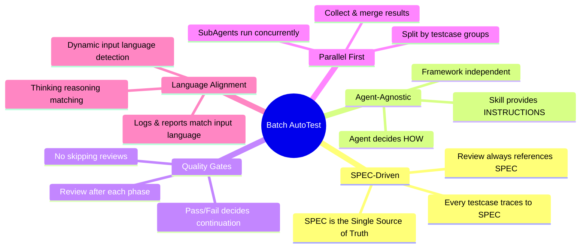
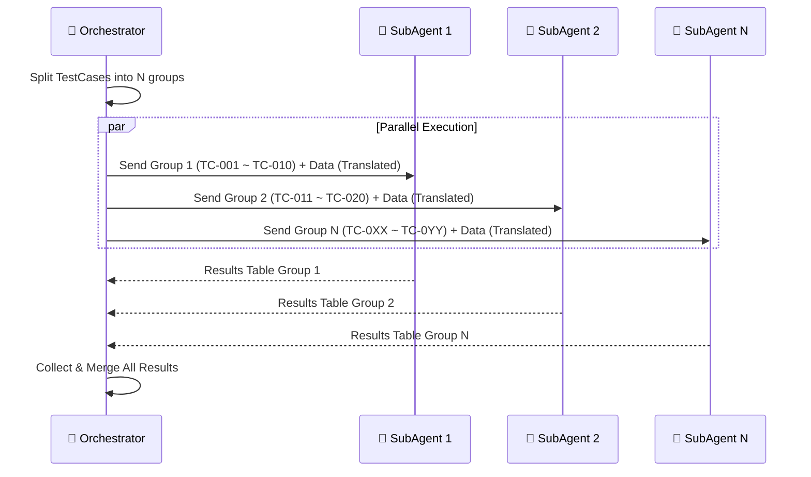
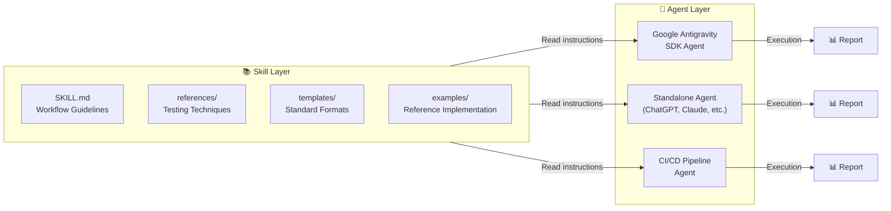
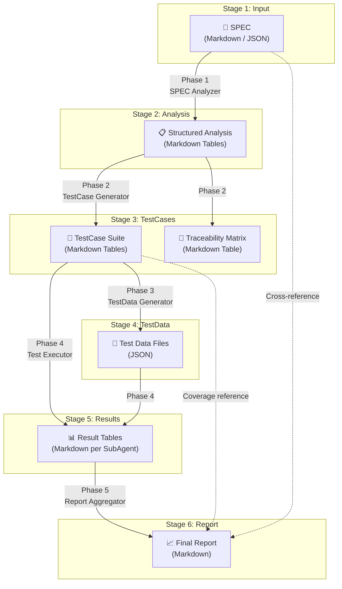
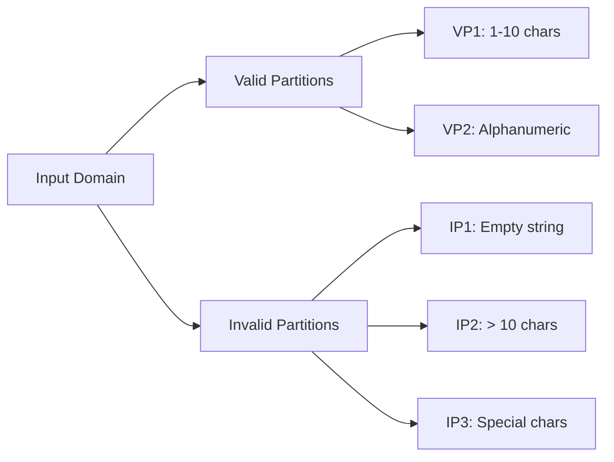
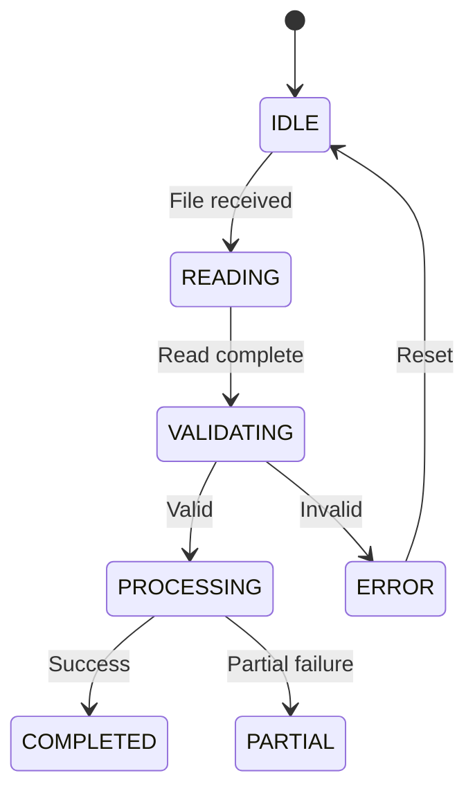

# 🏗️ Batch AutoTest System Architecture

> **Version**: 1.1.0  
> **Last Updated**: 2026-06-05  
> **Author**: AutoTest Team

---

## Table of Contents

1. [System Overview](#1-system-overview)
2. [Architecture Diagram](#2-architecture-diagram)
3. [Component Design](#3-component-design)
4. [Agent-Agnostic Design Pattern](#4-agent-agnostic-design-pattern)
5. [Data Flow](#5-data-flow)
6. [SubAgent Communication Protocol](#6-subagent-communication-protocol)
7. [Extensibility Points](#7-extensibility-points)
8. [Testing Techniques Reference](#8-testing-techniques-reference)
9. [Appendix](#9-appendix)

---

## 1. System Overview

### 1.1 Purpose

Batch AutoTest is a specialized **SPEC-driven automation testing** system designed for batch processing. The system receives a SPEC document describing batch requirements as input and automatically executes the entire workflow: from analysis → testcase generation → test data generation → parallel execution → report aggregation.

### 1.2 Design Principles

| Principle | Description |
|---|---|
| **SPEC is the Single Source of Truth** | All testing decisions originate from the SPEC. No testcase can exist without being traceable back to the SPEC. |
| **Agent-Agnostic** | The skill does not depend on any specific agent framework. Any agent capable of reading/writing files and creating subagents can utilize it. |
| **Reusable & Composable** | Each phase is an independent module that can be run individually or combined into a complete pipeline. |
| **Parallel Execution** | Phase 4 (Test Execution) is designed to run in parallel across multiple subagents to optimize execution time. |
| **Review Gates** | Mandatory review gates exist between each phase, ensuring output correctness before proceeding. |
| **Structured Output** | All outputs follow standardized formats (Markdown tables / JSON) to ensure consistency and parsing capability. |

### 1.3 Core Rules



---

## 2. Architecture Diagram

### 2.1 Overall Architecture

```mermaid
flowchart TD
    SPEC["📄 SPEC Document<br/>(Markdown / JSON)"]
    
    subgraph PHASE1["Phase 1: SPEC Analysis"]
        A1_1["Extract Business Rules"]
        A1_2["Analyze Input/Output Fields"]
        A1_3["Identify Constraints & Boundaries"]
        A1_4["Identify Equivalence Partitions"]
        A1_5["List Error Conditions"]
    end
    
    REVIEW1{"🔍 Review Gate 1<br/>Output vs SPEC"}
    
    subgraph PHASE2["Phase 2: TestCase Generation"]
        A2_1["Normal TestCases<br/>(Equivalence Partitioning)"]
        A2_2["Boundary TestCases<br/>(Boundary Value Analysis)"]
        A2_3["Logic TestCases<br/>(Decision Table)"]
        A2_4["State TestCases<br/>(State Transition)"]
        A2_5["Negative TestCases<br/>(Error Guessing)"]
    end
    
    REVIEW2{"🔍 Review Gate 2<br/>TestCases vs SPEC"}
    
    subgraph PHASE3["Phase 3: TestData Generation"]
        A3_1["Valid Data Sets"]
        A3_2["Invalid Data Sets"]
        A3_3["Edge Case Data"]
        A3_4["Combination Data"]
    end
    
    REVIEW3{"🔍 Review Gate 3<br/>TestData vs SPEC"}
    
    subgraph PHASE4["Phase 4: Parallel Execution"]
        ORCH["🎯 Orchestrator"]
        SUB1["🤖 SubAgent 1"]
        SUB2["🤖 SubAgent 2"]
        SUBN["🤖 SubAgent N"]
    end
    
    subgraph PHASE5["Phase 5: Aggregation & Report"]
        A5_1["Merge Results"]
        A5_2["Calculate Metrics"]
        A5_3["Analyze Failed Cases"]
        A5_4["Create Coverage Matrix"]
    end
    
    REPORT["📊 Final Report<br/>(Markdown)"]
    
    SPEC --> PHASE1
    PHASE1 --> REVIEW1
    REVIEW1 -->|"✅ Pass"| PHASE2
    REVIEW1 -->|"❌ Fail"| PHASE1
    PHASE2 --> REVIEW2
    REVIEW2 -->|"✅ Pass"| PHASE3
    REVIEW2 -->|"❌ Fail"| PHASE2
    PHASE3 --> REVIEW3
    REVIEW3 -->|"✅ Pass"| PHASE4
    REVIEW3 -->|"❌ Fail"| PHASE3
    ORCH --> SUB1
    ORCH --> SUB2
    ORCH --> SUBN
    SUB1 --> PHASE5
    SUB2 --> PHASE5
    SUBN --> PHASE5
    PHASE5 --> REPORT
 
    style SPEC fill:#4A90D9,color:#fff
    style REVIEW1 fill:#F5A623,color:#fff
    style REVIEW2 fill:#F5A623,color:#fff
    style REVIEW3 fill:#F5A623,color:#fff
    style REPORT fill:#7ED321,color:#fff
```



### 2.2 Detailed Data Flow

```mermaid
flowchart LR
    subgraph INPUT["📥 Input"]
        SPEC_MD["SPEC.md<br/>(Markdown)"]
        SPEC_JSON["SPEC.json<br/>(JSON Schema)"]
    end
    
    subgraph P1_OUT["Phase 1 Output"]
        RULES["Business Rules"]
        FIELDS["Field Definitions"]
        CONSTRAINTS["Constraints Table"]
        PARTITIONS["Equivalence Partitions"]
        ERRORS["Error Conditions"]
    end
    
    subgraph P2_OUT["Phase 2 Output"]
        TC_SUITE["TestCase Suite<br/>(Markdown Table)"]
        TRACE["Traceability Matrix"]
    end
    
    subgraph P3_OUT["Phase 3 Output"]
        TD_JSON["TestData Files<br/>(JSON)"]
    end
    
    subgraph P4_OUT["Phase 4 Output"]
        RES_1["Results Group 1"]
        RES_2["Results Group 2"]
        RES_N["Results Group N"]
    end
    
    subgraph P5_OUT["📊 Final Output"]
        FINAL["Final Report<br/>(Markdown)"]
    end
    
    INPUT --> P1_OUT
    P1_OUT --> P2_OUT
    P2_OUT --> P3_OUT
    P2_OUT --> P4_OUT
    P3_OUT --> P4_OUT
    P4_OUT --> P5_OUT
```



---

## 3. Component Design

### 3.1 Phase 1: SPEC Analyzer

> **Responsibility**: Reads and analyzes the SPEC document, extracting all necessary information required to generate test cases.

#### Input Contract

| Field | Type | Required | Description |
|---|---|---|---|
| `spec_document` | Markdown or JSON | Yes | The original SPEC document describing batch requirements |
| `spec_format` | `"markdown"` \| `"json"` | No | SPEC format (default: `"markdown"`) |

#### Output Contract

| Field | Type | Description |
|---|---|---|
| `business_rules` | Markdown List | List of business rules extracted from the SPEC |
| `input_fields` | Markdown Table | Table describing input fields (name, type, constraints, required) |
| `output_fields` | Markdown Table | Table describing output fields |
| `error_conditions` | Markdown List | List of error conditions |
| `boundary_values` | Markdown Table | Boundary values table for each field |
| `equivalence_partitions` | Markdown Table | Equivalence partitioning table |

#### Sample Output Format

```markdown
## SPEC Analysis Result

### Business Rules
1. Batch reads CSV file from the input directory.
2. Validate the format of each row.
3. Write valid data into the database.
4. Write erroneous rows into the error log.

### Input Fields
| Field | Type | Constraints | Required | Description |
|---|---|---|---|---|
| employee_id | String | Max 10 chars, alphanumeric | Yes | Employee ID |
| full_name | String | Max 100 chars, not empty | Yes | Full Name |
| salary | Decimal | > 0, max 999999999.99 | Yes | Basic Salary |
| department | String | Must exist in DEPT table | No | Department Code |

### Output Fields
| Field | Type | Description |
|---|---|---|
| status | Enum | SUCCESS / FAILED / PARTIAL |
| processed_count | Integer | Number of successfully processed rows |
| error_count | Integer | Number of erroneous rows |
| error_log_path | String | Path to the error log file |

### Error Conditions
1. CSV file does not exist → Error: FILE_NOT_FOUND
2. CSV file is empty → Error: EMPTY_FILE
3. Header is incorrectly formatted → Error: INVALID_HEADER
4. Data row misses required fields → Error: MISSING_REQUIRED_FIELD
5. Duplicate employee_id → Error: DUPLICATE_KEY

### Boundary Values
| Field | Min | Max | Min-1 | Max+1 |
|---|---|---|---|---|
| employee_id length | 1 char | 10 chars | 0 (empty) | 11 chars |
| salary | 0.01 | 999999999.99 | 0 | 1000000000.00 |
| full_name length | 1 char | 100 chars | 0 (empty) | 101 chars |

### Equivalence Partitions
| Field | Valid Partitions | Invalid Partitions |
|---|---|---|
| employee_id | Alphanumeric 1-10 chars | Empty, > 10 chars, special chars |
| salary | 0.01 - 999999999.99 | 0, negative, > max |
| department | Exists in DEPT table | Not in DEPT table, NULL |
```

#### Review Criteria & Gates

- [ ] All business rules from the SPEC are listed.
- [ ] All input/output fields are identified.
- [ ] Constraints match the SPEC exactly.
- [ ] Boundary values are reasonable for every constrained field.
- [ ] Equivalence partitions cover both valid and invalid partitions.
- [ ] **Language Check**: The analysis document must be written in the **exact same language** as the input prompt/SPEC (e.g., if the user prompts in Japanese, the entire analysis must be in Japanese).

---

### 3.2 Phase 2: TestCase Generator

> **Responsibility**: Generates a complete test suite from the SPEC analysis results, applying multiple test design techniques.

#### Input Contract

| Field | Type | Required | Description |
|---|---|---|---|
| `spec_analysis` | Markdown | Yes | Output from Phase 1 |
| `original_spec` | Markdown/JSON | Yes | Original SPEC for cross-referencing |

#### Output Contract

| Field | Type | Description |
|---|---|---|
| `testcase_suite` | Markdown Table | TestCase table with full details |
| `traceability_matrix` | Markdown Table | Traceability matrix mapping SPEC → TestCase |

#### Data Model — TestCase

| Column | Description | Example |
|---|---|---|
| `ID` | Unique test case identifier | `TC-001` |
| `Name` | Short descriptive name | `Valid basic CSV import` |
| `Category` | Technique group | `NORMAL` / `BOUNDARY` / `NEGATIVE` / `LOGIC` / `STATE` |
| `Priority` | Priority level | `CRITICAL` / `HIGH` / `MEDIUM` / `LOW` |
| `Technique` | Test technique applied | `Equivalence Partitioning` |
| `Description` | Detailed test case description | Input valid CSV with 10 rows |
| `Precondition` | Prerequisites | DB ready, DEPT table has data |
| `SPEC_Ref` | SPEC requirement reference | Rule #1, #3 |

#### Sample Output Format

```markdown
## TestCase Suite

| ID | Name | Category | Priority | Technique | Description | Precondition | SPEC_Ref |
|---|---|---|---|---|---|---|---|
| TC-001 | Valid basic CSV import | NORMAL | HIGH | Equivalence Partitioning | Valid CSV, 10 rows, all fields correct | DB ready, DEPT table exists | Rule #1, #3 |
| TC-002 | Empty CSV file | NEGATIVE | CRITICAL | Negative Testing | CSV file exists but contains no data | File exists | Rule #2 |
| TC-003 | Max length employee_id | BOUNDARY | MEDIUM | Boundary Value Analysis | employee_id is exactly 10 characters | Valid CSV | Rule #1 |
| TC-004 | Exceed max employee_id | BOUNDARY | HIGH | Boundary Value Analysis | employee_id is 11 characters | Valid CSV | Rule #1 |

## Traceability Matrix

| SPEC Requirement | TestCase IDs | Coverage |
|---|---|---|
| Rule #1: Read CSV | TC-001, TC-003, TC-004 | ✅ Full |
| Rule #2: Validate format | TC-002, TC-005, TC-006 | ✅ Full |
| Rule #3: Write to DB | TC-001, TC-010 | ⚠️ Partial |
```

#### Review Criteria & Gates

- [ ] Every SPEC requirement has at least 1 testcase.
- [ ] At least 5 core test techniques are applied.
- [ ] Priorities are assigned reasonably.
- [ ] Traceability matrix covers 100% of SPEC requirements.
- [ ] No duplicate test cases.
- [ ] **Language Check**: The test suite and matrix must be written in the **exact same language** as the input prompt/SPEC (e.g., if the user prompts in Japanese, the entire document must be in Japanese).

---

### 3.3 Phase 3: TestData Generator

> **Responsibility**: Generates concrete test data sets (JSON file format) for each test case.

#### Input Contract

| Field | Type | Required | Description |
|---|---|---|---|
| `testcase_suite` | Markdown Table | Yes | Output from Phase 2 |
| `spec_analysis` | Markdown | Yes | Output from Phase 1 (constraints, boundaries) |

#### Output Contract

| Field | Type | Description |
|---|---|---|
| `test_data_files` | JSON | A JSON structure mapping testcase IDs to concrete input/expected values |

#### Data Model — TestData (JSON)

```json
{
  "testcase_id": "TC-001",
  "testcase_name": "Valid basic CSV import",
  "data_sets": [
    {
      "set_id": "DS-001-01",
      "description": "10 valid CSV rows with all fields populated",
      "input": {
        "file_content": [
          {"employee_id": "EMP001", "full_name": "John Doe", "salary": 15000000.00, "department": "IT"},
          {"employee_id": "EMP002", "full_name": "Jane Smith", "salary": 20000000.00, "department": "HR"}
        ],
        "file_path": "/input/employees.csv"
      },
      "expected_output": {
        "status": "SUCCESS",
        "processed_count": 2,
        "error_count": 0,
        "error_log_path": null
      }
    }
  ]
}
```

#### Review Criteria & Gates

- [ ] Every testcase has at least 1 dataset.
- [ ] Data respects constraints in the SPEC.
- [ ] Invalid data is truly invalid (matches the targeted error category).
- [ ] Boundary data is accurate.
- [ ] JSON is valid and parseable.
- [ ] **Language Check**: Text values, descriptions, and expected outcomes must be in the **exact same language** as the input prompt/SPEC.

---

### 3.4 Phase 4: Test Executor (Parallel SubAgents)

> **Responsibility**: Divides the test suite into groups and runs them in parallel across multiple subagents.

#### Input Contract

| Field | Type | Required | Description |
|---|---|---|---|
| `testcase_suite` | Markdown Table | Yes | TestCase suite |
| `test_data` | JSON Files | Yes | Test data for each testcase |
| `max_subagents` | Integer | No | Max parallel subagents (default: 5) |
| `timeout_seconds` | Integer | No | Timeout per subagent (default: 300) |

#### Output Contract (per SubAgent)

| Field | Type | Description |
|---|---|---|
| `group_id` | String | TestCase group identifier |
| `results_table` | Markdown Table | Execution results table |
| `execution_time` | String | Total time elapsed |

#### Data Model — Execution Result

```markdown
## SubAgent Results — Group {N}

| ID | Name | Status | Input | Expected | Actual | Error |
|---|---|---|---|---|---|---|
| TC-001 | Valid basic input | ✅ PASS | `{"employee_id": "EMP001", ...}` | `{"status": "SUCCESS"}` | `{"status": "SUCCESS"}` | — |
| TC-002 | Empty CSV file | ❌ FAIL | `{"file": "empty.csv"}` | `Error: EMPTY_FILE` | `{"status": "SUCCESS"}` | Validation missing |
| TC-003 | Max length ID | ✅ PASS | `{"employee_id": "ABCDEFGHIJ"}` | `{"status": "SUCCESS"}` | `{"status": "SUCCESS"}` | — |
```

#### Execution Flow



#### Review Criteria & Gates

- [ ] All testcases are executed without omissions.
- [ ] Output table contains exactly 7 columns in the standard format.
- [ ] Status is accurate based on Expected vs Actual outcomes.
- [ ] **Critical Rule**: Source code is verified to be untouched (no code mutations).
- [ ] **Language Check**: Thoughts, logs, execution tables, and error messages must be written in the **exact same language** as the input prompt/SPEC (e.g., if the user prompts in Japanese, the SubAgent's thoughts and results must be in Japanese).

---

### 3.5 Phase 5: Report Aggregator

> **Responsibility**: Aggregates results from all subagents, calculates metrics, analyzes failures, and generates the final report.

#### Input Contract

| Field | Type | Required | Description |
|---|---|---|---|
| `subagent_results` | Markdown Tables | Yes | Results from all subagents |
| `testcase_suite` | Markdown Table | Yes | Original TestCase suite |
| `original_spec` | Markdown/JSON | Yes | Original SPEC reference |

#### Output Contract

| Field | Type | Description |
|---|---|---|
| `summary` | Markdown Table | High-level metrics summary |
| `detailed_results` | Markdown Table | Consolidated execution table of all testcases |
| `failed_analysis` | Markdown Sections | Root cause analysis for each failed testcase |
| `coverage_matrix` | Markdown Table | Traceability matrix showing requirement pass rates |

#### Sample Output Format

```markdown
# 📊 AutoTest Report — Employee CSV Import Batch

## Summary
| Metric | Value |
|---|---|
| Total TestCases | 50 |
| ✅ Passed | 42 (84%) |
| ❌ Failed | 6 (12%) |
| ⏭️ Skipped | 2 (4%) |
| Execution Time | 45s |
| SubAgents Used | 5 |

## Detailed Results
| ID | Name | Status | Input | Expected | Actual | Error |
|---|---|---|---|---|---|---|
| TC-001 | Valid basic CSV | ✅ PASS | `{...}` | `{...}` | `{...}` | — |
| TC-002 | Empty CSV file | ❌ FAIL | `{...}` | `Error: EMPTY_FILE` | `No error` | Validation missing |

## Failed TestCases Analysis

### TC-002: Empty CSV file
- **Root Cause**: Missing validation for empty file checks.
- **SPEC Reference**: Rule #2 — "Validate the format of each row"
- **Severity**: Critical
- **Recommendation**: Add a file.isEmpty() check before processing.

### TC-015: Duplicate employee_id
- **Root Cause**: Database unique constraint violation not handled.
- **SPEC Reference**: Rule #5 — "employee_id must be unique"
- **Severity**: High
- **Recommendation**: Implement a duplicate check query or upsert logic.

## Coverage Matrix
| SPEC Requirement | TestCase IDs | Passed | Failed | Coverage |
|---|---|---|---|---|
| Rule #1: Read CSV | TC-001, TC-003, TC-004 | 3 | 0 | ✅ 100% |
| Rule #2: Validate format | TC-002, TC-005 ~ TC-010 | 4 | 2 | ⚠️ 67% |
| Rule #3: Write to DB | TC-001, TC-010 ~ TC-015 | 5 | 1 | ⚠️ 83% |
| Rule #4: Error log | TC-020 ~ TC-025 | 6 | 0 | ✅ 100% |
| Rule #5: Unique ID | TC-015 ~ TC-018 | 2 | 2 | ❌ 50% |
```

#### Review Criteria & Gates

- [ ] Metrics match actual count (Total = Pass + Fail + Skip).
- [ ] Every failed testcase has a root cause analysis.
- [ ] Coverage matrix covers 100% of SPEC requirements.
- [ ] Report matches the standard template.
- [ ] **Language Check**: The entire final report must be in the **exact same language** as the input prompt/SPEC (e.g., if the user prompts in Japanese, the entire report must be in Japanese).

---

## 4. Agent-Agnostic Design Pattern

### 4.1 Philosophy: Skill provides WHAT, Agent decides HOW

Batch AutoTest is designed as an **instruction-driven** skill, not a **code-driven** library.



### 4.2 Separation of Concerns

| Layer | Responsibility | Example |
|---|---|---|
| **Skill Layer** | Defines **WHAT** needs to be done | "Analyze SPEC, extract rules, generate testcases using BVA and EP" |
| **Agent Layer** | Decides **HOW** to perform | "Use Gemini to parse, spawn subagents for parallel execution" |
| **Runtime Layer** | Manages **WHERE** to execute | "Run on local workspace, cloud container, or CI/CD runner" |

### 4.3 Minimum Agent Requirements

- **File Operations**: Ability to read instructions and write outputs.
- **Language Detection**: Dynamically inspect prompt/SPEC language and execute in the target language (thoughts, logs, chats, and files).
- **Text Generation**: Generate structured markdown/JSON outputs.
- **SubAgent Management**: Spawn subagents for parallel processing (optional; fallback is sequential).
- **JSON Processing**: Parse and generate JSON test datasets.

---

## 5. Data Flow

### 5.1 End-to-End Data Flow



### 5.2 Transformation Map

| Phase | Input Format | Transformation | Output Format |
|---|---|---|---|
| **Phase 1** | SPEC (Markdown/JSON) | Structuring & constraint analysis | `1_spec_analysis.md` |
| **Phase 2** | `1_spec_analysis.md` | Test techniques application | `2_testcases.md` |
| **Phase 3** | `2_testcases.md` + constraints | JSON dataset construction | `3_testdata.json` |
| **Phase 4** | `2_testcases.md` + `3_testdata.json` | Running tests & logging | `4_execution_results.json`, `4_execution_log.txt` |
| **Phase 5** | execution results | Aggregation & Failure analysis | `5_final_report.md`, `5_report_raw.json` |

### 5.3 Centralized Folder Structure

All output files must be stored under a unified run directory:
```
test_runs/run_<timestamp>_<run_id>/
├── 1_spec_analysis.md           # SPEC analysis results
├── 2_testcases.md               # Complete TestCase suite
├── 3_testdata.json              # Concrete JSON test data sets
├── 4_execution_results.json     # Test outcome summary from execution
├── 4_execution_log.txt          # Raw test logs
├── 5_final_report.md            # Final Markdown report
└── 5_report_raw.json            # Machine-readable report JSON
```

---

## 6. SubAgent Communication Protocol

### 6.1 Work Division Strategy

The Orchestrator splits the testcases based on:
1. **Count**: Divide evenly (e.g., 50 TCs / 5 agents = 10 TCs per agent).
2. **Category**: Group related categories (e.g., NEGATIVE, BOUNDARY) together.
3. **Priority**: Ensure balanced priority distribution (mix of Critical, High, Medium, Low).

### 6.2 Prompt Translation & Dispatching

> [!IMPORTANT]
> **Language Alignment Rule**: The Orchestrator must translate all prompt parameters (instructions, headers, testcase definitions) into the detected execution language (e.g., Japanese, Vietnamese) before sending them to the SubAgent. SubAgents must be explicitly instructed to think, execute, log, and write responses in the target language.

```markdown
## Task: Execute Test Group {N}

### Context
You are a test executor. Execute these test cases and report outcomes.
You must think internally, execute, log, and write your entire response strictly in {detected_language}. Do not use English or Vietnamese.

### TestCases to Execute
{TestCases in target language}

### Test Data
{JSON dataset}

### Output Format (MANDATORY)
Return a Markdown table in this format:
| ID | Name | Status | Input | Expected | Actual | Error |
```

### 6.3 Error Handling

- **SubAgent Timeout**: Mark all pending testcases as `⏭️ SKIP` with Error: `TIMEOUT`.
- **SubAgent Crash**: Mark all testcases in the group as `⏭️ SKIP` with Error: `AGENT_CRASH`. Log details.
- **Invalid Format Response**: Orchestrator requests re-formatting once. Fallback: parse whatever is available, mark the rest as `⏭️ SKIP`.

---

## 7. Extensibility Points

### 7.1 Custom Testing Techniques

To add a new testing technique (e.g., Pairwise Testing):
1. Update `references/testcase_design_guide.md` with guidelines.
2. Update Phase 2 workflow (`wf2_testcase_generation.md`) steps.
3. Add the Category to the TestCase data model.

### 7.2 Custom Output Formats

Extend the report format beyond Markdown by adding templates:
- **HTML Report**: Standard dashboards.
- **JUnit XML**: CI/CD reporting integrations.
- **CSV Export**: Spreadsheet compatibility.

---

## 8. Testing Techniques Reference

### 8.1 Equivalence Partitioning (EP)

> Division of input domain into valid and invalid partitions where all values within a partition are treated identically.



### 8.2 Boundary Value Analysis (BVA)

> Testing at the edges of equivalence partitions where defects are most likely to occur.

| Boundary | Test Value | Example (Range 18-65) |
|---|---|---|
| **Min** | Smallest valid value | 18 |
| **Min - 1** | Just below min | 17 |
| **Max** | Largest valid value | 65 |
| **Max + 1** | Just above max | 66 |
| **Nominal** | Average value | 40 |

### 8.3 Decision Tables

> Used when complex combinations of inputs yield different actions.

| Condition | R1 | R2 | R3 | R4 |
|---|---|---|---|---|
| File exists | Yes | Yes | Yes | No |
| Format valid | Yes | Yes | No | — |
| Data valid | Yes | No | — | — |
| **Action: Process** | ✅ | ❌ | ❌ | ❌ |

### 8.4 State Transitions

> Modeling system behavior through a series of discrete states and event-driven transitions.



### 8.5 Negative Testing

> Verifying system behavior against invalid, out-of-bounds, or unexpected inputs.

- **Null/Empty**: `null`, `""`, `[]`.
- **Type Mismatch**: String when number expected.
- **Overflow**: Numbers larger than database columns allow.
- **Injection**: SQL/Script injections.

---

## 9. Appendix

### A. Glossary

- **SPEC**: Specification document representing batch requirements.
- **TestCase (TC)**: Defined set of inputs, preconditions, and expected outcomes.
- **TestData (TD)**: Concrete values generated for test cases.
- **Review Gate**: Mandatory checkpoint between phases.
- **Traceability Matrix**: Mapping SPEC requirements to test cases and statuses.

### B. Version History

- **1.1.0** (2026-06-05): Added language alignment specifications for thoughts/logs, centralized run directory, and source code integrity rules.
- **1.0.0** (2026-06-05): Initial system architecture draft.
