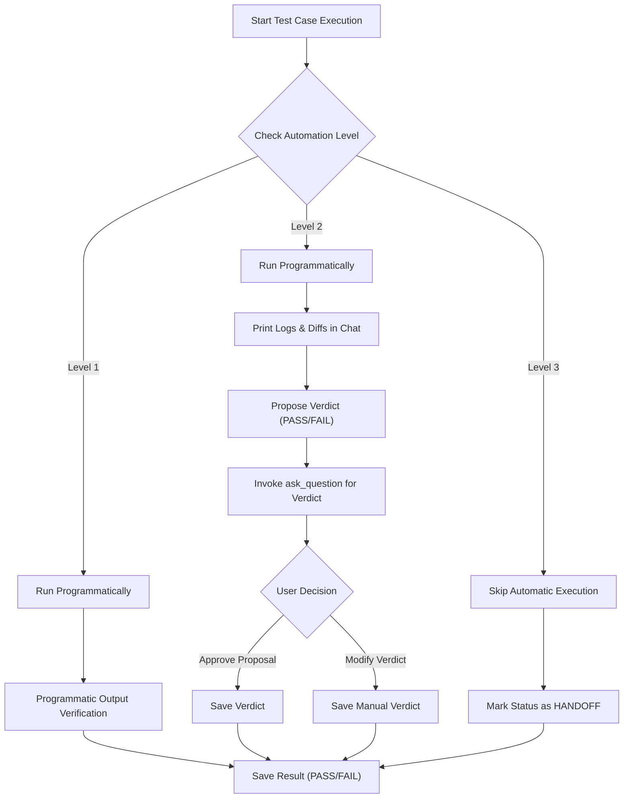

# Batch Test Automation Levels and Handoff Guide

> **Document ID**: REF-AUTO-LEVELS  
> **Status**: Approved  
> **Target**: Integration Testing (IT) Automation Boundaries

---

## 1. 🎯 Purpose

In Batch Integration Testing (IT), some scenarios can be fully automated by the AI Agent, while others require human review or must be executed entirely by humans due to environment, security, or business logic complexity. 

This guide defines the standard **3-Level Test Automation Model** to establish clear boundaries for the AI Agent, structure **Human-in-the-loop** interactions, and define a formal **Handoff & Triage** mechanism.

---

## 2. 📋 The 3-Level Test Automation Model

Every designed TestCase (`TC-xxx`) must be categorized into one of the following three levels:

```
+-----------------------------------------------------------------------+
|                         3-Level Automation Model                      |
+-----------------------------------------------------------------------+
|  [Level 1: Fully Automated] -> Executed entirely by AI (Deterministic)|
|  [Level 2: Human-in-the-loop] -> Executed by AI, verdict by Human     |
|  [Level 3: Manual / Handoff] -> Executed by Human (Constraints/Limits)|
+-----------------------------------------------------------------------+
```

### 🔹 Level 1 — Fully Automated (AI Self-Decision)
These are **deterministic** scenarios with a **clear, computable oracle** (known expected outputs that can be validated programmatically).

*   **Key Scenarios:**
    *   **Layout & Schema Validation**: Verifying header/footer, column counts, record lengths, delimiter positions, and file format structures.
    *   **Record Count Reconciliation**: Ensuring `Total Input Records = Successful Output Records + Rejected Records`.
    *   **Data Aggregation Reconciliation**: Summing up financial values/amounts and checking for rounding issues.
    *   **Encoding & Character set checks**: Validating Shift-JIS/CP932 representation, BOM presence, control characters, or full-width/half-width conversions.
    *   **Expected vs Actual Diff**: Comparing programmatic output files or DB tables field-by-field against a pre-defined expected file.
    *   **Idempotency Verification**: Running the batch twice under identical environment controls and verifying no duplicate inserts occur on the second run.

---

### 🔹 Level 2 — Human-in-the-loop (AI Executes, Human Verdicts)
The AI Agent can execute the test steps and collect execution evidence, but **determining whether the result is PASS or FAIL requires human verification**.

*   **Key Scenarios:**
    *   **Acceptable Tolerable Differences**: Slight rounding discrepancies in floating-point amounts, or timestamp/execution duration variations of a few seconds.
    *   **Ambiguous/Incomplete SPEC Cases**: Scenarios where the SPEC is silent or vague, requiring a business decision (e.g. "Is this warning log acceptable?").
    *   **Bug Triage & Severity Determination**: When an execution produces multiple errors, deciding whether to block the release or classify it as a minor anomaly.
*   **Agent Behavior:**
    *   The Agent executes the test case.
    *   The Agent collects and prints all logs, database diffs, and evidence directly to the user chat.
    *   The Agent proposes a verdict (e.g., "Propose PASS because...") but **stops execution** and invokes the `ask_question` tool to wait for the user's manual approval.

---

### 🔹 Level 3 — Manual / Human-driven (Out of AI Scope)
Scenarios that **cannot or should not be executed by the AI Agent** due to technical, environmental, or security constraints. These must be handed off to humans.

*   **Key Scenarios:**
    *   **The Oracle Problem (Business Domain Validation)**: Programmatically, the actual output matches the expected file. However, determining if the *expected file itself* reflects correct, real-world business logic requires human domain knowledge.
    *   **Third-party / External Integrations**: Interacting with external, secure, client-side black-box systems where mock frameworks cannot be established or where human-to-human coordination is required.
    *   **Real-world Operational Timing & Infrastructure**: Testing network disconnection during file transfer (HULFT), database connection pool exhaustion, disk full simulation, or failover cluster recovery.
    *   **Exploratory Testing**: Ad-hoc testing to find bugs outside the pre-designed kịch bản (test cases) using human intuition, curiosity, and domain experience.
    *   **Environment Setup & Sign-off**: Generating credentials, resolving security tokens, and multi-team sign-offs.
*   **Agent Behavior:**
    *   The Agent **skips** executing these test cases.
    *   The Agent marks the status as `HANDOFF` or `MANUAL_PENDING`.
    *   The Agent compiles a **Manual Integration Testing Handoff List** with clear step-by-step instructions for human testers.

---

## 3. 📊 Test Case Automation & Triage Sheet

During Phase 2 (TestCase Generation), the Agent must construct the **Automation & Triage Sheet** within the `2_testcases.md` file.

### Matrix Template:

| TC ID | TestCase Name | Automation Level | Triage Decision / Reason | Handoff Instruction (For Level 3) |
|---|---|---|---|---|
| `TC-001` | Verify layout format | `Level 1` | Deterministic layout verification. | N/A |
| `TC-010` | Check amount rounding | `Level 2` | Minor rounding discrepancies may occur. Propose PASS, human confirms. | N/A |
| `TC-080` | External bank gateway sync | `Level 3` | External sandbox is secure, requires client IP whitelisting and manual token. | 1. Setup whitelist.<br>2. Run batch.<br>3. Verify response token manually in DB. |
| `TC-085` | HULFT connection drop mid-run | `Level 3` | Infrastructure timing. Requires pulling network cable manually. | 1. Trigger HULFT transfer.<br>2. Manually disable network interface.<br>3. Check recovery logs. |

---

## 4. ⚙️ Execution Engine Flow (Phase 4)

During Phase 4 (Test Execution), the execution engine must branch behavior based on the `Automation Level` property of the target testcase:



### 💡 Golden Rule:
**If a test case depends on external system states or operational actions not fully under the sandbox controller's command, it must be triaged as Level 3. Never attempt to automate Level 3 cases, as it leads to false positives/negatives and process timeouts.**
