# 🚀 Batch AutoTest Workflows

> Comprehensive automated testing system for Batch Processing — from SPEC analysis to test reporting.

---

## 📋 Project Overview

**Batch AutoTest Workflows** is a standardized set of procedures for automated testing of Batch systems. The system is designed to:

- 🔍 **Analyze SPEC** automatically — extracting business rules, fields, and constraints.
- 🧪 **Generate TestCases** — achieving 100% requirements coverage using multiple test design techniques.
- 📦 **Generate Test Data** — creating concrete and precise test data based on constraints.
- ⚡ **Execute in Parallel** — using SubAgents to accelerate execution.
- 📊 **Aggregate Reports** — analyzing test results, coverage matrices, and recommending actions.

Every phase includes a **Review Gate** to ensure quality before moving to the next phase.

---

## 📑 Workflows List

| # | Workflow | File | Description |
|---|---|---|---|
| WF1 | SPEC Receipt and Analysis | [wf1_spec_analysis.md](./wf1_spec_analysis.md) | Analyze SPEC, extract business rules, fields, constraints, and equivalence partitions |
| WF2 | TestCase Generation | [wf2_testcase_generation.md](./wf2_testcase_generation.md) | Generate a comprehensive suite of test cases (Normal, Boundary, Logic, State, Negative) from Phase 1 output |
| WF3 | Test Data Generation | [wf3_testdata_generation.md](./wf3_testdata_generation.md) | Generate concrete test data (JSON) for each testcase, adhering strictly to constraints |
| WF4 | Parallel Test Execution | [wf4_test_execution.md](./wf4_test_execution.md) | Execute test cases in parallel using SubAgents, collecting and merging results |
| WF5 | Report Aggregation | [wf5_report_aggregation.md](./wf5_report_aggregation.md) | Aggregate results, analyze failures, create coverage matrices, and export the final report |
| Full | Pipeline Orchestrator | [wf_full_pipeline.md](./wf_full_pipeline.md) | Coordinate the entire pipeline end-to-end from SPEC input to final report (Main Entry Point) |

---

## 🏁 Quick Start

### Option 1: Run the Full Pipeline (Recommended)

The Agent reads the `wf_full_pipeline.md` file and executes all 5 phases sequentially:

```
Prompt for Agent:
"Please execute automated testing for the following SPEC.
Use the workflow described in /workflows/wf_full_pipeline.md

SPEC:
[SPEC content or SPEC file path]"
```

### Option 2: Run Individual Phases

If you want to control each step manually, the agent can run each phase individually:

1. Read `wf1_spec_analysis.md` → Analyze SPEC.
2. Read `wf2_testcase_generation.md` → Generate test cases from Phase 1 results.
3. Read `wf3_testdata_generation.md` → Generate test data from Phase 2 results.
4. Read `wf4_test_execution.md` → Execute tests in parallel.
5. Read `wf5_report_aggregation.md` → Aggregate and report.

### Option 3: Re-run a Specific Phase

If a phase needs adjustments, simply re-run that specific phase with the appropriate inputs.

---

## ✅ Prerequisites

| Requirement | Description |
|---|---|
| 📄 SPEC Document | Requirements specification document (PDF, Word, Markdown, or plain text) |
| 🤖 SubAgent Capability | The orchestrating agent must support spawning and managing SubAgents (for Phase 4) |
| 📐 Batch Processing Understanding | The agent needs a basic understanding of batch processes (input/output files, databases, business rules) |
| 💾 Writable Workspace | Write permissions on the workspace to save results and reports |

---

## 🔄 Workflow Execution Diagram

```mermaid
graph LR
    A["📄 SPEC"] --> B["WF1: SPEC Analysis"]
    B --> G1{"🔍 Gate 1<br/>ask_question"}
    G1 -->|"✅ Pass"| C["WF2: TestCase Gen"]
    G1 -->|"❌ Fail"| B
    C --> G2{"🔍 Gate 2<br/>ask_question"}
    G2 -->|"✅ Pass"| D["WF3: Test Data Gen"]
    G2 -->|"❌ Fail"| C
    D --> G3{"🔍 Gate 3<br/>ask_question"}
    G3 -->|"✅ Pass"| E["WF4: Test Execution"]
    G3 -->|"❌ Fail"| D
    E --> G4{"🔍 Gate 4<br/>ask_question"}
    G4 -->|"✅ Pass"| F["WF5: Reporting"]
    G4 -->|"❌ Fail"| E
    F --> G5{"🔍 Gate 5<br/>ask_question"}
    G5 -->|"✅ Pass"| H["📊 Final Report"]
    G5 -->|"❌ Fail"| F
```



### Gate Descriptions:

| Gate | Post Phase | Pass Condition | Review Mechanism |
|---|---|---|---|
| Gate 1 | WF1 | All business rules, fields, and constraints are fully extracted | Summary in chat + `ask_question` |
| Gate 2 | WF2 | 100% of requirements are covered by test cases, formats are valid | Summary in chat + `ask_question` |
| Gate 3 | WF3 | All test cases have corresponding test data, constraints are met | Summary in chat + `ask_question` |
| Gate 4 | WF4 | All tests executed, outcomes collected | Summary in chat + `ask_question` |
| Gate 5 | WF5 | Final report generated with duration and token usage | Summary in chat + `ask_question` |

> ⚠️ **Note**: If a Gate fails, the corresponding phase will be retried (up to 2 times). If it still fails after maximum retries, the pipeline stops and reports the error.

---

## 📏 General Conventions

### TestCase ID
- Format: `TC-{NNN}` (zero-padded 3-digit number)
- Example: `TC-001`, `TC-002`, ..., `TC-100`
- Numbered sequentially without skipping values

### Business Rule ID
- Format: `BR-{NNN}`
- Example: `BR-001`, `BR-002`

### Categories (TestCase Category)

| Category | Description | Example |
|---|---|---|
| `NORMAL` | Valid input, happy path | Customer registered successfully |
| `BOUNDARY` | Boundary value | Age = 18 (min), age = 65 (max) |
| `LOGIC` | Business logic, decision table | Combination of multiple conditions |
| `STATE` | State transition | Pending → Approved → Completed |
| `NEGATIVE` | Invalid input, error cases | null, empty, wrong type, overflow |
| `EDGE` | Rare edge cases | Unicode, SQL injection, zero-width characters |

### Priorities

| Priority | Description | When to Use |
|---|---|---|
| `CRITICAL` | Core business logic | Financial calculations, data integrity |
| `HIGH` | Crucial validations | Required fields, format validations |
| `MEDIUM` | Edge cases | Boundary values, non-critical logic |
| `LOW` | Nice-to-have | Cosmetic issues, rare scenarios |

---

## 📏 Critical Rules for Output Storage & Testing

### 1. Centralized Output Storage (Unified Run Directory)
Output documents for **each step** must be stored in a **single run directory** per execution to facilitate management, auditing, and debugging.
- Default run directory: `test_runs/run_<timestamp>_<run_id>/`
- Mandatory output files for each step:
  - Phase 1 (Spec Analysis): `1_spec_analysis.md`
  - Phase 2 (TestCase Gen): `2_testcases.md`
  - Phase 3 (TestData Gen): `3_testdata.json`
  - Phase 4 (Test Execution): `4_execution_results.json` and `4_execution_log.txt`
  - Phase 5 (Report Aggregation): `5_final_report.md` and `5_report_raw.json`

### 2. Testing Only - No Source Code Modifications
- **Maintain source code integrity**: This workflow is only intended to test and evaluate the existing application code. Do not modify production source code or insert mockup logic into the application files to force test cases to pass.
- **Report bugs when discovered**: If a discrepancy is found between the source code behavior and the SPEC during testing, the Agent must not modify the TestCase or Expected Output to cover it up. The Agent **does not need to fix the bug; instead, they must show the bug and log it in detail in the test report**, keeping the application source code in its original state.

### 3. Language Alignment Rule
- **Automatic detection and language matching**: The Agent (including the main orchestrator agent and all subagents) must inspect the language of the input SPEC document or user prompt to determine the execution language.
- **Language application**: The contents of all generated output files (analysis reports, test cases, test data, execution results, and final reports) along with all chat communications between the main agent, subagents, and the user must be written in the **exact same language** as detected (e.g., if the SPEC is in Vietnamese, outputs and chats must be in Vietnamese; if in English, outputs and chats must be in English).

---

## 📚 References

- Each workflow file contains detailed instructions, examples, review criteria, and tips.
- The `wf_full_pipeline.md` file serves as the **main entry point** for the entire pipeline.
- Workflows are designed so that the agent can execute them automatically from start to finish.

---

## 📝 Changelog

| Date | Version | Change |
|---|---|---|
| 2026-06-05 | 1.2.0 | Integrated ask_question tool, reporting phase results directly in agent chat (no phase report file created on disk), and measuring execution duration and token usage at the end of the pipeline. |
| 2026-06-05 | 1.1.0 | Updated rules for centralized output folder, testing-only constraint, and language alignment. |
| 2026-06-05 | 1.0.0 | Initial creation of the workflow documentation. |

---

> 💡 **Tip**: To get started as quickly as possible, use `wf_full_pipeline.md` as the entry point. It will automatically orchestrate all 5 phases.
