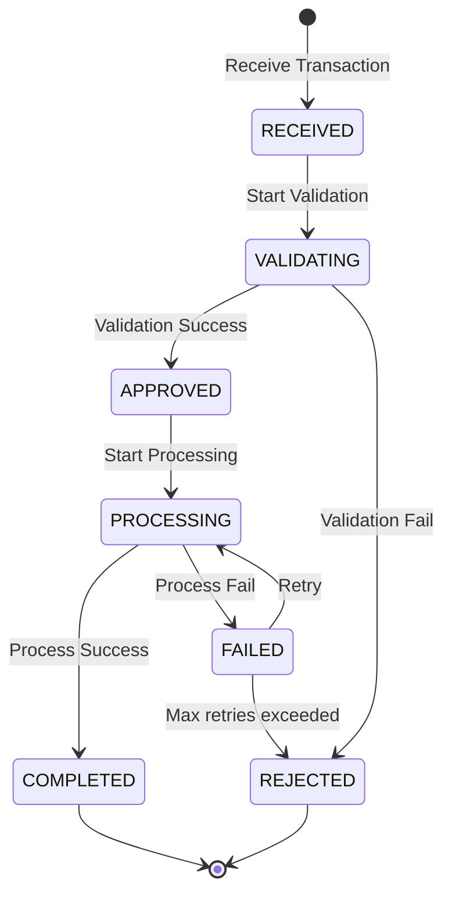

# 🧪 Phase 2: TestCase Generation from SPEC Analysis

> **Workflow ID**: WF2  
> **Phase**: 2/5  
> **Previous**: [Phase 1 - SPEC Analysis](./wf1_spec_analysis.md)  
> **Next**: [Phase 3 - Test Data Generation](./wf3_testdata_generation.md)

---

## 1. 🎯 Purpose

Generate a **comprehensive and structured** TestCase suite from the SPEC analysis results of Phase 1, ensuring:
- ✅ **100% Requirement Coverage** — Each business rule maps to at least one test case.
- ✅ **Technique Diversity** — Integrates Equivalence Partitioning, BVA, Decision Tables, State Transitions, and Negative Testing.
- ✅ **Traceability** — Each test case traces back to its source requirements.
- ✅ **Readiness for Phase 3** — Output provides sufficient detail to generate concrete test data.
- 📦 **Mandatory Storage**: The TestCase suite must be saved as `2_testcases.md` in the centralized run directory (`test_runs/run_<timestamp>_<run_id>/`).

---

## 2. 📥 Input

All outputs from Phase 1 (WF1):

| Input | Description | Used in Step |
|---|---|---|
| Business Rules (BR-xxx) | List of business rules | Steps 1, 3, 7 |
| Fields Table | Table of input/output fields | Steps 1, 2, 5 |
| Constraints Table | Table of constraints for each field | Steps 2, 5 |
| Equivalence Partitions | Table of equivalence partitions | Step 1 |
| Error Conditions | List of error conditions | Step 5 |

> ⚠️ **Verification**: Ensure Phase 1 has passed Gate 1 before starting Phase 2.

---

## 3. 📋 Detailed Process

### Overview Table

| Step | Action | Input | Output | Review Criteria |
|---|---|---|---|---|
| 1 | Create Batch Test Data Matrix | Input fields + SPEC | Batch Test Data Matrix | Check fields & batch scenarios, explain exclusions |
| 2 | Create Normal TestCases | Equivalence partitions | TC-xxx | 1 TC per valid partition |
| 3 | Create Boundary TestCases | Constraints | TC-xxx | min, max, min-1, max+1 check |
| 4 | Create Decision Table TCs | Business rules | TC-xxx | All combinations mapped |
| 5 | Create State Transition TCs | Data states lifecycle | TC-xxx | All valid/invalid state transitions mapped |
| 6 | Create Database CRUD TCs | DB Interactions CRUD | TC-xxx | Verify pre/post DB states of impacted tables |
| 7 | Create Input Mutation TCs | Input format constraints | TC-xxx | Verify batch self-defense on corrupted file structure |
| 8 | Create Fault Tolerance TCs | System constraints | TC-xxx | Verify recovery/rollback on process crash or outage |
| 9 | Apply Pairwise Testing | Config parameters | TC-xxx | Optimize combinatorial config parameter cases |
| 10 | Create Negative TestCases | Error conditions | TC-xxx | Covers null, empty, wrong type |
| 11 | Create Automation Triage Sheet | Raw TCs list | Triage Sheet + Handoff | Classify TCs into Level 1, 2, 3 and define handoff instructions |
| 12 | Assign Priority & Category | Raw TCs list | Categorized TCs | Proper priority distribution |
| 13 | Create Traceability Matrix | BR-xxx + TC-xxx | Traceability table | 100% requirements covered |
| 14 | REVIEW GATE | All outputs | Checklist status (pass/fail) | All checklist criteria are met + Three-Amigos review |


---

### 📌 Step 1: Creating Batch Test Data Matrix

**Principles:**
- **Every input field** and **batch-level check** must be systematically analyzed to guarantee 100% test coverage.
- You must construct a **Batch Test Data Matrix** (refer to `references/testcase_design_guide.md#8-batch-test-data-matrix` for details).
- The matrix maps each intersection of a field (with its technical data type) and a test characteristic (including batch volume, record states, and rerun idempotency) to a TestCase ID (`TC-xxx`) or explicitly marks it as `N/A` with a reason.

**How to Implement:**
1. List all input fields extracted in Phase 1 along with their technical data types.
2. For each field, apply the Master Checklist (refer to `references/field_test_checklist_guide.md`).
3. Set up the Batch Test Data Matrix table. Populate all intersections with either a target TestCase ID (`TC-xxx`) or `N/A` (with a logical exclusion reason based on the SPEC).
4. Identify global batch-level scenarios (e.g., empty file, sort order, duplicate keys, rerun idempotency, crash resilience) and add them as global matrix rows.
5. Translate all kept scenarios into corresponding TestCases (Normal, Boundary, Negative, etc.) in the subsequent steps.

**Example Batch Test Data Matrix:**

| Field & Technical Type | Normal | Boundary | Null/Empty/Space | Invalid / Format | Encoding / Spec. Char | Batch Volume / State | Rerun / Resilience |
|---|---|---|---|---|---|---|---|
| **customer_id** <br>*(String, Max 10, Fixed)* | `TC-001` | `TC-010` (1 char) <br> `TC-011` (10 chars) | `TC-040` (Null) <br> `TC-041` (Empty) <br> `TC-042` (Spaces) | `TC-043` (11 chars) | `TC-050` (Shift-JIS) <br> `TC-051` (Control char) | `TC-060` (Duplicate) | `N/A` (Field-level only) |
| **amount** <br>*(Decimal, Min 0)* | `TC-001` | `TC-012` (0) | `TC-044` (Null) | `TC-045` (-1) <br> `TC-046` (Decimal precision) | `N/A` | `N/A` | `TC-080` (Rerun idempotency check) |
| **Global File/Batch** | `TC-001` | `N/A` | `TC-070` (Empty file) | `TC-071` (Wrong format) | `TC-072` (BOM prefix) | `TC-073` (1 record) <br> `TC-074` (Large vol) | `TC-081` (Crash resilience) |

---

### 📌 Step 2: Creating Normal TestCases (Equivalence Partitioning)

**Principles:**
- **1 TestCase for each valid partition** identified in Phase 1.
- Each TC tests **ONE representative value** from **ONE valid partition**.
- Purpose: Verify that the system operates correctly under normal, valid inputs.

**How to Implement:**
1. Retrieve the Equivalence Partitions table from Phase 1.
2. Filter out all **valid partitions**.
3. For each valid partition, create 1 TC using its representative value.
4. Combine valid partitions from different fields to construct complete test scenarios.

**Example:**

From Phase 1, the `amount` field has the following valid partitions:
- P1: Small amount (1 - 1,000,000)
- P2: Medium amount (1,000,001 - 100,000,000)
- P3: Large amount (100,000,001 - 500,000,000)

→ Create 3 Normal TCs:

| ID | TestCase Name | Category | Priority | Description | Precondition | Input Summary | Expected Output |
|---|---|---|---|---|---|---|---|
| TC-001 | Transfer small amount | NORMAL | HIGH | Verify transaction succeeds with an amount in the small range | Source account has sufficient balance | amount=500,000, bank_code=VCB | status=APPROVED, fee=10,000 |
| TC-002 | Transfer medium amount | NORMAL | HIGH | Verify transaction succeeds with a medium amount | Source account has sufficient balance | amount=50,000,000, bank_code=TCB | status=APPROVED, fee=25,000 |
| TC-003 | Transfer large amount | NORMAL | CRITICAL | Verify transaction succeeds with a large amount close to the limit | Source account has sufficient balance | amount=300,000,000, bank_code=ACB | status=APPROVED, fee=50,000 |

**Review Criteria:**
- [ ] Each valid partition maps to at least 1 TC.
- [ ] Representative values lie strictly inside the partition range (not on the boundary).
- [ ] Expected output aligns with the business rules.

---

### 📌 Step 3: Creating Boundary TestCases (Boundary Value Analysis - BVA)

**Principles:**
- For each field with a **numeric constraint** or **length constraint**:
  - **min**: The minimum valid value.
  - **max**: The maximum valid value.
  - **min-1**: Value just below the minimum (invalid).
  - **max+1**: Value just above the maximum (invalid).
- For **string fields** with length constraints:
  - **length = 0**: Empty string (if optional).
  - **length = 1**: 1-character string.
  - **length = max-1**: String length near max.
  - **length = max**: String exactly at max length.
  - **length = max+1**: String exceeding max length (invalid).

**How to Implement:**
1. Retrieve the Constraints table from Phase 1.
2. For each field with a numeric range constraint, create 4 BVA TCs.
3. For each field with a string length constraint, create 5 BVA TCs.

**Example — Numeric Boundary (field: amount, range 1-500,000,000):**

| ID | TestCase Name | Category | Priority | Description | Input Summary | Expected Output |
|---|---|---|---|---|---|---|
| TC-010 | BVA: amount = min (1) | BOUNDARY | HIGH | Verify correct behavior at boundary min | amount=1 | status=APPROVED |
| TC-011 | BVA: amount = max (500M) | BOUNDARY | HIGH | Verify correct behavior at boundary max | amount=500,000,000 | status=APPROVED |
| TC-012 | BVA: amount = min-1 (0) | BOUNDARY | HIGH | Verify rejection below min | amount=0 | status=REJECTED, error=ERR-INVALID-AMT |
| TC-013 | BVA: amount = max+1 (500,000,001) | BOUNDARY | HIGH | Verify rejection above max | amount=500,000,001 | status=REJECTED, error=ERR-OVER-LIMIT |

**Example — String Length Boundary (field: description, length 0-140):**

| ID | TestCase Name | Category | Priority | Description | Input Summary | Expected Output |
|---|---|---|---|---|---|---|
| TC-014 | BVA: description empty | BOUNDARY | MEDIUM | Verify empty description is accepted | description="" (length=0) | status=APPROVED |
| TC-015 | BVA: description 1 char | BOUNDARY | MEDIUM | Verify correct behavior with 1 character | description="A" (length=1) | status=APPROVED |
| TC-016 | BVA: description max-1 | BOUNDARY | LOW | Verify correct behavior close to max length | description="A"×139 (length=139) | status=APPROVED |
| TC-017 | BVA: description max | BOUNDARY | MEDIUM | Verify max length is accepted | description="A"×140 (length=140) | status=APPROVED |
| TC-018 | BVA: description max+1 | BOUNDARY | HIGH | Verify rejection when exceeding max length | description="A"×141 (length=141) | status=REJECTED |

**Review Criteria:**
- [ ] Each numeric range has 4 BVA TCs (min, max, min-1, max+1).
- [ ] Each string length constraint has ≥ 4 BVA TCs.
- [ ] Boundary values are EXACT (no approximations).
- [ ] Expected outputs are clear for both valid and invalid boundaries.

---

### 📌 Step 4: Creating Logic TestCases (Decision Table)

**Principles:**
- Identify all **conditions** affecting the output.
- Identify all possible **actions** (outcomes).
- Create a **decision table** containing all combinations of conditions.
- Each unique combination represents 1 TestCase.

**How to Implement:**
1. Using the Business Rules, identify the relevant conditions.
2. List all possible actions.
3. Formulate the decision table.
4. Remove impossible combinations (logically inconsistent states).
5. Generate 1 TestCase for each remaining combination.

**Example — Decision Table for Fee Calculation:**

Conditions:
- C1: Amount is valid (Y/N)
- C2: Bank code is valid (Y/N)
- C3: Account balance is sufficient (Y/N)

Actions:
- A1: Approve transaction
- A2: Calculate fee
- A3: Reject transaction with error code

| Rule | C1: Amount valid | C2: Bank valid | C3: Balance sufficient | Action |
|---|:---:|:---:|:---:|---|
| R1 | Y | Y | Y | A1: Approve + A2: Calculate fee |
| R2 | Y | Y | N | A3: Reject (ERR-INSUF-BAL) |
| R3 | Y | N | Y | A3: Reject (ERR-INVALID-BANK) |
| R4 | Y | N | N | A3: Reject (ERR-INVALID-BANK) |
| R5 | N | Y | Y | A3: Reject (ERR-INVALID-AMT) |
| R6 | N | Y | N | A3: Reject (ERR-INVALID-AMT) |
| R7 | N | N | Y | A3: Reject (ERR-INVALID-AMT) |
| R8 | N | N | N | A3: Reject (ERR-INVALID-AMT) |

→ Create 8 Logic TCs:

| ID | TestCase Name | Category | Priority | Description |
|---|---|---|---|---|
| TC-030 | Logic: All valid | LOGIC | CRITICAL | All conditions valid → Approve |
| TC-031 | Logic: Insufficient balance | LOGIC | CRITICAL | Amount and bank valid, insufficient balance → Reject |
| TC-032 | Logic: Invalid bank | LOGIC | HIGH | Amount valid, bank invalid → Reject |
| TC-033 | Logic: Invalid bank + insufficient | LOGIC | MEDIUM | Bank invalid and balance insufficient → Reject |
| TC-034 | Logic: Invalid amount | LOGIC | HIGH | Amount invalid → Reject regardless of other conditions |
| TC-035 | Logic: Invalid amount + valid bank | LOGIC | MEDIUM | Amount invalid, bank valid → Reject |
| TC-036 | Logic: Invalid amount + invalid bank | LOGIC | MEDIUM | Both amount and bank invalid → Reject |
| TC-037 | Logic: All invalid | LOGIC | LOW | All conditions invalid → Reject |

**Review Criteria:**
- [ ] Decision table covers all combinations of conditions.
- [ ] No combinations are missed.
- [ ] Actions for each combination align with business rules.
- [ ] Logically impossible combinations are removed with documented reasons.

---

### 📌 Step 5: Creating State Transition TestCases

> ⚠️ **Only applicable** when the SPEC describes a stateful process (involving state transitions).

**Principles:**
- Identify all possible **states** from Phase 1.
- Identify all **events** (triggers that transition states).
- Identify **valid transitions**.
- Identify **invalid transitions**.
- Generate test cases for both valid AND invalid transitions.

**State Transition Diagram (Example):**



**Example State TCs:**

| ID | TestCase Name | Category | Priority | Description | Precondition | Expected Output |
|---|---|---|---|---|---|---|
| TC-040 | State: RECEIVED → VALIDATING | STATE | HIGH | Valid transition when validation starts | Transaction is in RECEIVED state | State = VALIDATING |
| TC-041 | State: VALIDATING → APPROVED | STATE | CRITICAL | Valid transition when validation succeeds | Transaction is VALIDATING, data valid | State = APPROVED |
| TC-042 | State: VALIDATING → REJECTED | STATE | CRITICAL | Valid transition when validation fails | Transaction is VALIDATING, data invalid | State = REJECTED |
| TC-043 | State: APPROVED → PROCESSING | STATE | HIGH | Valid transition when starting processing | Transaction is APPROVED | State = PROCESSING |
| TC-044 | State: FAILED → PROCESSING (Retry) | STATE | HIGH | Retry execution after failure | Transaction is FAILED, retry < max | State = PROCESSING |
| TC-045 | State: Invalid RECEIVED → COMPLETED | STATE | MEDIUM | Invalid transition | Transaction is RECEIVED | Error: Invalid state transition |
| TC-046 | State: Invalid REJECTED → APPROVED | STATE | MEDIUM | Invalid transition | Transaction is REJECTED | Error: Invalid state transition |

**Review Criteria:**
- [ ] All valid transitions are tested by TCs.
- [ ] At least 2-3 invalid transitions are tested by TCs.
- [ ] State diagram aligns with the SPEC.
- [ ] Preconditions are clear for each transition.

---

### 📌 Step 6: Creating Database CRUD Matrix TestCases

**Principles:**
- Batch systems are highly data-intensive, reading and modifying database records.
- Every database interaction mapped in Phase 1 (CRUD Impacted Tables) must be validated.
- Test cases must assert both **Pre-state** (initial DB data) and **Post-state** (expected DB modifications).

**How to Implement:**
1. List all tables from the DB CRUD table in Phase 1.
2. For each CRUD operation:
   - Define the required **Pre-condition DB State** (e.g. initial account balances).
   - Define the **Post-condition DB State** after batch execution (e.g. fee deducted, transactions updated).
3. Create TestCases specifically asserting Database state mutations.

**Example CRUD TCs:**

| ID | TestCase Name | Category | Priority | Description | Precondition | Expected Output |
|---|---|---|---|---|---|---|
| TC-060 | CRUD: Update account balances | DB_CRUD | CRITICAL | Verify balance is correctly updated after transaction | Account `A` balance = 100M, txn = 50M, fee = 25K | Account `A` balance = 49,975,000 |
| TC-061 | CRUD: Insert daily settlement | DB_CRUD | HIGH | Verify daily summary is created on batch completion | `settlement_summary` has no record today | `settlement_summary` has 1 record with total_amount = 50M |

---

### 📌 Step 7: Creating Input Formatting & Mutation TestCases

**Principles:**
- Batch files (CSV, XML, JSON) processed on production often suffer from corrupted structures or bad encodings.
- Test cases must verify the batch's self-defense mechanisms (rejections/graceful handling) on structural anomalies.

**How to Implement:**
1. Define structural mutations:
   - Wrong number of delimiters/columns (e.g. CSV with 6 columns instead of 7).
   - Extra spaces, missing quotes, or stray newline characters inside string columns.
   - Non-standard character encodings (e.g. Shift-JIS or UTF-16 in a UTF-8 batch).
2. Create TestCases validating that these mutations do not cause batch crashes and are rejected with appropriate logs.

**Example Input Mutation TCs:**

| ID | TestCase Name | Category | Priority | Description | Precondition | Expected Output |
|---|---|---|---|---|---|---|
| TC-070 | Mutation: CSV missing columns | MUTATION | HIGH | Verify rejection when CSV rows have fewer columns | Input CSV row has 5 columns instead of 7 | Row rejected, error: `ERR-INVALID-COL-COUNT` |
| TC-071 | Mutation: Bad file encoding | MUTATION | MEDIUM | Verify error handling when file is Shift-JIS | Input file encoded in Shift-JIS | Batch stops gracefully, error: `ERR-INVALID-ENCODING` |

---

### 📌 Step 8: Creating Fault Tolerance & Checkpoint Recovery TestCases

**Principles:**
- Verifies system resilience and recoverability during run-time system interruptions.
- Ensures no duplicate processing or data inconsistency when restarting a failed batch run.

**How to Implement:**
1. Identify potential failure points during execution (e.g. middle of processing loop).
2. Design test scenarios simulating:
   - Network disconnection (e.g. database connection lost).
   - Disk space exhaustion (Disk Full).
   - Process force kill (SIGKILL).
3. Verify that the batch rollbacks transactions correctly or resumes from the last processed checkpoint.

**Example Fault Tolerance TCs:**

| ID | TestCase Name | Category | Priority | Description | Precondition | Expected Output |
|---|---|---|---|---|---|---|
| TC-080 | Fault: Database disconnect mid-run | RESILIENCE | CRITICAL | Verify transaction rollback when DB disconnects | Batch runs 50%, DB connection cut | Unprocessed records rollback, database stays consistent |
| TC-081 | Fault: Checkpoint recovery | RESILIENCE | HIGH | Verify batch resumes from last checkpoint | Batch failed at rec 50. Restart batch. | Batch skips first 49 records, starts processing from rec 50 |

---

### 📌 Step 9: Apply Pairwise Testing

**Principles:**
- If the batch has multiple configuration parameters or filter rules, testing all combinations leads to combinatorial explosion.
- Pairwise Testing ensures that **every pair of parameter values is tested together at least once**, providing ~90% defect coverage with minimal test cases.

**How to Implement:**
1. Identify all independent parameters (e.g. Partner Bank, Transaction Type, Priority, Account Status).
2. List the possible values for each parameter.
3. Use a Pairwise tool or orthogonal arrays to generate the minimal combination set.
4. Add the generated combinations to the TestCase list.

**Example Pairwise Parameters:**
- Bank: `VCB`, `TCB`, `ACB`
- TxType: `TRANSFER`, `REFUND`
- Priority: `N`, `H`
*All combinations = 3 x 2 x 2 = 12 cases. Pairwise reduces this to 6 optimized test cases.*

---

### 📌 Step 10: Creating Negative TestCases

**Principles:**
- For each field, generate TCs targeting invalid inputs:
  - **null**: Required field is null or missing.
  - **empty**: Empty string.
  - **wrong type**: Mismatched data types.
  - **overflow**: Extremely large values.
  - **special chars**: Special characters.
  - **injection**: SQL injection, XSS.
- Utilize the Error Conditions list from Phase 1.

**How to Implement:**
1. Retrieve the Error Conditions list from Phase 1.
2. For each mandatory field, create at least 1 TC for null/empty.
3. For each field, create TCs for wrong types.
4. For each constrained field, create TCs for overflow values.
5. Add TCs for security-related items (SQL injection, XSS).

**Example:**

| ID | TestCase Name | Category | Priority | Description | Input Summary | Expected Output |
|---|---|---|---|---|---|---|
| TC-050 | Neg: transaction_id = null | NEGATIVE | HIGH | Missing transaction_id (mandatory) | transaction_id=null | REJECTED, ERR-MISSING-TXID |
| TC-051 | Neg: source_account = empty | NEGATIVE | HIGH | Empty source_account | source_account="" | REJECTED, ERR-MISSING-FIELD |
| TC-052 | Neg: amount = text | NEGATIVE | HIGH | amount contains letters | amount="abc" | REJECTED, ERR-INVALID-TYPE |
| TC-053 | Neg: amount = negative | NEGATIVE | HIGH | Negative amount value | amount=-50000 | REJECTED, ERR-INVALID-AMT |
| TC-054 | Neg: bank_code = unknown | NEGATIVE | HIGH | Bank code does not exist | bank_code="XYZ" | REJECTED, ERR-INVALID-BANK |
| TC-055 | Neg: date = invalid format | NEGATIVE | MEDIUM | Date violates format | transaction_date="2026/01/01" | REJECTED, ERR-INVALID-DATE |
| TC-056 | Neg: date = 30 Feb | NEGATIVE | MEDIUM | Date does not exist | transaction_date="20260230" | REJECTED, ERR-INVALID-DATE |
| TC-057 | Neg: description SQL injection | NEGATIVE | MEDIUM | SQL injection attempt | description="'; DROP TABLE;--" | REJECTED or sanitized |
| TC-058 | Neg: description XSS | NEGATIVE | MEDIUM | XSS injection attempt | description="<script>alert(1)</script>" | REJECTED or sanitized |
| TC-059 | Neg: amount = MAX_INT overflow | NEGATIVE | MEDIUM | Numeric overflow | amount=9999999999999 | REJECTED, ERR-OVER-LIMIT |

**Review Criteria:**
- [ ] Each mandatory field has TCs for both null and empty.
- [ ] Each field has a TC for mismatched data type.
- [ ] Constrained fields have TCs for out-of-range/overflow values.
- [ ] Injection test cases (SQL, XSS) are included (at least 2 TCs).
- [ ] Expected outputs are explicit (error codes/messages).

---

### 📌 Step 11: Creating Automation Triage Sheet

**Principles:**
- Every designed TestCase must be analyzed to determine its execution feasibility by the AI Agent.
- We classify test cases into **3 Automation Levels**: `Level 1` (Fully Automated), `Level 2` (Human-in-the-loop), and `Level 3` (Manual / Handoff).
- Level 3 cases must have a clear handoff instruction so human testers can execute them.
- Reference: `references/test_automation_levels_guide.md`.

**How to Implement:**
1. List all TCs generated from previous steps.
2. For each TC, analyze constraints: Does it require human business judgment? Does it connect to a secure 3rd-party sandbox? Does it require physical infrastructure interruptions?
3. Assign the appropriate **Automation Level** (`Level 1`, `Level 2`, or `Level 3`).
4. For `Level 3` cases, write down the **Handoff Instruction** containing step-by-step commands or manual actions required.
5. Store this matrix inside the final `2_testcases.md` document.

**Example Triage Sheet Table:**

| TestCase ID | TestCase Name | Automation Level | Triage Decision / Reason | Handoff Instruction (For Level 3) |
|---|---|---|---|---|
| `TC-001` | Transfer normal amount | `Level 1` | Deterministic verification of DB states. | N/A |
| `TC-012` | Rounding precision margin | `Level 2` | Minor floating-point variations require human verdict. | N/A |
| `TC-080` | External CoreBanking gateway down | `Level 3` | External mock cannot be controlled programmatically. | 1. Contact CoreBank ops to shut sandbox gateway.<br>2. Run batch.<br>3. Verify retry logs in batch. |

**Review Criteria:**
- [ ] Every TestCase ID is present in the Triage Sheet.
- [ ] Every TestCase has a valid level assigned.
- [ ] Level 3 TestCases contain explicit, actionable Handoff instructions.

---

### 📌 Step 12: Assigning Priority and Category

**Category Rules:**

| Category | When to Use | Example |
|---|---|---|
| `NORMAL` | Valid inputs, happy path, valid partitions | Successful transfer |
| `BOUNDARY` | Boundary values (min, max, min-1, max+1) | amount = 1, amount = 500M |
| `LOGIC` | Condition combinations (decision table) | Amount valid, bank invalid |
| `STATE` | State transition paths | RECEIVED → VALIDATING |
| `NEGATIVE` | Invalid inputs, error cases | null, empty, wrong type |
| `EDGE` | Rare but possible edge scenarios | Unicode, zero-width characters |

**Priority Rules:**

| Priority | Criteria | Example |
|---|---|---|
| `CRITICAL` | ① Core business flow ② Data integrity ③ Financial calculations | Correct fee calculation, correct approve/reject |
| `HIGH` | ① Required fields validation ② Format validation ③ Primary boundaries | Null checks, amount range checks |
| `MEDIUM` | ① Edge cases ② Non-critical boundaries ③ Secondary logic | Description max length, retry logic |
| `LOW` | ① Cosmetic issues ② Rare scenarios ③ Nice-to-have tests | Injection testing, extreme overflow |

**How to Implement:**
1. Review each TestCase generated in Steps 1-5.
2. Confirm the assigned Category is correct.
3. Assign a Priority based on the criteria above.
4. Cross-check: Ensure CRITICAL TCs cover all core business rules.

**Review Criteria:**
- [ ] Each TC is assigned exactly one Category.
- [ ] Each TC is assigned exactly one Priority.
- [ ] CRITICAL priority is strictly reserved for core business logic.
- [ ] Balanced distribution across priority levels.

---

### 📌 Step 13: Creating Traceability Matrix

**Principles:**
- **Every requirement (BR-xxx) must map to at least 1 TC.**
- The matrix enables bidirectional traceability: requirement ↔ test case.

**How to Implement:**
1. List all BR-xxx from Phase 1.
2. Identify all TCs related to each BR.
3. Mark the coverage status.
4. Flag any requirement that LACKS a corresponding TC.

**Example Traceability Matrix:**

| Requirement ID | Description | TestCase IDs | TC Count | Coverage Status |
|---|---|---|---|---|
| BR-001 | Validate amount (1-500M) | TC-001, TC-002, TC-003, TC-010, TC-011, TC-012, TC-013, TC-034 | 8 | ✅ Covered |
| BR-002 | Calculate transfer fee | TC-001, TC-002, TC-003, TC-030 | 4 | ✅ Covered |
| BR-003 | Validate bank code | TC-001, TC-032, TC-054 | 3 | ✅ Covered |
| BR-004 | Check account balance | TC-031, TC-030 | 2 | ✅ Covered |
| BR-005 | Handle duplicate tx | TC-060 | 1 | ✅ Covered |
| BR-006 | Daily limit of transactions | TC-061 | 1 | ✅ Covered |
| BR-007 | Transaction date format | TC-055, TC-056 | 2 | ✅ Covered |

**Review Criteria:**
- [ ] All BR-xxx are represented in the matrix.
- [ ] Each BR maps to at least 1 TC.
- [ ] Coverage Status is ✅ for all requirements.
- [ ] ❌ NO requirements are left "Not Covered".

---

### 📌 Step 14: REVIEW GATE

**Detailed Description:**
This is the final quality check before proceeding to Phase 3. The process includes performing a brainstorming quality analysis of the TestCase suite, printing the summary report directly in the agent chat (DO NOT create a separate phase report file on disk), and obtaining user approval.

1. **Agent Brainstorming**:
   - Evaluate the quality of the generated TestCase suite: does it cover boundary values, error scenarios (Negative), and complex business logic?
   - Verify that all TestCases are correctly triaged into Automation Levels (Level 1, 2, 3) and Level 3 handoff instructions are clear.
   - Analyze the logical alignment of the Traceability Matrix to ensure no Business Rules from Phase 1 are missed.
   - Self-check against the checklist below.
2. **Print Phase Summary**:
   - Print a summary of Phase 2 results directly in the agent chat:
     - TestCase counts by Category & Priority.
     - TestCase counts by **Automation Level** (Level 1, Level 2, Level 3).
     - Batch Test Data Matrix status and Traceability status.
3. **Present Options via ask_question**:
    - The Agent calls the `ask_question` tool in the detected language to ask:
      - **Question**: "Is the TestCase generation (Phase 2) output satisfactory?"
      - **Options**:
        - "(Recommended) Everything is fine, proceed to Phase 3 (Test Data Generation)."
        - "There are issues, I want to adjust or provide feedback."
4. **Wait for Response**: The pipeline blocks until the user responds to the `ask_question` modal.

**Review Gate 2 Checklist:**

```
REVIEW GATE 2 - CHECKLIST
==========================

□ 1. Requirement Coverage
  □ Traceability Matrix shows 100% coverage.
  □ Each BR-xxx maps to ≥ 1 TC.
  □ No requirements are "Not Covered".

□ 2. Batch Test Data Matrix
  □ Batch Test Data Matrix shows 100% coverage or logical exclusion reasons.
  □ All checklist exclusions have logical, SPEC-based reasons documented.

□ 3. Automation Triage Sheet
  □ Every TestCase has a designated Automation Level (Level 1, 2, or 3).
  □ All Level 3 TestCases contain explicit, actionable Handoff instructions.

□ 4. TestCase Format
  □ Each TC contains: ID, Name, Category, Priority, Description, Automation Level.
  □ Each TC contains: Precondition, Input Summary, Expected Output.
  □ TC IDs are unique and sequential (TC-001, TC-002, ...).

□ 5. TestCase Quality
  □ Normal TCs: Cover all valid partitions.
  □ Boundary TCs: Min, max, min-1, max+1 exist for each constrained field.
  □ Logic TCs: Decision table covers all combinations.
  □ State TCs: Cover valid + invalid transitions between data states.
  □ CRUD TCs: Verify pre/post DB states of impacted tables.
  □ Mutation TCs: Verify batch self-defense against corrupted files.
  □ Resilience TCs: Verify rollback and recovery on process crash/outage.
  □ Negative TCs: Cover null, empty, wrong type, overflow, injection.

□ 6. Priority Assignment
  □ CRITICAL TCs target core business logic.
  □ Reasonable priority distribution.
  □ No TCs lack priority assignment.

□ 7. Consistency & Review
  □ Expected Output aligns with Business Rules.
  □ No TCs contradict the SPEC.
  □ TC names clearly describe the test objective.
  □ Three-Amigos review (QA, Developer, BA) has been conducted to verify completeness.
  □ User approval has been obtained for the TestCase list.
```

**Decision:**
- **Approved by user (Option 1 selected in ask_question)** -> Transition to Phase 3.
- **Adjustments requested (Option 2 selected in ask_question)** -> Ask the user for feedback in chat, update Phase 2 based on feedback, and repeat Review Gate 2.

---

## 4. 🔢 TestCase ID Conventions

| Rule | Description | Example |
|---|---|---|
| Format | `TC-{NNN}` (zero-padded 3-digit number) | TC-001, TC-042, TC-100 |
| Numbering | Sequential, without skipping numbers | TC-001, TC-002, TC-003, ... |
| Range | 001-999 | Maximum 999 TCs |
| Uniqueness | Each TC must have a unique ID | No duplicates |

**Suggested TC grouping by category (optional):**
- TC-001 → TC-029: NORMAL
- TC-030 → TC-039: BOUNDARY
- TC-040 → TC-049: LOGIC
- TC-050 → TC-059: STATE
- TC-060 → TC-079: NEGATIVE
- TC-080 → TC-099: EDGE

> 💡 Grouping by category helps in organization but is NOT mandatory. Sequential numbering is also perfectly fine.

---

## 5. 📤 Output Format

### TestCase Table (OFFICIAL Format)

```markdown
| ID | TestCase Name | Category | Priority | Description | Precondition | Input Summary | Expected Output |
|---|---|---|---|---|---|---|---|
| TC-001 | ... | NORMAL | HIGH | ... | ... | ... | ... |
```

### Complete Example Table (10+ rows)

| ID | TestCase Name | Category | Priority | Description | Precondition | Input Summary | Expected Output |
|---|---|---|---|---|---|---|---|
| TC-001 | Transfer small amount success | NORMAL | HIGH | Verify transaction succeeds with small amount | Account has sufficient balance | amount=500,000, bank=VCB | APPROVED, fee=10,000 |
| TC-002 | Transfer medium amount success | NORMAL | HIGH | Verify transaction succeeds with medium amount | Account has sufficient balance | amount=50,000,000, bank=TCB | APPROVED, fee=25,000 |
| TC-003 | Transfer large amount success | NORMAL | CRITICAL | Verify transaction succeeds with large amount | Account has sufficient balance | amount=300,000,000, bank=ACB | APPROVED, fee=50,000 |
| TC-010 | BVA: amount = min (1) | BOUNDARY | HIGH | Boundary min for amount | Account has sufficient balance | amount=1 | APPROVED |
| TC-011 | BVA: amount = max (500M) | BOUNDARY | HIGH | Boundary max for amount | Account has sufficient balance | amount=500,000,000 | APPROVED |
| TC-012 | BVA: amount = 0 (min-1) | BOUNDARY | HIGH | Below boundary min | Account has sufficient balance | amount=0 | REJECTED, ERR-INVALID-AMT |
| TC-013 | BVA: amount = 500M+1 (max+1) | BOUNDARY | HIGH | Above boundary max | Account has sufficient balance | amount=500,000,001 | REJECTED, ERR-OVER-LIMIT |
| TC-030 | Logic: All conditions valid | LOGIC | CRITICAL | All conditions valid | Account has balance, data valid | All fields valid | APPROVED + calculate fee |
| TC-031 | Logic: Insufficient balance | LOGIC | CRITICAL | Amount/bank valid, balance insufficient | Account balance < amount + fee | amount=100M, balance=50M | REJECTED, ERR-INSUF-BAL |
| TC-050 | Neg: transaction_id = null | NEGATIVE | HIGH | Mandatory field missing | — | transaction_id=null | REJECTED, ERR-MISSING-TXID |
| TC-055 | Neg: date wrong format | NEGATIVE | MEDIUM | Date violates YYYYMMDD format | — | date="2026/01/01" | REJECTED, ERR-INVALID-DATE |
| TC-057 | Neg: SQL injection | NEGATIVE | MEDIUM | Security test | — | desc="'; DROP TABLE;--" | REJECTED or sanitized |

---

## 6. 🚪 Gate Condition

### MANDATORY conditions to transition to Phase 3:

| # | Condition | Level |
|---|---|---|
| 1 | Traceability Matrix shows 100% requirement coverage | 🔴 Mandatory |
| 2 | Each TC has required fields: ID, Name, Category, Priority, Description, Precondition, Input Summary, Expected Output, Automation Level | 🔴 Mandatory |
| 3 | TC IDs are unique and sequential | 🔴 Mandatory |
| 4 | Contains at least Normal, Boundary, and Negative TCs | 🔴 Mandatory |
| 5 | CRITICAL TCs cover all core business rules | 🔴 Mandatory |
| 6 | Batch Test Data Matrix shows 100% coverage or logical exclusion reasons | 🔴 Mandatory |
| 7 | State Transition, CRUD, Mutation, and Resilience TCs are present | 🔴 Mandatory |
| 8 | Automation Triage Sheet is generated, assigning Level 1, 2, 3 to all TCs | 🔴 Mandatory |
| 9 | Level 3 TestCases contain explicit, actionable Handoff instructions | 🔴 Mandatory |
| 10 | User approval (Option 1 in ask_question) is received | 🔴 Mandatory |
| 11 | File `2_testcases.md` is created and saved in the centralized run directory | 🔴 Mandatory |
| 12 | Three-Amigos review (QA, Developer, BA) has been completed | 🟡 Recommended |

---

> ⛔ **If any MANDATORY condition is not met or user approval is missing, DO NOT proceed to Phase 3.**

## 7. 💡 Tips and Common Mistakes

### ✅ Best Practices

1. **Start with Normal TCs first** — Ensure the happy path is verified before testing error cases.
2. **Boundary values must be EXACT** — E.g., `amount=1`, NOT `amount≈1`.
3. **Test one thing per TestCase** — Do not combine multiple test objectives in a single TC.
4. **Expected output must be specific** — E.g., "REJECTED with error ERR-001", NOT "handles error".
5. **Name TestCases clearly** — The name should explain the test objective without needing to read the description.
6. **Consult the SPEC for expected outputs** — Do not guess; base them strictly on the SPEC.

### ❌ Common Mistakes

| # | Mistake | Consequence | How to Avoid |
|---|---|---|---|
| 1 | Missing boundary values | Undetected boundary defects | Checklist: ensure each range has 4 BVA TCs |
| 2 | Using boundary values in Normal TCs | Redundancy with BVA TCs | Normal TCs should use values in the MIDDLE of partitions |
| 3 | Missing traceability matrix | Uncertain requirements coverage | Always generate the traceability matrix at the end |
| 4 | Non-unique TC IDs | Execution confusion | Auto-generate IDs and verify uniqueness |
| 5 | Vague expected outputs | Unverifiable results | Specify precise status, error codes, and field values |
| 6 | Lacking preconditions | Non-reproducible test cases | Clearly document the initial required state |
| 7 | Neglecting negative security tests | Security vulnerabilities | Always include SQL injection and XSS TCs |

---

## 7.5 ⚠️ Critical Rules

1. **Testing Source Code Only (No code changes during test)**:
   - Execute testing on the existing application code as-is. Absolutely no modifications to the production code are permitted.
   - If a bug is found in the application, do not change the testcase or expected output to hide the issue. Record the bug details transparently in the final report without attempting to fix the source code.
2. **Centralized Output Storage**:
   - Write the entire TestCase suite output to `2_testcases.md` and save it inside the centralized run directory: `test_runs/run_<timestamp>_<run_id>/`.
3. **Language Alignment Rule**:
   - Inspect the input SPEC/prompt to determine the execution language.
   - All generated output files, log outputs (including execution status logs shown to the user), internal reasoning/thinking blocks, and all chat communications must be written in the **exact same language** as detected (e.g., if the user prompts in Japanese, your thoughts, logs, and answers must be entirely in Japanese without mixing English or Vietnamese).

---

## 8. 📚 References

- **Previous Phase**: [WF1 - SPEC Analysis](./wf1_spec_analysis.md)
- **Next Phase**: [WF3 - Test Data Generation](./wf3_testdata_generation.md)
- **Pipeline Overview**: [README](./README.md)
- **Full Pipeline**: [WF Full Pipeline](./wf_full_pipeline.md)

---

> 📌 **Reminder**: The TestCase suite is the BLUEPRINT for the entire testing process. If it is incomplete, test data generation and test execution cannot make up for it. Investing time in Phase 2 saves significant effort in subsequent phases.
