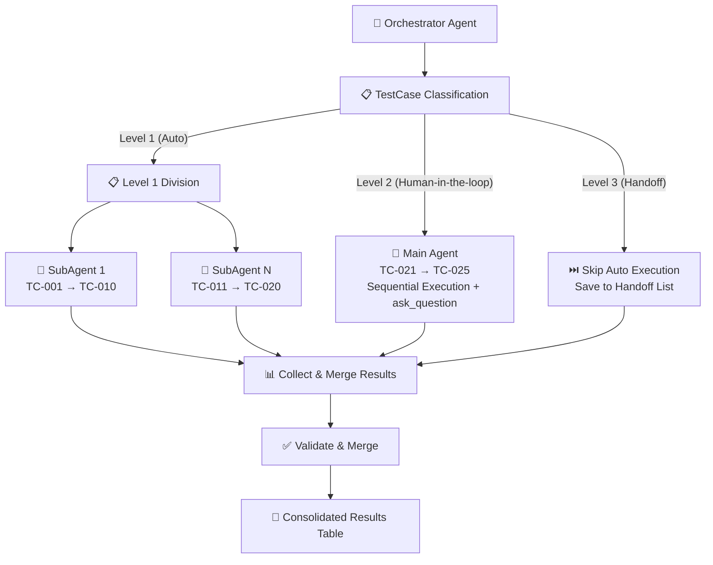
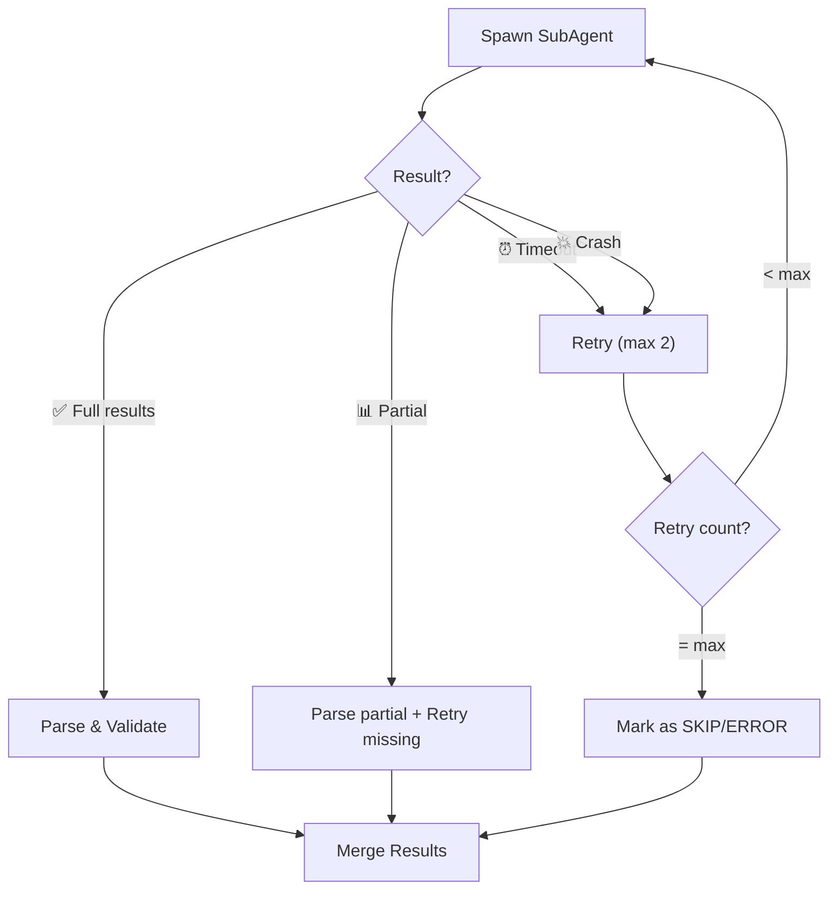

# ⚡ Phase 4: Parallel Test Execution (SubAgents)

> **Workflow ID**: WF4  
> **Phase**: 4/5  
> **Previous**: [Phase 3 - Test Data Generation](./wf3_testdata_generation.md)  
> **Next**: [Phase 5 - Report Aggregation](./wf5_report_aggregation.md)

---

## 1. 🎯 Purpose

Execute **all test cases in parallel** using SubAgents, to:
- ⚡ **Accelerate Execution** — Run multiple TCs simultaneously instead of sequentially.
- 🎯 **Ensure Completeness** — Every TC is executed without omission.
- 📊 **Collect Results** — Merge all sub-results into a single consolidated table.
- 🔄 **Handle Failures** — Implement retry logic for subagent timeouts or crashes.
- 📦 **Centralized Output Storage**:
   - Save the execution results and raw logs (`4_execution_results.json` and `4_execution_log.txt`) inside the centralized run directory: `test_runs/run_<timestamp>_<run_id>/`.
   - **Test Case Isolation**: For each test case, organize all of its inputs and outputs within a dedicated directory structure inside the run folder: `{run_dir}/{tc_id}/input/` and `{run_dir}/{tc_id}/output/`. Do NOT create scattered sibling folders like `tmp_input_{tc_id}` or `tmp_output_{tc_id}` in the run directory.

---

## 2. 📥 Input

| Input | Source | Description |
|---|---|---|
| TestCase suite | Phase 2 (WF2) | Complete TestCase suite with all details |
| Test datasets | Phase 3 (WF3) | JSON data for each TC |
| SPEC reference | Phase 1 (WF1) | Business rules and constraints to verify outcomes |

> ⚠️ **Verification**: Ensure Phase 3 has passed Gate 3 (all TCs have data).

---

## 3. 🏗️ Architecture



### Architecture Description:

| Component | Role | Details |
|---|---|---|
| **Orchestrator** | Coordination | Divides TCs, spawns subagents, collects and validates results |
| **SubAgent** | Execution | Receives assigned TCs, executes tests, and reports results |
| **Validator** | Verification | Verifies completeness, merges results, and resolves conflicts |

---

## 4. 📋 Detailed Process

### Overview Table

| Step | Action | Input | Output |
|---|---|---|---|
| 0 | Generate batch runner script | SPEC + Template | run_testcases.py (in temp run dir) |
| 1 | Filter and classify TestCases | total_TCs | Triage results (Level 1, 2, 3) |
| 2 | Divide Level 1 TestCases into groups | Level 1 TC list | Level 1 groups |
| 3 | Prepare prompt for SubAgent | TCs + data + SPEC | Prompt strings |
| 4 | Spawn all SubAgents for Level 1 | Prompts | Running agents |
| 5 | Collect Level 1 results | Agent responses | Raw Level 1 results |
| 6 | Validate Level 1 results | Raw results | Validated Level 1 results |
| 7 | Merge Level 1 results | Validated results | Consolidated Level 1 table |
| 8 | Execute and approve Level 2 TestCases | Level 2 TCs + data | Approved/Rejected Level 2 results |
| 8.5 | Final Merge of all Level 1, 2, 3 results | Level 1, 2, 3 results | Complete results table |
| 9 | REVIEW GATE | Merged results | Summary in chat + Approval |

---

### 📌 Step 0: Generate Batch-Specific Test Runner Script

Before executing test cases, the Orchestrator must generate a batch-specific runner script in the designated run directory:
1. Create a centralized run directory: `test_runs/run_<timestamp>_<run_id>/`.
2. Copy the template `skills/batch-autotest/templates/run_testcases_template.py` to `{run_dir}/run_testcases.py`.
3. Analyze the batch execution details (from SPEC Analysis in Phase 1 & 2):
   - Command line call (e.g., `python -m settlement_batch` or script files).
   - Column schemas for all input data files.
   - Special handlers (e.g., idempotency, custom parameters).
   - Expected error string mappings.
4. Replace/populate placeholders (or modify the python code values) inside `{run_dir}/run_testcases.py` to match the specific batch attributes.
5. **(Optional Customization)**: If the batch has complex testing requirements (e.g., customized pre-state/post-state validation, database connections), the Tester or Orchestrator can directly modify this generated Python script inside the `{run_dir}/` folder before execution.
6. The SubAgents will execute tests by calling this newly generated script:
   ```bash
   python3 {run_dir}/run_testcases.py --tc-ids <ids> --run-dir {run_dir} --testdata-json {testdata_json}
   ```

---

### 📌 Step 1: Filtering and Classifying TestCases

Before dividing test cases, the Agent must filter them based on their **Automation Level** (from the Triage Sheet):
1. **Level 3 (Manual / Handoff)**: Skip automatic execution entirely. Mark their status immediately as `⏭️ SKIP` (Status Detail: `HANDOFF`) and set the actual result to "Handoff to human - see Handoff List".
2. **Level 1 (Fully Automated)**: Triage for parallel programmatic execution using SubAgents.
3. **Level 2 (Human-in-the-loop)**: Triage for direct sequential execution on the Main Agent to enable interactive verdict approval.
4. Count the active Level 1 test cases (`active_level_1_TCs = total_TCs - level_3_count - level_2_count`).

**Formula for SubAgent Groups (Only for Level 1 TCs):**
```
num_groups = min(ceil(active_level_1_TCs / 10), max_subagents)
```

**Where:**
- `active_level_1_TCs`: Count of active Level 1 test cases.
- `max_subagents`: Upper limit of concurrent subagents (default: 5).

---

### 📌 Step 2: Dividing Level 1 TestCases

**Division Algorithm (Only for Level 1 TCs):**

1. **Sort Level 1 TestCases** by Category and finally by ID.
2. **Distribute Round-Robin** into groups.
3. **Verify** that each group has a balanced count.

**Priority**: Keep TestCases of the same category in the same group where possible (to share execution context).

**Example Division of 25 Level 1 TestCases into 3 groups:**

| Group | SubAgent | TestCase IDs | Count | Categories |
|---|---|---|---|---|
| 1 | SubAgent 1 | TC-001 → TC-009 | 9 | NORMAL (5), BOUNDARY (4) |
| 2 | SubAgent 2 | TC-010 → TC-017 | 8 | BOUNDARY (7), LOGIC (1) |
| 3 | SubAgent 3 | TC-018 → TC-025 | 8 | LOGIC (6), STATE (2) |

**Pseudocode:**
```python
def split_testcases(all_tcs, num_groups):
    # Sort by category then ID
    sorted_tcs = sorted(all_tcs, key=lambda tc: (tc.category, tc.id))
    
    # Initialize groups
    groups = [[] for _ in range(num_groups)]
    
    # Distribute round-robin
    for i, tc in enumerate(sorted_tcs):
        group_idx = i % num_groups
        groups[group_idx].append(tc)
    
    # Verify balance
    sizes = [len(g) for g in groups]
    assert max(sizes) - min(sizes) <= 1, "Groups not balanced!"
    
    return groups
```

**Review Criteria:**
- [ ] All TCs are assigned to a group.
- [ ] No TCs are duplicated (appearing in 2+ groups).
- [ ] No TCs are missed.
- [ ] Group size discrepancy is ≤ 1 TC.

---

### 📌 Step 3: Preparing the SubAgent Prompt

**Each SubAgent receives:**
1. TestCase IDs + details (from Phase 2).
2. Test data JSON (from Phase 3).
3. Relevant SPEC reference sections.
4. Output format instructions.

**Principles:**
- Only send relevant SPEC sections (to optimize prompt size).
- Send complete test data for the assigned TCs.
- Require exact compliance with output formats.

---

### 📌 Step 4: SubAgent Prompt Template

> ⚠️ **CRITICAL NOTE ON LANGUAGE ALIGNMENT**: The main agent must translate the entire prompt template, including instructions, headers, explanations, and placeholder values, into the detected execution language (e.g., Japanese, Vietnamese) before sending it to the SubAgent. **OFFICIAL SubAgent Template (English Reference - Translate to Target Language before sending):**

````markdown
You are a **Test Executor Agent**. Execute the following test cases and report the results. You must think internally, execute, log, and write your entire response strictly in {detected_language}. Do not use English or Vietnamese.

## 📋 Assigned TestCases

{testcase_list_with_full_details}

Example format of testcase list:
| ID | Name | Category | Priority | Description | Precondition | Expected Output | Automation Level |
|---|---|---|---|---|---|---|---|
| TC-001 | Transfer small amount | NORMAL | HIGH | Verify transaction succeeds | Source account has balance | APPROVED, fee=10,000 | Level 1 |
| TC-012 | Rounding precision | NORMAL | HIGH | Verify rounding precision | Source account has balance | APPROVED | Level 2 |

## 📦 Test Data

```json
{test_data_json}
```

## 📄 SPEC Reference

{relevant_spec_sections}

## 📐 Execution Instructions

1. For **each test case**, use the provided test data as input.
2. Execute the batch/system under test according to the rules in the SPEC Reference.
3. Compare the **actual output** with the **expected output**.
4. **Automation Level Execution Rules**:
   - For **Level 1** cases: Fully verify results automatically.
   - For **Level 2** cases: Run the batch, collect all logs/DB diffs as evidence, print them clearly in the execution logs, and propose a verdict (PASS/FAIL) with a reason. Mark the status as `Level 2 - Pending` so the Orchestrator can prompt the user.
5. Log the outcomes in **EXACTLY** the format defined below.

## 📤 Output Format (MANDATORY)

Return results in this table format, **DO NOT alter the table structure**:

| ID | Name | Automation Level | Status | Input Summary | Expected | Actual | Error Detail |
|---|---|---|---|---|---|---|---|
| TC-xxx | ... | Level 1 | ✅ PASS | ... | ... | ... | — |
| TC-yyy | ... | Level 2 | Level 2 - Pending | ... | ... | ... | Propose PASS. Reason: Rounded amount difference is 0.01. |
| TC-zzz | ... | Level 1 | ❌ FAIL | ... | ... | ... | Detailed error description |
| TC-aaa | ... | Level 1 | ⏭️ SKIP | ... | ... | ... | Skip reason |

## ⚠️ Rules

1. **Status** must strictly be: `✅ PASS`, `❌ FAIL`, or `⏭️ SKIP`.
2. If **FAIL**: You MUST populate the "Error Detail" column with details of the discrepancy.
3. If **SKIP**: You MUST populate the "Error Detail" column with the skip reason.
4. **DO NOT skip** any test cases in the assigned list.
5. **DO NOT add** test cases outside the assigned list.
6. Return the results **IMMEDIATELY** upon completion without extraneous text.

## 📊 Summary

Include a summary after the table:
- Total: {count}
- Passed: {count}
- Failed: {count}  
- Skipped: {count}
````

**How to Use the Template:**
1. Replace `{testcase_list_with_full_details}` with the test cases table from Phase 2.
2. Replace `{test_data_json}` with the JSON test data from Phase 3 (only for TCs in this group).
3. Replace `{relevant_spec_sections}` with SPEC sections relevant to the TCs in this group.

---

### 📌 Step 5: Spawning SubAgents

**Spawning Process:**

```python
# Pseudocode for spawning subagents
subagent_tasks = []
for i, group in enumerate(tc_groups):
    prompt = format_subagent_prompt(
        testcases=group.testcases,
        test_data=group.test_data,
        spec_reference=group.relevant_spec
    )
    
    task = invoke_subagent(
        type="self",
        role=f"Test Executor Group {i+1}",
        prompt=prompt
    )
    subagent_tasks.append(task)

# All subagents run CONCURRENTLY
```

**Spawning Rules:**
- Spawn ALL subagents **CONCURRENTLY** (not sequentially).
- Assign a **unique role name** to each subagent for clear tracking.
- Log start timestamps for each subagent.

---

### 📌 Step 6: Collecting Results

**Collection Process:**

1. **Wait** for all subagents to complete.
2. **Parse** the result tables from each subagent response.
3. **Validate** each response:
   - Are all assigned TCs present?
   - Is the table format correct?
   - Are statuses valid (PASS/FAIL/SKIP)?
4. **Handle timeouts** if they occur.

**Expected Timeline:**

```
T=0:00  Spawn all subagents
T=0:01  All subagents started
T=2:00  SubAgent 1 completes (10 TCs)
T=2:30  SubAgent 3 completes (10 TCs)
T=3:00  SubAgent 2 completes (10 TCs)
T=3:30  SubAgent 4 completes (5 TCs)
T=3:31  All results collected
T=4:00  Validation & Merge complete
```

---

### 📌 Step 7: Validation & Merge

**Validation Checks:**

| Check | Description | Action on Failure |
|---|---|---|
| Completeness | All TCs have a reported outcome | Re-run missing TCs |
| No Duplicates | No duplicate TC IDs exist | Retain the latest outcome |
| Valid Status | Status is PASS/FAIL/SKIP | Re-parse or flag |
| Format Correct | Table has all required columns | Re-parse |

**Merge Process:**

1. Consolidate result tables from all subagents.
2. Sort by TestCase ID (TC-001, TC-002, ...).
3. Verify: `total_results == total_TCs`.
4. Create the final consolidated results table.

**Merged Output Format:**

| ID | Name | Category | Priority | Automation Level | Status | Input Summary | Expected | Actual | Error Detail | SubAgent |
|---|---|---|---|---|---|---|---|---|---|---|
| TC-001 | Small transfer | NORMAL | HIGH | Level 1 | ✅ PASS | amount=500K | APPROVED | APPROVED | — | Group 1 |
| TC-010 | BVA: amount=min | BOUNDARY | HIGH | Level 1 | ✅ PASS | amount=1 | APPROVED | APPROVED | — | Group 2 |
| TC-012 | Rounding precision | NORMAL | HIGH | Level 2 | ✅ PASS | amount=10.005 | APPROVED | APPROVED | Human Approved (diff=0.005) | Group 2 |
| TC-031 | Logic: insuf balance | LOGIC | CRITICAL | Level 1 | ❌ FAIL | balance<amount | REJECTED | APPROVED | Balance not checked | Group 3 |
| TC-080 | External gateway sync | LOGIC | CRITICAL | Level 3 | ⏭️ SKIP | — | — | Handoff: See instructions | — |

---

### 📌 Step 8: Direct Execution & Verdict Approval for Level 2 TestCases

Instead of running Level 2 test cases in the background using SubAgents, the Orchestrator (Main Agent) must execute them directly and sequentially to enable real-time interactive confirmation:

1. For **each** Level 2 testcase:
   - **Action 1 (Execute)**: Run the batch process for this testcase locally by invoking the generated test runner script in its run folder:
     ```bash
     python3 {run_dir}/run_testcases.py --tc-ids {tc_id} --run-dir {run_dir} --testdata-json {testdata_json}
     ```
   - **Action 2 (Collect Evidence)**: Read the execution output and logs from `{run_dir}/{tc_id}/output/` (such as output CSV files, errors.jsonl, and execution stdOut/stdErr).
   - **Action 3 (Present Evidence)**: Print the collected evidence and the proposed verdict (PASS/FAIL with the rationale) directly to the user in the main chat.
   - **Action 4 (Interactive Approval)**: Invoke the `ask_question` tool in the detected execution language to prompt the user:
     - **Question**: "Review execution evidence for {tc_id}. Propose verdict: {proposal}. Accept?"
     - **Options**:
       - "Accept proposal (PASS)."
       - "Reject proposal (FAIL)."
   - **Action 5 (Record Verdict)**: Update the testcase status in the merged results table based on the user's response:
     - If accepted -> Set status to `✅ PASS`.
     - If rejected -> Set status to `❌ FAIL` and document the user's reject reason/comments in "Error Detail".

---

### 📌 Step 9: REVIEW GATE

**Detailed Description:**
This is the final quality check before proceeding to Phase 5 (Report Aggregation). The process includes performing a brainstorming quality analysis of the execution results, printing the summary report directly in the agent chat (DO NOT create a separate phase report file on disk), and obtaining user approval.

1. **Agent Brainstorming**:
   - Assess the execution completeness: ensure all Level 1 & Level 2 test cases have a resolved status (PASS or FAIL), and all Level 3 test cases are marked as HANDOFF.
   - Analyze failures: look for patterns in failures that might suggest underlying systemic issues.
   - Self-check against the checklist below.
2. **Print Phase Summary**:
   - Print a summary of Phase 4 results directly in the agent chat:
     - Total TCs executed programmatically (Level 1 & Level 2).
     - Passed/Failed counts for Level 1 & Level 2.
     - Number of Level 3 TCs skipped and handed off.
     - Execution duration.
3. **Present Options via ask_question**:
    - The Agent calls the `ask_question` tool in the detected language to ask:
      - **Question**: "Is the Test Execution (Phase 4) output satisfactory?"
      - **Options**:
        - "(Recommended) Everything is fine, proceed to Phase 5 (Report Aggregation)."
        - "There are issues, I want to adjust or rerun tests."
4. **Wait for Response**: The pipeline blocks until the user responds to the `ask_question` modal.

**Review Gate 4 Checklist:**

```
REVIEW GATE 4 - CHECKLIST
==========================

□ 1. Completeness
  □ All active test cases (Level 1 & Level 2) have a resolved status (PASS or FAIL).
  □ All Level 3 test cases have status `⏭️ SKIP` (Detail: `HANDOFF`) and are listed for handoff.
  □ Total results count matches the test suite count exactly.

□ 2. Human-in-the-loop Verdicts
  □ All Level 2 test cases have been reviewed and approved/rejected by the user.

□ 3. Accuracy & Traceability
  □ Failures accurately reflect discrepancies between actual and expected outcomes.
  □ Skipped test cases (other than Level 3 Handoffs) have documented and valid reasons.

□ 4. Output Files
  □ File `4_execution_results.json` is created.
  □ File `4_execution_log.txt` is created.
  □ Summary has been printed directly in the chat conversation.
  □ User approval has been obtained.
```

**Decision:**
- **Approved by user (Option 1 selected in ask_question)** -> Proceed to Phase 5.
- **Adjustments requested (Option 2 selected in ask_question)** -> Ask the user for feedback/instructions in chat, update/re-run tests as requested, and repeat Review Gate 4.

---

## 5. ⚠️ Error Handling

### SubAgent Timeout

```
Scenario: SubAgent does not return results within 10 minutes
→ Action:
  1. Log warning: "⚠️ SubAgent Group X timeout after 10 minutes."
  2. Retry 1: Spawn the subagent again with the same prompt.
  3. If retry times out: Retry 2.
  4. If it still times out: Mark all TCs in this group as SKIP
     with the reason "Agent Timeout - max retries exceeded."
  5. Proceed to merge outcomes from other subagents.
```

### Partial Results

```
Scenario: SubAgent returns results but misses some TCs
→ Action:
  1. Parse the returned outcomes.
  2. Identify the missing TCs.
  3. Log warning: "⚠️ SubAgent Group X: Missing TCs: TC-015, TC-016."
  4. Spawn a new subagent ONLY for the missing TCs.
  5. Merge the supplementary outcomes.
```

### SubAgent Crash

```
Scenario: SubAgent crashes or yields unparseable output
→ Action:
  1. Log error: "❌ SubAgent Group X crashed."
  2. Retry 1: Spawn the entire group again.
  3. Retry 2: If it still fails, partition the group into smaller subgroups (3-5 TCs each) and run.
  4. If it fails completely: Mark TCs as ERROR and document in report.
```

### Retry Logic Summary



---

## 6. ⚡ Performance Considerations

### Optimal Configuration

| Parameter | Recommended Value | Reason |
|---|---|---|
| TCs per subagent | 8-12 | Balanced workload, controls prompt size |
| Max subagents | 5 | Limits resources (context window, API limits) |
| Timeout | 10 minutes/subagent | Adequate time for ~10 TCs |
| Max retries | 2 | Avoids infinite loops |

### Optimization Tips

1. **Optimize Prompt Size**: Only send SPEC sections relevant to the group's test cases.
2. **Group Related TCs**: Assign TCs of the same category to the same subagent to leverage shared context.
3. **Measure Execution Time**: Log execution time for each subagent to identify bottlenecks.
4. **Concurrency Limit**: Keep concurrent subagents ≤ 5.

### Time Estimates

| TCs | Groups | Sequential Time | Parallel Time |
|---|---|---|---|
| 10 | 1 | ~3 mins | ~3 mins |
| 30 | 3 | ~9 mins | ~3-4 mins |
| 50 | 5 | ~15 mins | ~4-5 mins |
| 100 | 5 (20 TCs/group) | ~30 mins | ~7-10 mins |

---

## 7. 📤 Output

### Consolidated Results Table

The final output of Phase 4 is the consolidated results table:

| ID | Name | Category | Priority | Status | Input Summary | Expected | Actual | Error Detail |
|---|---|---|---|---|---|---|---|---|
| TC-001 | ... | NORMAL | HIGH | ✅ PASS | ... | ... | ... | — |
| TC-002 | ... | NORMAL | HIGH | ✅ PASS | ... | ... | ... | — |
| ... | ... | ... | ... | ... | ... | ... | ... | ... |

### Execution Metadata

```json
{
  "execution_date": "2026-06-05T14:30:00+07:00",
  "total_testcases": 50,
  "num_subagent_groups": 5,
  "execution_times": {
    "group_1": {"start": "14:30:00", "end": "14:33:15", "duration_seconds": 195},
    "group_2": {"start": "14:30:00", "end": "14:34:02", "duration_seconds": 242},
    "group_3": {"start": "14:30:00", "end": "14:33:48", "duration_seconds": 228},
    "group_4": {"start": "14:30:00", "end": "14:32:55", "duration_seconds": 175},
    "group_5": {"start": "14:30:00", "end": "14:33:30", "duration_seconds": 210}
  },
  "total_duration_seconds": 242,
  "retries": 0,
  "errors": []
}
```

### ⚠️ Critical Rules

1. **Testing Source Code Only (No code changes during test)**:
   - SubAgents must execute testing on the existing application code as-is. Absolutely no modifications to the production code (such as bypassing validations, ignoring logic checks, or adding mocks inside production files) are permitted to force test cases to pass.
   - Code integrity must be strictly maintained throughout the test run.
2. **Report Bugs When Discovered**:
   - If a test case fails due to a real bug in the application (deviating from the SPEC), the Agent/SubAgent must not modify the test case or expected output to hide the issue.
   - The Agent **does not need to fix the bug; instead, they must show the bug and log it in detail in the test report**, keeping the application source code in its original state.
3. **Language Alignment Rule**:
   - All SubAgents must execute tasks, reason/think internally, and generate all output files (test results, logs) and chat responses using the **exact same language** designated by the main orchestrator agent (which is determined from the language of the SPEC/user prompt). For example, if the execution language is Japanese, the SubAgent's thoughts, logs, and replies must be entirely in Japanese without mixing English or Vietnamese.

---

## 8. 📚 References

- **Previous Phase**: [WF3 - Test Data Generation](./wf3_testdata_generation.md)
- **Next Phase**: [WF5 - Report Aggregation](./wf5_report_aggregation.md)
- **Pipeline Overview**: [README](./README.md)
- **Full Pipeline**: [WF Full Pipeline](./wf_full_pipeline.md)

---

> 📌 **Reminder**: Phase 4 is where the tests are actually run. Ensure subagent prompts are clear, datasets are complete, and error handling is in place. Output from Phase 4 is the direct input for Phase 5 (Reporting).
