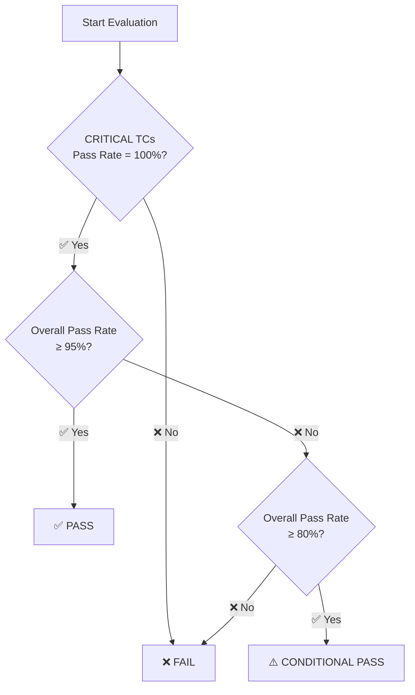

# 📊 Phase 5: Report Aggregation

> **Workflow ID**: WF5  
> **Phase**: 5/5 (Final Phase)  
> **Previous**: [Phase 4 - Parallel Test Execution](./wf4_test_execution.md)

---

## 1. 🎯 Purpose

Aggregate all test results from Phase 4 into a structured **final report**, containing:
- 📊 **Executive Summary** — Pass/Fail/Skip counts and percentages.
- 🔍 **Detailed Analysis** — Root cause analysis for each failed TC.
- 🗺️ **Coverage Matrix** — Maps requirements to test results.
- 💡 **Recommendations** — Action items based on execution outcomes.
- 📋 **Final Conclusion** — PASS / CONDITIONAL PASS / FAIL.
- 📦 **Mandatory Storage**: The final Markdown report and raw JSON report must be saved as `5_final_report.md` and `5_report_raw.json` respectively in the centralized run directory (`test_runs/run_<timestamp>_<run_id>/`).

---

## 2. 📥 Input

| Input | Source | Description |
|---|---|---|
| Merged results table | Phase 4 (WF4) | Combined result table for all test cases |
| Original TestCase suite | Phase 2 (WF2) | TestCase details including Category and Priority |
| SPEC Analysis | Phase 1 (WF1) | Business rules, fields, and constraints |
| Traceability Matrix | Phase 2 (WF2) | Mapping of BR-xxx requirements to TestCase IDs |
| Execution Metadata | Phase 4 (WF4) | Durations and subagent execution statistics |

---

## 3. 📋 Detailed Process

### Overview Table

| Step | Action | Input | Output |
|---|---|---|---|
| 1 | Merge and verify results | Raw results | Verified results table |
| 2 | Calculate statistics | Results table | Statistics tables |
| 3 | Analyze failed TCs | Failed TCs + SPEC | Failure analysis table |
| 4 | Create Coverage Matrix | Results + Traceability | Coverage matrix |
| 5 | Generate Final Report | All outputs above | Markdown report |
| 6 | Save report files | Report content | Saved files |
| 7 | REVIEW GATE | Saved files | Summary in chat + Approval |

---

### 📌 Step 1: Merge and Verify Results

**Actions:**
1. Receive the result tables from Phase 4.
2. Sort them by TestCase ID (TC-001, TC-002, ...).
3. Verify completeness:
   - Count total results.
   - Compare with total TCs from Phase 2.
   - Flag any missing or extra test cases.
4. Resolve duplicates (if any): retain the latest outcome.

**Verification Checklist:**
- [ ] `total_results == total_TCs_from_Phase2`.
- [ ] No TC IDs are missing.
- [ ] No duplicate TC IDs exist.
- [ ] Each result contains all required columns (ID, Name, Status, ...).
- [ ] Status values are strictly PASS, FAIL, or SKIP.

**Example Merged Table:**

| ID | Name | Category | Priority | Status | Input Summary | Expected | Actual | Error Detail |
|---|---|---|---|---|---|---|---|---|
| TC-001 | Small transfer | NORMAL | HIGH | ✅ PASS | amount=500K | APPROVED | APPROVED | — |
| TC-002 | Medium transfer | NORMAL | HIGH | ✅ PASS | amount=50M | APPROVED | APPROVED | — |
| TC-003 | Large transfer | NORMAL | CRITICAL | ✅ PASS | amount=300M | APPROVED | APPROVED | — |
| TC-010 | BVA: min | BOUNDARY | HIGH | ✅ PASS | amount=1 | APPROVED | APPROVED | — |
| TC-012 | BVA: min-1 | BOUNDARY | HIGH | ❌ FAIL | amount=0 | REJECTED | APPROVED | amount=0 not validated |
| TC-031 | Logic: insuf bal | LOGIC | CRITICAL | ❌ FAIL | balance<amount | REJECTED | APPROVED | Balance not checked |
| TC-050 | Neg: txid null | NEGATIVE | HIGH | ✅ PASS | txid=null | REJECTED | REJECTED | — |
| TC-057 | Neg: SQL inj | NEGATIVE | MEDIUM | ⏭️ SKIP | desc=injection | REJECTED | — | Cannot test injection in this env |

---

### 📌 Step 2: Calculating Statistics

**2.1 General Statistics:**

```
📊 GENERAL STATISTICS
========================
Total TestCases:      50
✅ Passed:            42 (84.0%)
❌ Failed:             6 (12.0%)
⏭️ Skipped:            2 (4.0%)
━━━━━━━━━━━━━━━━━━━━━━
Pass Rate:           84.0%
```

**2.2 Statistics by Category:**

| Category | Total | ✅ Pass | ❌ Fail | ⏭️ Skip | Pass Rate |
|---|---|---|---|---|---|
| NORMAL | 5 | 5 | 0 | 0 | 100.0% ✅ |
| BOUNDARY | 12 | 10 | 2 | 0 | 83.3% ⚠️ |
| LOGIC | 8 | 5 | 3 | 0 | 62.5% ❌ |
| STATE | 7 | 7 | 0 | 0 | 100.0% ✅ |
| NEGATIVE | 10 | 9 | 0 | 1 | 90.0% ⚠️ |
| EDGE | 8 | 6 | 1 | 1 | 75.0% ⚠️ |
| **TOTAL** | **50** | **42** | **6** | **2** | **84.0%** |

**2.3 Statistics by Priority:**

| Priority | Total | ✅ Pass | ❌ Fail | ⏭️ Skip | Pass Rate |
|---|---|---|---|---|---|
| CRITICAL | 8 | 7 | 1 | 0 | 87.5% ⚠️ |
| HIGH | 18 | 16 | 2 | 0 | 88.9% ⚠️ |
| MEDIUM | 16 | 13 | 2 | 1 | 81.3% ⚠️ |
| LOW | 8 | 6 | 1 | 1 | 75.0% ⚠️ |
| **TOTAL** | **50** | **42** | **6** | **2** | **84.0%** |

**2.4 Statistics by Automation Level:**

| Automation Level | Total | ✅ Pass | ❌ Fail | ⏭️ Skip (Handoff) | Pass Rate |
|---|---|---|---|---|---|
| Level 1 (Auto) | 35 | 32 | 3 | 0 | 91.4% |
| Level 2 (Human-in-loop) | 10 | 10 | 0 | 0 | 100.0% |
| Level 3 (Manual Handoff) | 5 | 0 | 0 | 5 | 0.0% (N/A) |
| **TOTAL** | **50** | **42** | **3** | **5** | **93.3%** |

**Formula:**
```
Pass Rate = (Passed / (Total - Skipped)) × 100%
```

> ⚠️ **Note**: Pass Rate is calculated based on executed test cases only (excluding Skipped/Handoff).

---

### 📌 Step 3: Analyzing Failed TestCases

**For EACH failed TC, analyze:**

1. **Root Cause**: Compare Expected vs Actual outcomes to pinpoint the failure.
2. **SPEC Reference**: Identify the violated business rule or constraint.
3. **Recommendation**: Propose a resolution or investigation direction (only reporting, no code changes).
4. **Severity**: Grade the defect severity.

**Failure Analysis Table Format:**

| TC ID | Category | Priority | Root Cause | SPEC Reference | Recommendation | Severity |
|---|---|---|---|---|---|---|
| TC-012 | BOUNDARY | HIGH | Expected: REJECTED when amount=0, Actual: APPROVED | BR-001: amount must be > 0 | Fix validation: check for amount > 0 | 🔴 High |
| TC-013 | BOUNDARY | HIGH | Expected: REJECTED when amount=500M+1, Actual: APPROVED | BR-001: amount ≤ 500M | Fix validation: check upper boundary | 🔴 High |
| TC-031 | LOGIC | CRITICAL | Expected: REJECTED when balance < amount, Actual: APPROVED | BR-004: Balance ≥ amount + fee | Fix: implement balance check before approval | 🔴 Critical |
| TC-032 | LOGIC | HIGH | Expected: REJECTED when bank_code invalid, Actual: APPROVED | BR-003: bank_code in whitelist | Fix: validate bank_code against whitelist | 🟡 Medium |
| TC-056 | NEGATIVE | MEDIUM | Expected: REJECTED for Feb 30th, Actual: APPROVED | BR-007: Date must be valid | Fix: validate calendar date logic | 🟡 Medium |
| TC-072 | EDGE | LOW | Expected: REJECTED for XSS payload, Actual: APPROVED | Implicit: input sanitization | Add input sanitization | 🟠 Low |

**Severity Levels:**

| Severity | Criteria | Action |
|---|---|---|
| 🔴 Critical | Affects data integrity, financial calculations | Fix immediately, blocks release |
| 🔴 High | Validation bypass, security concern | Fix prior to release |
| 🟡 Medium | Edge case, non-critical logic | Fix within the current sprint |
| 🟠 Low | Cosmetic issues, rare scenarios | Fix when resources permit |

**Pattern Analysis (Identify Systemic Issues):**

Group related failures:

```
🔍 PATTERN ANALYSIS
====================
Pattern 1: "Amount validation missing"
  - TC-012: amount = 0 not rejected
  - TC-013: amount = 500M+1 not rejected
  → Root cause: Amount boundary validation is missing or bypassed
  → Impact: 2 TCs, Category: BOUNDARY, Priority: HIGH
  → Recommended Fix: Implement comprehensive amount validation

Pattern 2: "Balance verification failure"
  - TC-031: Insufficient balance not rejected
  → Root cause: Balance check logic is un-implemented
  → Impact: 1 TC, Category: LOGIC, Priority: CRITICAL
  → Recommended Fix: Implement balance verification before approving transaction
```

---

### 📌 Step 4: Creating the Coverage Matrix

**Map each SPEC requirement to test outcomes:**

| Requirement ID | Description | TestCase IDs | Pass | Fail | Status |
|---|---|---|---|---|---|
| BR-001 | Validate amount (1-500M) | TC-001, TC-002, TC-003, TC-010, TC-011, TC-012, TC-013, TC-034 | 6 | 2 | ⚠️ Partial |
| BR-002 | Calculate transfer fee | TC-001, TC-002, TC-003, TC-030 | 4 | 0 | ✅ All Pass |
| BR-003 | Validate bank code | TC-001, TC-032, TC-054 | 2 | 1 | ⚠️ Partial |
| BR-004 | Check balance | TC-031, TC-030 | 1 | 1 | ⚠️ Partial |
| BR-005 | Handle duplicate tx | TC-060 | 1 | 0 | ✅ All Pass |
| BR-006 | Daily limit of tx | TC-061 | 1 | 0 | ✅ All Pass |
| BR-007 | Transaction date format | TC-055, TC-056 | 1 | 1 | ⚠️ Partial |

**Status Legend:**
- ✅ **All Pass**: All test cases mapping to this requirement passed.
- ⚠️ **Partial**: Some test cases passed, while others failed.
- ❌ **All Fail**: All test cases mapping to this requirement failed.
- ⬜ **Not Tested**: No test cases were executed (all skipped).

**Coverage Summary:**

```
📋 COVERAGE SUMMARY
====================
Total Requirements:     7
✅ All Pass:            3 (42.9%)
⚠️ Partial:            4 (57.1%)
❌ All Fail:            0 (0.0%)
⬜ Not Tested:          0 (0.0%)
━━━━━━━━━━━━━━━━━━━━━━━
Requirement Coverage:  100% (all requirements have mapped TCs)
Full Pass Coverage:    42.9%
```

---

### 📌 Step 5: Compiling Manual Integration Testing Handoff List

**Principles:**
- Level 3 test cases cannot be executed programmatically and must be Triaged as Level 3.
- The Agent must compile these test cases into a highly detailed and structured Handoff List inside the final report so human testers can execute them manually.
- The Handoff List must contain explicit step-by-step instructions, expected outputs, and reasons for triage. **Absolutely no placeholders or summary descriptions are allowed.**

**How to Implement:**
1. Filter the merged results table and Phase 2 TestCase suite for all test cases marked as `Level 3` (Status: `⏭️ SKIP`, detail: `HANDOFF`).
2. Construct the **Manual Handoff List** with the following fields:
   - **TC ID**: Unique test case identifier (e.g., `TC-045`).
   - **TestCase Name**: The title of the test case.
   - **Triage Reason / Constraints**: Clear explanation of why this case must be tested manually (e.g., requires external bank sandbox UI verification, physical OTP device validation).
   - **Handoff Instructions / Steps**: Comprehensive, step-by-step instructions for human testers to execute the test manually (e.g., 1. Log in to portal with user A; 2. Click Transfer; 3. Verify OTP modal).
   - **Expected Outcome**: Detailed expected behavior and artifacts to verify (e.g., Transaction status updated to SUCCESS; SMS received with code).
3. Populate all columns fully by extracting the detailed test steps and expected results defined during Phase 2.
4. Incorporate this list into Section 6 of the final report.

---

### 📌 Step 6: Generating the Final Report

**OFFICIAL Report Template:**

```markdown
# 📊 AUTOMATED TESTING REPORT
## {SPEC Name / Batch Name}
### Execution Date: {YYYY-MM-DD HH:MM}

---

## 1. 📋 Executive Summary

| Metric | Value |
|---|---|
| Total TestCases | {total} |
| ✅ Passed | {passed} ({pass_pct}%) |
| ❌ Failed | {failed} ({fail_pct}%) |
| ⏭️ Skipped | {skipped} ({skip_pct}%) |
| Pass Rate | {pass_rate}% |
| **Final Conclusion** | **{PASS / CONDITIONAL PASS / FAIL}** |

### Summary Conclusion
{1-3 sentences summarizing main outcomes and key highlights}

---

## 2. 📈 Detailed Statistics

### 2.1 By Category

| Category | Total | ✅ Pass | ❌ Fail | ⏭️ Skip | Pass Rate |
|---|---|---|---|---|---|
{category_stats_rows}
| **TOTAL** | **{total}** | **{passed}** | **{failed}** | **{skipped}** | **{pass_rate}%** |

### 2.2 By Priority

| Priority | Total | ✅ Pass | ❌ Fail | ⏭️ Skip | Pass Rate |
|---|---|---|---|---|---|
{priority_stats_rows}
| **TOTAL** | **{total}** | **{passed}** | **{failed}** | **{skipped}** | **{pass_rate}%** |

### 2.3 By Automation Level

| Automation Level | Total | ✅ Pass | ❌ Fail | ⏭️ Skip (Handoff) | Pass Rate |
|---|---|---|---|---|---|
{level_stats_rows}
| **TOTAL** | **{total}** | **{passed}** | **{failed}** | **{skipped}** | **{pass_rate}%** |

---

## 3. 📝 Detailed Results

| ID | Name | Category | Priority | Automation Level | Status | Input | Expected | Actual | Error |
|---|---|---|---|---|---|---|---|---|---|
{all_result_rows}

---

## 4. 🔍 Failed TestCases Analysis

### 4.1 Individual Failure Details

| TC ID | Category | Priority | Root Cause | SPEC Ref | Recommendation | Severity |
|---|---|---|---|---|---|---|
{failed_analysis_rows}

### 4.2 Pattern Analysis
{pattern_analysis_if_applicable}

---

## 5. 🗺️ Coverage Matrix

| Requirement ID | Description | TestCase IDs | Pass | Fail | Status |
|---|---|---|---|---|---|
{coverage_matrix_rows}

### Coverage Summary
- Total Requirements: {total_reqs}
- ✅ All Pass: {all_pass_count} ({all_pass_pct}%)
- ⚠️ Partial: {partial_count} ({partial_pct}%)
- ❌ All Fail: {all_fail_count} ({all_fail_pct}%)

---

## 6. 📋 Manual Integration Testing Handoff List
This list contains Level 3 testcases that require manual execution by human testers.

| TC ID | TestCase Name | Triage Reason / Constraints | Handoff Instructions / Steps | Expected Outcome |
|---|---|---|---|---|
{handoff_list_rows}

---

## 7. 💡 Conclusions and Recommendations

### 7.1 Overall Conclusion
{overall_conclusion}

### 7.2 Recommendations
{action_items_numbered_list}

### 7.3 Remaining Risks
{remaining_risks}

---

## 8. 📎 Metadata

| Metric | Value |
|---|---|
| SPEC Name | {spec_name} |
| Execution Date | {date} |
| Total Duration | {duration} |
| Tokens Used | {tokens_used} |
| Num SubAgents | {num_subagents} |
| Pipeline Version | 1.3.0 |
```

---

### 📌 Step 7: Saving the Report

**Filename Rules:**
All reports belonging to a single run must be saved in the centralized run directory: `test_runs/run_<timestamp>_<run_id>/`:
- Main Markdown report: `5_final_report.md`
- Raw JSON report: `5_report_raw.json`

**Example Paths:**
```
test_runs/run_20260605_150000_abc123/5_final_report.md
test_runs/run_20260605_150000_abc123/5_report_raw.json
```

**JSON Raw Data Structure:**

```json
{
  "report_metadata": {
    "spec_name": "Interbank Transfer Transaction Processing Batch",
    "execution_date": "2026-06-05T14:30:00+07:00",
    "total_duration_seconds": 242,
    "total_tokens_used": 150000,
    "pipeline_version": "1.2.0"
  },
  "summary": {
    "total": 50,
    "passed": 42,
    "failed": 6,
    "skipped": 2,
    "pass_rate": 84.0
  },
  "results": [
    {
      "id": "TC-001",
      "name": "Small transfer",
      "category": "NORMAL",
      "priority": "HIGH",
      "status": "PASS",
      "input_summary": "amount=500000",
      "expected": "APPROVED",
      "actual": "APPROVED",
      "error_detail": null
    }
  ],
  "failed_analysis": [...],
  "coverage_matrix": [...],
  "statistics": {
    "by_category": {...},
    "by_priority": {...}
  },
  "conclusion": "CONDITIONAL PASS"
}
```

---

### 📌 Step 8: REVIEW GATE

**Detailed Description:**
This is the final quality check before concluding the pipeline. The process includes performing a brainstorming quality analysis of the generated report, printing the summary report and **the detailed Handoff List** directly in the agent chat (DO NOT create a separate phase report file on disk), and obtaining user approval.

1. **Agent Brainstorming**:
   - Assess the final report completeness: verify all sections are populated, statistics are correct, and conclusions are properly justified.
   - Verify that the Handoff List matches the Level 3 skipped TCs and contains highly detailed, actionable steps.
   - Self-check against the checklist below.
2. **Print Phase Summary & Handoff List**:
   - Print a summary of Phase 5 results (Final report status, conclusion, total duration, tokens used, and handoff count) directly in the agent chat conversation.
   - **Mandatory Display**: Print the complete, detailed **Manual Integration Testing Handoff List** (Markdown Table containing TC ID, Name, Triage Reason, Instructions, and Expected Outcome) directly in the chat. This ensures that the user can immediately review all manual test cases and their instructions in the main chat.
3. **Present Options via ask_question**:
   - The Agent calls the `ask_question` tool in the detected language to ask:
     - **Question**: "Is the Final Report (Phase 5) satisfactory?"
     - **Options**:
       - "(Recommended) The report is complete. Finish the pipeline."
       - "There are issues, I want to adjust the report."
4. **Wait for Response**: The pipeline blocks until the user responds to the `ask_question` modal.

**Review Gate 5 Checklist:**

```
REVIEW GATE 5 - CHECKLIST
==========================

□ 1. Completeness
  □ All test cases are accounted for in the results table.
  □ Passed + Failed + Skipped (Handoff) = Total.
  □ Category, Priority, and Automation Level statistics sum up to Total.
  □ Handoff List (Section 6) contains all Level 3 test cases.

□ 2. Accuracy
  □ Pass rates are calculated correctly (excluding skipped/handoff TCs).
  □ Coverage matrix aligns with test execution outcomes.
  □ Conclusion criteria are applied properly.

□ 3. Analysis Quality
  □ Every failed TC has a root cause analysis.
  □ Every failed TC lists a SPEC reference.
  □ Every failed TC has a recommendation.
  □ Pattern analysis is performed (for related failures).

□ 4. Coverage Matrix
  □ All requirements are listed in the matrix.
  □ Statuses are accurate (All Pass / Partial / All Fail).
  □ TestCase IDs are mapped correctly.

□ 5. Report Format
  □ Strict adherence to the template.
  □ No placeholders or TBD values remain.
  □ Conclusion is clear (PASS/CONDITIONAL PASS/FAIL).
  □ Actionable recommendations are listed.
  □ Total Duration and Tokens Used are correctly recorded.
  □ User approval has been obtained.
```

**Decision:**
- **Approved by user (Option 1 selected in ask_question)** -> Pipeline completes successfully.
- **Adjustments requested (Option 2 selected in ask_question)** -> Ask the user for feedback in chat, update the final report as requested, and repeat Review Gate 5.

---

## 4. ✅ Quality Checks

Before finalizing the report, perform quality checks:

```
QUALITY CHECK CHECKLIST
========================

□ 1. Completeness
  □ All test cases are accounted for in the results table.
  □ Passed + Failed + Skipped = Total.
  □ Category statistics sum up to Total.
  □ Priority statistics sum up to Total.

□ 2. Accuracy
  □ Pass rates are calculated correctly.
  □ Coverage matrix aligns with test execution outcomes.
  □ Conclusion criteria are applied properly.

□ 3. Analysis Quality
  □ Every failed TC has a root cause analysis.
  □ Every failed TC lists a SPEC reference.
  □ Every failed TC has a recommendation.
  □ Pattern analysis is performed (for related failures).

□ 4. Coverage Matrix
  □ All requirements are listed in the matrix.
  □ Statuses are accurate (All Pass / Partial / All Fail).
  □ TestCase IDs are mapped correctly.

□ 5. Report Format
  □ Strict adherence to the template.
  □ No placeholders or TBD values remain.
  □ Conclusion is clear (PASS/CONDITIONAL PASS/FAIL).
  □ Actionable recommendations are listed.
```

---

## 5. 👑 Conclusion Criteria

### Evaluation Rules:

| Conclusion | Condition | Description |
|---|---|---|
| ✅ **PASS** | Pass Rate ≥ 95% **AND** CRITICAL TCs pass = 100% | The system meets requirements, ready to release. |
| ⚠️ **CONDITIONAL PASS** | Pass Rate ≥ 80% **OR** CRITICAL TCs pass = 100% but HIGH TCs have failures | minor fixes needed before release. |
| ❌ **FAIL** | Pass Rate < 80% **OR** any CRITICAL TCs fail | The system does not meet requirements, requires fixes and retest. |

### Evaluation Flowchart:



---

## 6. 💡 Tips

### ✅ Best Practices

1. **Verify Statistics**: Ensure Pass + Fail + Skip always sums to Total.
2. **Group Failures**: Identify failure patterns to highlight systemic issues rather than enumerating individual bugs.
3. **Prioritize Failures**: Structure recommendations starting from CRITICAL down to HIGH and MEDIUM.
4. **Cite SPEC**: Quote specific SPEC sections in the failure analysis report.
5. **Actionable Recommendations**: Make recommendations specific (e.g., "Add amount > 0 check to function X") rather than generic.

### ❌ Common Mistakes

| # | Mistake | Consequence | How to Avoid |
|---|---|---|---|
| 1 | Mismatched statistics | Unreliable report | Verify: P + F + S = Total |
| 2 | Missing failure analysis | Lack of direction on what to fix | Every FAIL must have a root cause analysis |
| 3 | Incomplete coverage matrix | Missed gaps in verification | Cross-check with Phase 2 traceability matrix |
| 4 | Conclusion violates criteria | Incorrect assessment | Adhere strictly to the flowchart |
| 5 | Lacking action items | Report is not actionable | Map each failure pattern to a concrete action item |

---

## 6.5 ⚠️ Critical Rules

1. **Testing Source Code Only (No code changes during test)**:
   - Execute testing on the existing application code as-is. Absolutely no modifications to the production code are permitted.
   - If a bug is found in the application, do not change the testcase or expected output to hide the issue. Record the bug details transparently in the final report without attempting to fix the source code.
2. **Centralized Output Storage**:
   - Write the aggregated final report to `5_final_report.md` and save the raw report data to `5_report_raw.json` inside the centralized run directory: `test_runs/run_<timestamp>_<run_id>/`.
3. **Language Alignment Rule**:
   - Inspect the input SPEC/prompt to determine the execution language.
   - All generated output files, log outputs (including execution status logs shown to the user), internal reasoning/thinking blocks, and all chat communications must be written in the **exact same language** as detected (e.g., if the user prompts in Japanese, your thoughts, logs, and answers must be entirely in Japanese without mixing English or Vietnamese).

---

## 7. 📚 References

- **Previous Phase**: [WF4 - Parallel Test Execution](./wf4_test_execution.md)
- **Pipeline Overview**: [README](./README.md)
- **Full Pipeline**: [WF Full Pipeline](./wf_full_pipeline.md)

---

> 📌 **Reminder**: The report is the FINAL PRODUCT that stakeholders will read. Ensure it is clear, accurate, and actionable. A good report not only presents the statistics but also EXPLAINS why failures occurred and PROPOSES concrete next steps.
