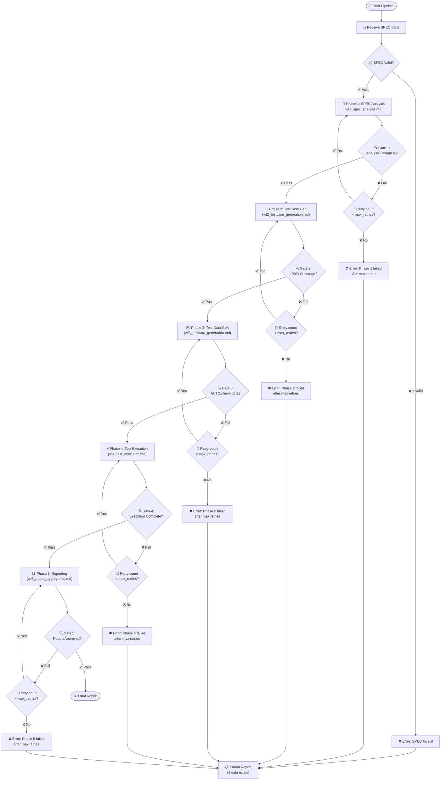
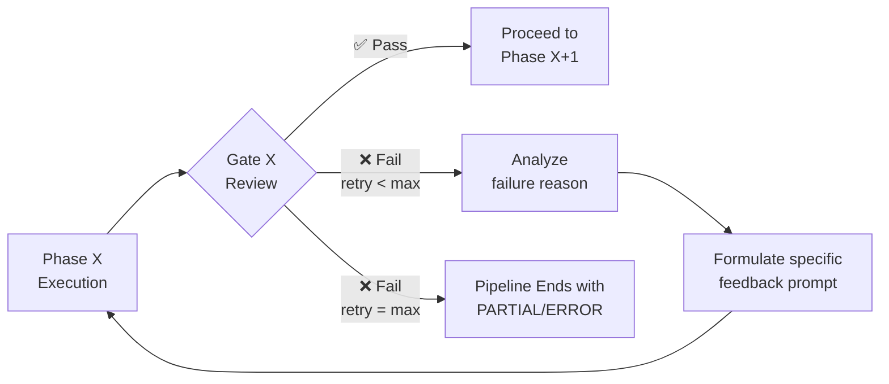
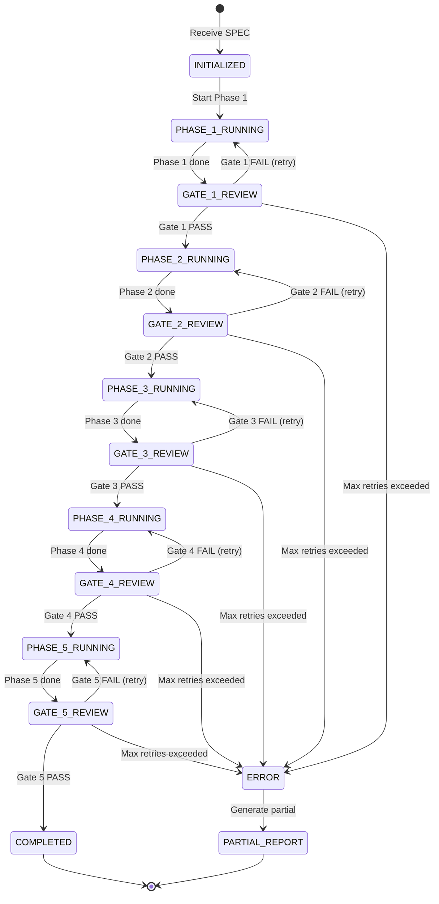

# 🚀 Full Pipeline Orchestrator

> **Workflow ID**: WF-FULL  
> **Type**: Master Orchestrator  
> **Role**: Main entry point — orchestrates all 5 phases from SPEC input to final reporting.

---

## 1. 🎯 Purpose

Provide a **single entry point** to run the **entire automated testing pipeline**:
- 📄 Receive SPEC input.
- 🔄 Sequentially execute 5 phases with interactive review gates.
- 🔁 Automatically retry when a phase fails its gate.
- 📊 Export the final test report.

**Benefits:**
- ✅ **Simple**: Run the entire pipeline with a single prompt.
- ✅ **Automated**: The orchestrator handles gates, retries, and error recovery.
- ✅ **Reliable**: Each phase is verified before the pipeline proceeds.
- ✅ **Resumable**: Saves state to resume execution if interrupted.

---

## 2. 📥 Input

### Mandatory Input

| Parameter | Description | Example |
|---|---|---|
| `spec_input` | SPEC document (file path OR direct content) | `/path/to/spec.md` or raw SPEC content |

### Configuration (Optional)

```json
{
  "max_subagents": 5,
  "max_retries": 2,
  "output_dir": "./reports",
  "spec_format": "auto",
  "log_level": "INFO",
  "timeout_per_phase_minutes": 15,
  "timeout_per_subagent_minutes": 10
}
```

**Configuration Details:**

| Parameter | Default | Description |
|---|---|---|
| `max_subagents` | 5 | Maximum number of subagents running in parallel in Phase 4 |
| `max_retries` | 2 | Maximum retry attempts for each phase upon gate failure |
| `output_dir` | `./reports` | Output directory for reports and raw results |
| `spec_format` | `auto` | SPEC format: `auto`, `markdown`, `text`, `pdf` |
| `log_level` | `INFO` | Log level: `DEBUG`, `INFO`, `WARN`, `ERROR` |
| `timeout_per_phase_minutes` | 15 | Execution timeout per phase (minutes) |
| `timeout_per_subagent_minutes` | 10 | Timeout per subagent in Phase 4 (minutes) |

---

## 2.1 ⚠️ Critical Rules

### 1. Testing Only - No Source Code Modifications
- **Maintain source code integrity**: The sole objective of this pipeline is to test and evaluate the existing application code. Neither the main agent nor the subagents are allowed to modify the application files or insert mockup logic into production files to force test cases to pass.
- **Report bugs when discovered**: If a test case fails due to a bug in the application (deviating from the SPEC), the Agent must not modify the TestCase or Expected Output. The Agent **does not need to fix the bug; instead, they must show the bug and log it in detail in the test report**, keeping the application source code in its original state.

### 2. Centralized Output Storage (Unified Run Directory)
All intermediate and final output files generated throughout the pipeline must be stored together in a single run directory for each execution.
- **Default Storage Path**: `test_runs/run_<timestamp>_<run_id>/`
- **Mandatory Output Files per Phase**:
  - **Phase 1 Output**: `1_spec_analysis.md` (SPEC analysis document)
  - **Phase 2 Output**: `2_testcases.md` (TestCase list)
  - **Phase 3 Output**: `3_testdata.json` (JSON test data)
  - **Phase 4 Output**: `4_execution_results.json` and `4_execution_log.txt` (Raw test outcomes and log)
  - **Phase 5 Output**: `5_final_report.md` (Markdown report with duration and token usage) and `5_report_raw.json` (Raw JSON report data)

### 3. Language Alignment Rule
- **Input Language Inspection**: The Agent (including the main orchestrator agent and all subagents) must inspect the language of the input SPEC document or user prompt to determine the execution language.
- **Output and Conversation Language**: All generated output files (SPEC analysis, test cases, test data, test results, and final reports), log outputs (including execution status logs shown to the user), internal reasoning/thinking blocks, and all chat communications (logs, status updates, agent answers, and user interactions) must be written in the **exact same language** as detected (e.g., if the SPEC or user prompt is in Japanese, all thinking, logging, and replies must be entirely in Japanese without mixing English or Vietnamese).

### 4. Sandbox Permission Optimization
- **Proactive Authorization**: At the very beginning of the pipeline execution, the Agent must proactively invoke the `ask_permission` tool with `Action="write_file"` and `Target` set to the absolute path of the workspace. This registers write authorization once and enables automated file/folder creation under `test_runs/` without repeatedly showing permission prompts.

---

## 3. 🔄 Pipeline Flow Diagram



---

## 4. 📋 Orchestration Logic — Step-by-Step Details

---

### 🔹 Step 1: Receive SPEC Input

```
[{timestamp}] [PIPELINE] [INFO] Pipeline started
[{timestamp}] [STEP-1]  [INFO] Receiving SPEC input...
```

**Actions:**
1. **Request Sandbox Write Access**: Call the `ask_permission` tool with `Action="write_file"` and `Target` set to the absolute path of the active workspace. This is required to authorize automatic test run folder creation and file writing without repeatedly prompting the user.
2. Receive `spec_input` from the user.
3. Identify input type:
   - **File Path**: Read file contents.
   - **Direct Content**: Use directly.
4. Validate SPEC:
   - Must not be empty.
   - Must contain meaningful text (> 100 characters).
   - Contains relevant keywords (business rules, fields, constraints).
4. Log: `SPEC received, length={length} chars, format={format}`.

**If SPEC is invalid:**
```
[{timestamp}] [STEP-1] [ERROR] SPEC validation failed: {reason}
→ Terminate pipeline, notify the user.
```

---

### 🔹 Step 2: Execute Phase 1 (WF1 - SPEC Analysis)

```
[{timestamp}] [PHASE-1] [INFO] Starting SPEC Analysis...
```

**Actions:**
1. Read the detailed instructions from `wf1_spec_analysis.md`.
2. Execute each step in WF1:
   - Read SPEC → Extract Business Rules → Extract Fields.
   - Identify Constraints → Create Equivalence Partitions.
   - Identify Error Conditions.
3. Self-review the output against Gate 1 criteria.
4. Log Phase 1 outcomes.

**Phase 1 Output:**
- Business Rules table (BR-001, BR-002, ...).
- Fields table (input + output).
- Constraints table.
- Equivalence Partitions table.
- Error Conditions list.
- **File Storage**: Write the entire analysis to `{run_dir}/1_spec_analysis.md`.

---

### 🔹 Step 3: Gate 1 Review (Interaction + Brainstorming)

```
[{timestamp}] [GATE-1] [INFO] Reviewing Phase 1 output & presenting options...
```

**Interaction Flow:**
1. **Agent Brainstorming**: The Agent automatically reviews the SPEC analysis document against the checklist below, noting assumptions labeled [ASSUMPTION] and any ambiguities.
2. **Print Phase Summary**: Print a summary of Phase 1 results (extracted rules, fields count, constraints, etc.) directly in the agent chat conversation.
3. **Present Options via ask_question**: The Agent calls the `ask_question` tool in the detected language to ask:
   - **Question**: "Is the SPEC analysis (Phase 1) output satisfactory?"
   - **Options**:
     - "(Recommended) Everything is fine, proceed to Phase 2 (TestCase Generation)."
     - "There are issues, I want to adjust or provide feedback."
4. **Wait for Approval**: The pipeline blocks until the user responds to the `ask_question` modal.

**Gate 1 Checklist:**

| # | Check | Verification Method |
|---|---|---|
| 1 | Business Rules have IDs? | Each rule is prefixed with BR-xxx |
| 2 | All fields identified? | Input and output fields tables exist |
| 3 | Specific constraints? | Min, max, formats are defined (not "TBD") |
| 4 | Equivalence Partitions? | Each field has ≥ 1 valid and ≥ 1 invalid partition |
| 5 | Error Conditions? | List of ERR-xxx with expected behaviors |
| 6 | No "TBD" values? | Search "TBD", "unclear", "TODO" count = 0 |
| 7 | User approved? | Received Option 1 response |

**If FAIL or user selects Option 2/3:**
```
[{timestamp}] [GATE-1] [WARN] Gate 1 FAILED or adjustment requested.
[{timestamp}] [GATE-1] [INFO] Updating Phase 1 based on feedback (Attempt {n}/{max_retries})
```
→ Return to Step 2 to re-run/update the analysis based on user feedback.

**If PASS (User selects Option 1):**
```
[{timestamp}] [GATE-1] [INFO] Gate 1 PASSED ✅ (Approved by user)
[{timestamp}] [GATE-1] [INFO] Proceeding to Phase 2
```

---

### 🔹 Step 4: Execute Phase 2 (WF2 - TestCase Generation)

```
[{timestamp}] [PHASE-2] [INFO] Starting TestCase Generation...
```

**Actions:**
1. Read instructions from `wf2_testcase_generation.md`.
2. Use Phase 1 output as input.
3. Generate TestCases: Normal → Boundary → Logic → State → Negative.
4. Assign Priority and Category.
5. Create the Traceability Matrix.
6. Self-review against Gate 2 criteria.

**Phase 2 Output:**
- TestCase suite (complete table).
- Traceability Matrix.
- Batch Test Data Matrix.
- Automation Triage Sheet.
- State Transition Table.
- Database CRUD Matrix.
- **File Storage**: Write all test cases, matrices, and tables to `{run_dir}/2_testcases.md`.

---

### 🔹 Step 5: Gate 2 Review (Interaction + Brainstorming)

```
[{timestamp}] [GATE-2] [INFO] Reviewing Phase 2 output & presenting options...
```

**Interaction Flow:**
1. **Agent Brainstorming**: The Agent automatically reviews the TestCase suite and Traceability Matrix against the checklist below, analyzing for duplicates, missed edge cases, or logic conflicts.
2. **Print Phase Summary**: Print a summary of Phase 2 results (TestCase count by category/priority, coverage pct) directly in the agent chat conversation.
3. **Present Options via ask_question**: The Agent calls the `ask_question` tool in the detected language to ask:
   - **Question**: "Is the TestCase generation (Phase 2) output satisfactory?"
   - **Options**:
     - "(Recommended) Everything is fine, proceed to Phase 3 (Test Data Generation)."
     - "There are issues, I want to adjust or provide feedback."
4. **Wait for Approval**: The pipeline blocks until the user responds to the `ask_question` modal.

**Gate 2 Checklist:**

| # | Check | Verification Method |
|---|---|---|
| 1 | 100% requirement coverage? | Traceability Matrix shows each BR maps to ≥ 1 TC |
| 2 | Batch Test Data Matrix coverage? | Batch Test Data Matrix covers 100% of fields & batch scenarios, and documents exclusions |
| 3 | Automation Level triage complete? | Automation Triage Sheet is generated, assigning Level 1, 2, 3 and Level 3 Handoff instructions |
| 4 | Advanced TCs present? | State Transition, CRUD, Mutation, and Resilience TCs are created |
| 5 | TC format correct? | Each TC contains: ID, Name, Category, Priority, Description, Precondition, Input Summary, Expected Output, Automation Level |
| 6 | TC IDs unique? | No duplicate IDs |
| 7 | Includes Normal, Boundary, Negative? | At least 3 categories present |
| 8 | CRITICAL TCs cover core logic? | Core business BRs map to CRITICAL TCs |
| 9 | Three-Amigos review? | Conducted QA, Developer, and BA check |
| 10 | User approved? | Received Option 1 response |

**If FAIL or user selects Option 2/3:**
```
[{timestamp}] [GATE-2] [WARN] Gate 2 FAILED or adjustment requested.
[{timestamp}] [GATE-2] [INFO] Updating Phase 2 based on feedback (Attempt {n}/{max_retries})
```
→ Return to Step 4 to update the TestCase suite based on user feedback.

**If PASS (User selects Option 1):**
```
[{timestamp}] [GATE-2] [INFO] Gate 2 PASSED ✅ (Approved by user)
[{timestamp}] [GATE-2] [INFO] Proceeding to Phase 3
```

---

### 🔹 Step 6: Execute Phase 3 (WF3 - Test Data Generation)

```
[{timestamp}] [PHASE-3] [INFO] Starting Test Data Generation...
```

**Actions:**
1. Read instructions from `wf3_testdata_generation.md`.
2. Input: Phase 2 TestCase suite + Phase 1 constraints.
3. Generate data: Valid → Boundary → Invalid → Edge → Combination → Volume.
4. Self-review against Gate 3 criteria.

**Phase 3 Output:**
- JSON test data for each TC.
- Coverage matrix (TCs to datasets).
- **File Storage**: Write the complete JSON test data to `{run_dir}/3_testdata.json`.

---

### 🔹 Step 7: Gate 3 Review (Interaction + Brainstorming)

```
[{timestamp}] [GATE-3] [INFO] Reviewing Phase 3 output & presenting options...
```

**Interaction Flow:**
1. **Agent Brainstorming**: The Agent automatically reviews the test data sets against the checklist below, verifying range constraints and checking that invalid data isolates constraints correctly.
2. **Print Phase Summary**: Print a summary of Phase 3 results (Test data files created, TCs covered, JSON verification status) directly in the agent chat conversation.
3. **Present Options via ask_question**: The Agent calls the `ask_question` tool in the detected language to ask:
   - **Question**: "Is the TestData generation (Phase 3) output satisfactory?"
   - **Options**:
     - "(Recommended) Everything is fine, proceed to Phase 4 (Test Execution)."
     - "There are issues, I want to adjust or provide feedback."
4. **Wait for Approval**: The pipeline blocks until the user responds to the `ask_question` modal.

**Gate 3 Checklist:**

| # | Check | Verification Method |
|---|---|---|
| 1 | Programmatic validation passed? | Running `validate_testdata.py` with batch validation config returns SUCCESS (exit code 0) |
| 2 | Each TC has data? | Coverage = 100% |
| 3 | Valid data satisfies constraints? | Verify each field value against constraints |
| 4 | Invalid data isolates constraints? | Violates exactly 1 constraint (Isolation Principle) |
| 5 | Boundary values exact? | Values are exact, not approximations |
| 6 | Mutated files generated? | Mutation TCs have corrupted files stored in target folder |
| 7 | DB pre-state ready? | CRUD and State TCs have setup scripts generated |
| 8 | Resilience triggers prepared? | Trigger scripts exist for simulated failures |
| 9 | JSON valid? | JSON matches templates/testdata_schema.json |
| 10 | User approved? | Received Option 1 response in ask_question |

**If FAIL or user selects Option 2/3:**
```
[{timestamp}] [GATE-3] [WARN] Gate 3 FAILED or adjustment requested.
[{timestamp}] [GATE-3] [INFO] Updating Phase 3 based on feedback (Attempt {n}/{max_retries})
```
→ Return to Step 6 to update the Test Data suite based on user feedback.

**If PASS (User selects Option 1):**
```
[{timestamp}] [GATE-3] [INFO] Gate 3 PASSED ✅ (Approved by user)
[{timestamp}] [GATE-3] [INFO] Proceeding to Phase 4
```

---

### 🔹 Step 8: Execute Phase 4 (WF4 - Parallel Test Execution)

```
[{timestamp}] [PHASE-4] [INFO] Starting Test Execution...
[{timestamp}] [PHASE-4] [INFO] Total TCs: {count}, Level 1 (Auto): {l1_count}, Level 2 (Interactive): {l2_count}, Level 3 (Handoff): {l3_count}
```

**Actions:**
1. Read instructions from `wf4_test_execution.md`.
2. **Generate Test Runner Script**: Read `skills/batch-autotest/templates/run_testcases_template.py`, analyze the batch spec & data schemas, and generate `{run_dir}/run_testcases.py` specifically configured for this batch.
3. **Filter and Execute TCs by Automation Level**:
   - **Level 1 (Fully Automated)**: Group Level 1 TCs, spawn SubAgents concurrently to execute them by calling `{run_dir}/run_testcases.py`. Collect and merge subagent outcomes.
   - **Level 2 (Human-in-the-loop)**: Execute sequentially on the Main Agent using `{run_dir}/run_testcases.py`. Collect execution logs and output files as evidence, present them to the user in the main chat, and prompt the user to approve/reject the proposed verdict via `ask_question`.
   - **Level 3 (Handoff)**: Skip execution, mark as `⏭️ SKIP` (Detail: `HANDOFF`), and save to the Handoff List.
4. Validate completeness of all execution results.
5. **Organize Outputs**: Ensure each test case isolates its files under `{run_dir}/{tc_id}/input/` and `{run_dir}/{tc_id}/output/` folders to keep the run folder clean.

**Phase 4 Output:**
- Merged results table.
- Execution metadata.
- **File Storage**: Save execution results and raw logs to `{run_dir}/4_execution_results.json` and `{run_dir}/4_execution_log.txt`.

---

### 🔹 Step 8.5: Gate 4 Review (Interaction + Brainstorming)

```
[{timestamp}] [GATE-4] [INFO] Reviewing Phase 4 output & presenting options...
```

**Interaction Flow:**
1. **Human-in-the-loop Verdicts**: Orchestrator displays evidence for all `Level 2` test cases and collects user verdicts (PASS/FAIL) via `ask_question`.
2. **Agent Brainstorming**: The Agent reviews the consolidated results (including programmatically executed Level 1, human-approved Level 2, and skipped Level 3 Handoffs).
3. **Print Phase Summary**: Print a summary of Phase 4 results directly in the agent chat conversation (Passed/Failed for Level 1 & 2, skipped/handoff count for Level 3, and duration).
4. **Present Options via ask_question**: The Agent calls the `ask_question` tool in the detected language to ask:
   - **Question**: "Is the Test Execution (Phase 4) output satisfactory?"
   - **Options**:
     - "(Recommended) Everything is fine, proceed to Phase 5 (Report Aggregation)."
     - "There are issues, I want to adjust or rerun tests."
5. **Wait for Approval**: The pipeline blocks until the user responds to the `ask_question` modal.

---

### 🔹 Step 9: Execute Phase 5 (WF5 - Report Aggregation)

```
[{timestamp}] [PHASE-5] [INFO] Starting Report Aggregation...
```

**Actions:**
1. Read instructions from `wf5_report_aggregation.md`.
2. Merge results and calculate statistics.
3. Perform failure analysis.
4. Create the coverage matrix.
5. Calculate total duration and estimated token usage.
6. Generate the final Markdown report including duration and token details.
7. Save report files to the centralized run directory.

**Phase 5 Output:**
- Final consolidated report (Markdown file with duration & token usage).
- Raw report data (JSON file).
- **File Storage**: Save reports to `{run_dir}/5_final_report.md` and `{run_dir}/5_report_raw.json`.

---

### 🔹 Step 9.5: Gate 5 Review (Interaction + Brainstorming)

```
[{timestamp}] [GATE-5] [INFO] Reviewing Phase 5 output & presenting options...
```

**Interaction Flow:**
1. **Agent Brainstorming**: The Agent reviews the generated final report, ensuring all metrics are accurate, conclusions are justified, and the quality checklist is fully met.
2. **Print Phase Summary & Handoff List**:
   - Print a summary of Phase 5 results (Report status, final conclusion, total duration, total tokens) directly in the agent chat conversation.
   - **Mandatory Display**: Print the complete, detailed **Manual Integration Testing Handoff List** (Markdown Table containing TC ID, Name, Triage Reason, Instructions, and Expected Outcome) directly in the chat window.
3. **Present Options via ask_question**: The Agent calls the `ask_question` tool in the detected language to ask:
   - **Question**: "Is the Final Report (Phase 5) satisfactory?"
   - **Options**:
     - "(Recommended) The report is complete. Finish the pipeline."
     - "There are issues, I want to adjust the report."
4. **Wait for Approval**: The pipeline blocks until the user responds to the `ask_question` modal.

---

### 🔹 Step 10: Return Final Report

```
[{timestamp}] [PIPELINE] [INFO] Pipeline COMPLETED
[{timestamp}] [PIPELINE] [INFO] Duration: {duration}
[{timestamp}] [PIPELINE] [INFO] Tokens Used: {tokens_used}
[{timestamp}] [PIPELINE] [INFO] Report saved to: {report_path}
[{timestamp}] [PIPELINE] [INFO] Conclusion: {PASS/CONDITIONAL PASS/FAIL}
```

**Return values:**
- Path to the final report.
- Summary statistics.
- Total duration.
- Tokens used.
- Final conclusion (PASS / CONDITIONAL PASS / FAIL).

---

## 5. 🚪 Gate Definitions Summary

| Gate | Post Phase | Detailed Criteria | Review Mechanism |
|---|---|---|---|
| **Gate 1** | WF1 (SPEC Analysis) | ① All BRs have IDs ② All fields have types ③ All constraints have specific values ④ Partitions created ⑤ Error conditions listed ⑥ No TBDs | Summary in chat + `ask_question` tool |
| **Gate 2** | WF2 (TestCase Gen) | ① 100% requirement coverage ② Batch Test Data Matrix 100% coverage ③ Automation Triage Sheet complete ④ TestCase format valid ⑤ State, CRUD, Mutation, Resilience TCs present ⑥ CRITICAL TCs cover core logic ⑦ Three-Amigos review conducted | Summary in chat + `ask_question` tool |
| **Gate 3** | WF3 (TestData Gen) | ① All TCs have data ② Valid data satisfies constraints ③ Isolation principle followed ④ Exact boundaries ⑤ Mutated input files & DB pre-state generated ⑥ Resilience triggers prepared ⑦ Valid JSON format | Summary in chat + `ask_question` tool |
| **Gate 4** | WF4 (Test Execution) | ① All subagents complete execution ② Level 2 manual verdicts approved ③ Level 3 test cases skipped & handed off ④ Results merged completely ⑤ Execution log generated | Summary in chat + `ask_question` tool |
| **Gate 5** | WF5 (Reporting) | ① Final report generated ② Statistics calculated ③ Coverage matrix complete ④ Duration & Tokens recorded | Summary in chat + `ask_question` tool |

### Retry Strategy for each Gate:



**Retry Principles:**
1. **Attempt 1**: Retry with specific prompts targeting missing items.
2. **Attempt 2**: Retry with more detailed instructions and illustrative examples.
3. **Exceeded max retries**: Terminate the pipeline and output a partial report.

---

## 6. ⚠️ Error Handling and Recovery

### Ambiguous or Incomplete SPEC
- Log a warning indicating the ambiguous section.
- Formulate concrete constraints using assumptions labeled [ASSUMPTION].
- Save issues in the "Issues Detected in SPEC" table in the output report.

### Phase Failure after Max Retries
- Terminate the pipeline.
- Generate a partial report documenting results achieved up to the failure point.
- Set pipeline status to `PARTIAL`.
- Notify the user with suggestions for manual SPEC adjustments.

### SubAgent Failures (Phase 4)
- Follow instructions in `wf4_test_execution.md`: retry the failed group (up to 2 times).
- If it still fails, mark TCs in that group as `SKIP` with the failure reason and continue.

### System Errors
- Log the full stack trace.
- Save the current pipeline state (last successful gate, completed outputs, error logs).
- Exit pipeline with status `ERROR`.

### Resuming the Pipeline
- If interrupted, the pipeline can be resumed:
  1. Identify the last successful gate.
  2. Load outputs from the completed phases.
  3. Resume execution from the next phase.

---

## 7. 📝 Logging and Observability

### Log Format

```
[{timestamp}] [{component}] [{level}] {message}
```

**Components:**
- `PIPELINE`: Master Orchestrator events.
- `PHASE-1` to `PHASE-5`: Phase-specific events.
- `GATE-1` to `GATE-3`: Gate review events.
- `SUBAGENT`: SubAgent-specific execution events.

**Levels:**
- `DEBUG`: In-depth execution details.
- `INFO`: Normal execution flow messages.
- `WARN`: Warnings (retries, partial outcomes).
- `ERROR`: Critical failures.

### Log File

```
Saved as: {output_dir}/pipeline_log_{date}.txt
```

**Example Log Output:**
```
[2026-06-05T14:30:00] [PIPELINE] [INFO] Pipeline started
[2026-06-05T14:30:00] [PIPELINE] [INFO] SPEC received: batch_chuyen_khoan.md (2,500 chars)
[2026-06-05T14:30:01] [PIPELINE] [INFO] Configuration: max_subagents=5, max_retries=2
[2026-06-05T14:30:01] [PHASE-1] [INFO] Starting SPEC Analysis
[2026-06-05T14:33:15] [PHASE-1] [INFO] Extracted 7 business rules
[2026-06-05T14:33:16] [PHASE-1] [INFO] Extracted 8 input fields, 5 output fields
[2026-06-05T14:33:17] [PHASE-1] [INFO] Phase 1 completed in 196 seconds
[2026-06-05T14:33:17] [GATE-1]  [INFO] Reviewing Phase 1 output...
[2026-06-05T14:33:18] [GATE-1]  [INFO] Gate 1 PASSED ✅
[2026-06-05T14:33:18] [PHASE-2] [INFO] Starting TestCase Generation
[2026-06-05T14:36:45] [PHASE-2] [INFO] Generated 50 testcases
[2026-06-05T14:36:46] [PHASE-2] [INFO] Traceability: 7/7 requirements covered (100%)
[2026-06-05T14:36:46] [GATE-2]  [INFO] Gate 2 PASSED ✅
[2026-06-05T14:36:47] [PHASE-3] [INFO] Starting Test Data Generation
[2026-06-05T14:39:30] [PHASE-3] [INFO] Generated data for 50/50 testcases
[2026-06-05T14:39:30] [GATE-3]  [INFO] Gate 3 PASSED ✅
[2026-06-05T14:39:31] [PHASE-4] [INFO] Starting Parallel Test Execution
[2026-06-05T14:39:31] [SUBAGENT] [INFO] Spawning 5 subagents (10 TCs each)
[2026-06-05T14:42:45] [SUBAGENT] [INFO] All subagents completed
[2026-06-05T14:42:46] [PHASE-4] [INFO] Merged results: 50 TCs
[2026-06-05T14:42:46] [PHASE-5] [INFO] Starting Report Aggregation
[2026-06-05T14:43:30] [PHASE-5] [INFO] Report generated: CONDITIONAL PASS (84% pass rate)
[2026-06-05T14:43:31] [PHASE-5] [INFO] Report saved to: ./reports/report_batch_chuyen_khoan_2026-06-05.md
[2026-06-05T14:43:31] [PIPELINE] [INFO] Pipeline COMPLETED in 13 minutes 31 seconds
[2026-06-05T14:43:31] [PIPELINE] [INFO] Conclusion: CONDITIONAL PASS
```

---

## 8. 💻 Usage Examples

### Example 1: Run Pipeline with a SPEC File

```
Prompt for Agent:
"Please execute automated testing for the following SPEC.
Use the workflow described in /workflows/wf_full_pipeline.md

SPEC file: /path/to/batch_chuyen_khoan_spec.md"
```

### Example 2: Run Pipeline with Inline SPEC

```
Prompt for Agent:
"Please execute automated testing for the following SPEC.
Use the workflow described in /workflows/wf_full_pipeline.md

SPEC:
# Interbank Transfer Transaction Processing Batch

## 1. Description
The system receives transaction files from partner banks, validates data,
calculates fees, and records transactions in core banking.

## 2. Input Format
- transaction_id: String(20), required
- source_account: String(10-16), required
- amount: Decimal(1-500,000,000), required
- bank_code: String(3-8), required, values: VCB, TCB, ACB, MBB
- transaction_date: Date(YYYYMMDD), required

## 3. Business Rules
- BR-001: amount must be > 0 and ≤ 500,000,000
- BR-002: Fee = max(10,000, min(50,000, amount × 0.05%))
- BR-003: bank_code must be in the whitelist
..."
```

### Example 3: Run Pipeline with Custom Configuration

```
Prompt for Agent:
"Please run automated testing with the following configuration:
- max_subagents: 3
- max_retries: 1
- output_dir: ./test_reports

Workflow: /workflows/wf_full_pipeline.md
SPEC: [SPEC content]"
```

### Expected Timeline

```
T = 0:00  Pipeline started
T = 0:01  SPEC received & validated
T = 3:00  Phase 1 completed (SPEC Analysis)
T = 3:01  Gate 1 PASSED
T = 6:00  Phase 2 completed (TestCase Generation)
T = 6:01  Gate 2 PASSED
T = 9:00  Phase 3 completed (Test Data Generation)
T = 9:01  Gate 3 PASSED
T = 9:02  Phase 4 started (Parallel Execution)
T = 12:00 Phase 4 completed (All subagents done)
T = 13:00 Phase 5 completed (Report Generated)
T = 13:01 Pipeline COMPLETED
          Total duration: ~13 minutes
```

---

## 9. 📊 Pipeline Status Diagram



---

## 10. 📚 References

### Workflow Files

| Phase | File | Description |
|---|---|---|
| Overview | [README.md](./README.md) | Overview of all workflows |
| Phase 1 | [wf1_spec_analysis.md](./wf1_spec_analysis.md) | SPEC Receipt and Analysis |
| Phase 2 | [wf2_testcase_generation.md](./wf2_testcase_generation.md) | TestCase Generation from SPEC Analysis |
| Phase 3 | [wf3_testdata_generation.md](./wf3_testdata_generation.md) | Test Data Generation |
| Phase 4 | [wf4_test_execution.md](./wf4_test_execution.md) | Parallel Test Execution (SubAgents) |
| Phase 5 | [wf5_report_aggregation.md](./wf5_report_aggregation.md) | Report Aggregation |

### General Conventions

- TestCase ID: `TC-{NNN}`
- Business Rule ID: `BR-{NNN}`
- Error Condition ID: `ERR-{XXX}`
- Categories: NORMAL, BOUNDARY, LOGIC, STATE, NEGATIVE, EDGE
- Priorities: CRITICAL, HIGH, MEDIUM, LOW

---

> 📌 **Final Reminder**: This file is the **MASTER ORCHESTRATOR** — the SINGLE starting point for running the entire pipeline. When the agent reads this file, the agent will automatically orchestrate all 5 phases, handle review gates and retries, and output the final report. No user intervention is required unless the pipeline encounters an unrecoverable system error.
