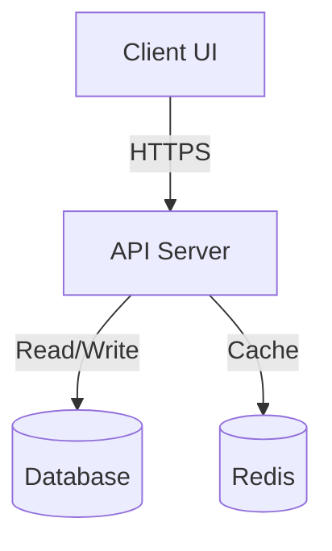

# Project Context: {{PROJECT_NAME}}

This document details the background, system architecture, development rules, and domain-specific knowledge for **{{PROJECT_NAME}}**. All agents and engineers joining the project must read this context first.

---

## 1. Project Background & Vision
* **Core Purpose**: Explain *why* this application exists and what problem it solves.
* **Target Users**: Describe the primary user personas (e.g., end-consumers, system administrators, internal developers).
* **Key Business Goals**: List the main metrics or capabilities the project aims to deliver.

## 2. Technical Stack & Environmental Constraints
List the primary technologies, platforms, and databases mandated for this project:
* **Frontend**: {{FE_TECH}} (e.g., Next.js, Vite React, Vue)
* **Backend**: {{BE_TECH}} (e.g., Rust Axum, Node Express, Go)
* **Database**: {{DB_TECH}} (e.g., PostgreSQL, SQLite, MongoDB)
* **Hosting / Cloud**: {{HOSTING}} (e.g., AWS ECS, Vercel, Render)
* **Dev Environments**: Node v18+, Rust 1.70+, Docker, etc.

## 3. Architecture Overview & Data Flow
Describe the system components and how they communicate with each other:
* **UI Client** communicates with **API Server** via REST/GraphQL.
* **API Server** uses **Redis** for session caching and writes to **PostgreSQL**.
* **Batch Scheduler** wakes up every midnight to aggregate transactions.

*(Embed Mermaid diagram below if applicable)*

## 4. Coding Standards & Repository Layout
Outline the critical coding style rules:
* **Pattern**: Domain-Driven Design (DDD) vs MVC vs Clean Architecture.
* **Formatters**: Use Prettier for JS/TS, `rustfmt` for Rust, `black` for Python.
* **Git Rules**: All commits must be prefixed with their Feature ID (e.g., `F02: add login endpoint`).
* **WIP = 1 Policy**: Strictly work on one feature branch at a time.

## 5. Domain Glossary & Business Rules
Define critical domain terms to avoid confusion:
* **Entity A (e.g., "Active Session")**: A session that has been active within the last 15 minutes.
* **Entity B (e.g., "Verification Gate")**: A shell script check that validates code structure.
* **Entity C (e.g., "DLQ - Dead Letter Queue")**: A storage for records that fail during batch jobs.

## 6. Local Setup & Credentials
List step-by-step commands to get the application running locally:
1. Run `./init.sh` to install dependencies.
2. Start the local database using `docker-compose up -d`.
3. Copy `.env.example` to `.env` and configure credentials.
4. Run `npm run dev` or `cargo run` to start.
