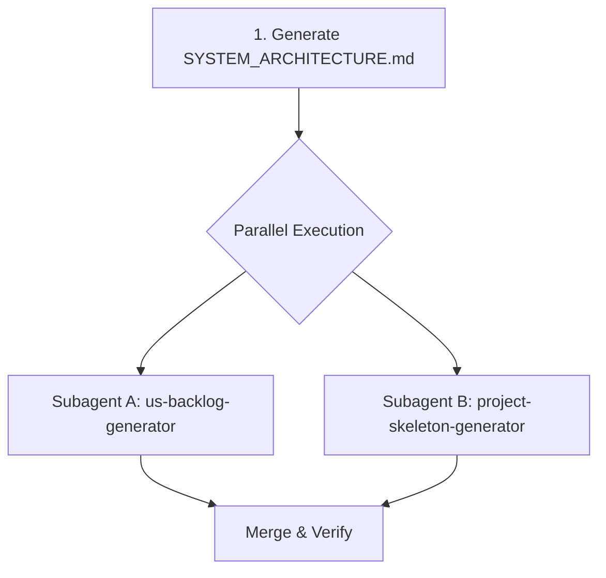

Bootstrap project using: $ARGUMENTS

This is a multi-agent orchestration workflow to initialize a target project from an idea description to a structured codebase.

## Execution Sequence

### Step 1: Requirements Analysis & Tech Discovery
Execute the [skill architecture-agent/SKILL.md](file:///home/zrik/workspace/projs/harness/.agents/skills/architecture-agent/SKILL.md) skill to interview the user.
* **Objective**: Evaluate project size and user persona (Dev vs. Non-Tech).
* **Task**: Perform the contextual interview (deep technical questions for Devs, friendly suggestions for Non-Techs) to determine languages, databases, hosting, and architecture.
* **Output**: Generate `docs/SYSTEM_ARCHITECTURE.md`.

### Step 2: Parallel Scaffold & Backlog Generation (Subagents)
Once `docs/SYSTEM_ARCHITECTURE.md` is ready, run the following tasks **IN PARALLEL** using the `invoke_subagent` tool:



* **Subagent A (Backlog Generator)**:
  * **Role**: Requirements Backlog Agent
  * **Task**: Execute the [skill us-backlog-generator/SKILL.md](file:///home/zrik/workspace/projs/harness/.agents/skills/us-backlog-generator/SKILL.md) skill to read `docs/SYSTEM_ARCHITECTURE.md`, draft the User Stories, present them clearly in a Markdown table to the user, and obtain explicit user approval before populating the feature backlog via `./harness add`.
* **Subagent B (Skeleton Scaffold)**:
  * **Role**: Repository Architect Agent
  * **Task**: Execute the [skill project-skeleton-generator/SKILL.md](file:///home/zrik/workspace/projs/harness/.agents/skills/project-skeleton-generator/SKILL.md) skill to read `docs/SYSTEM_ARCHITECTURE.md` and create matching directory structures, configuration files (`docker-compose.yml`, `.gitignore`, `.env.example`), and baseline smoke tests.

### Step 3: Verification & Initial Handoff
Once both subagents report completion:
1. Run the environment startup script:
   ```bash
   ./init.sh
   ```
2. Confirm that the workspace compiles cleanly and all baseline tests pass.
3. Execute `./harness status` to print the backlog.
4. **STOP EXECUTION IMMEDIATELY**: Do not start any feature implementation. Prompt the user that bootstrapping is complete, display the final backlog, and ask them to select a single feature (WIP = 1) to proceed with, or invite other team members to pick up tasks.
