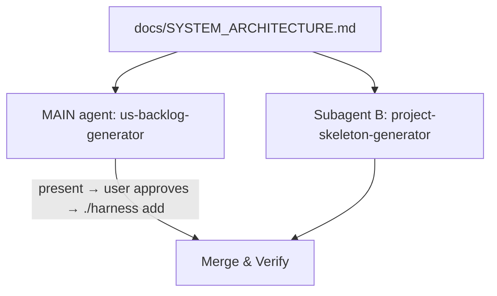

# Phase 2 — Scaffold & Backlog Generation

**Skills used:** [plan-us-backlog-generator](../../plan-us-backlog-generator/SKILL.md), [plan-project-skeleton-generator](../../plan-project-skeleton-generator/SKILL.md), [dev-db-designer](../../dev-db-designer/SKILL.md)

Prerequisite: `docs/SYSTEM_ARCHITECTURE.md` from [Phase 1](phase-1-architecture.md).

> **Why the backlog generator does NOT run as a subagent.** It has two steps a
> subagent cannot perform: (1) it must obtain **explicit user approval** before
> writing — a subagent has no channel to the user; (2) it must **persist** the
> backlog by running `./harness add` — a subagent only returns text to the
> parent, so its draft is lost unless the parent re-does the work. Running it as
> a subagent stalls at the approval gate and leaves `.harness/features.json`
> with only the init placeholder. Run it **in the main agent**.

Run the **skeleton scaffold (Subagent B)** in parallel while the main agent
drives backlog generation. Only B is delegated ([agent-tool-mapping](../../../resources/agent-tool-mapping.md); `Agent`/`Task` in Claude Code).

## Backlog Generator — runs in the MAIN agent
- **Role:** Requirements Backlog Agent (Product Owner)
- **Skill:** [plan-us-backlog-generator](../../plan-us-backlog-generator/SKILL.md) — note its own directive: *"Do NOT spawn a subagent for this."*
- **Task:** Read `docs/SYSTEM_ARCHITECTURE.md` **and every detailed `docs/spec/*` SPEC**, draft the User Stories, present them in a Markdown table.
- **Coverage gate:** Run the generator's Step 2.5 coverage check. This sub-check *may* spawn a PM subagent ([check-ba-evaluator](../../check-ba-evaluator/SKILL.md) Mode B) because it is **read-only** — it reads the SPECs and the drafted backlog and returns gaps as text. Fill any gaps before presenting.
- **Approval gate:** Obtain explicit user approval **before** populating the backlog.
- **Persist (do not skip):** After approval, run `./harness add` for **each** story, then `./harness status` to confirm. The turn must not end with `.harness/features.json` still holding only the placeholder F01 — the `backlog-guard.sh` Stop hook blocks that.

## Subagent B — Skeleton Scaffold
- **Role:** Repository Architect Agent
- **Skill:** [plan-project-skeleton-generator](../../plan-project-skeleton-generator/SKILL.md) (consult [dev-db-designer](../../dev-db-designer/SKILL.md) for schema/migrations when a DB is defined)
- **Task:** Read `docs/SYSTEM_ARCHITECTURE.md` and create the directory structure, config files (`docker-compose.yml`, `.gitignore`, `.env.example`), and baseline smoke tests.
- Safe to delegate: it writes files on disk and needs no user interaction.

## Merge & Verify
- Confirm `.harness/features.json` actually contains the approved stories (`./harness status` shows more than the placeholder) **and** the scaffold exists on disk.
- Resolve any conflicts (e.g. a story with no corresponding scaffold) before Phase 3.
