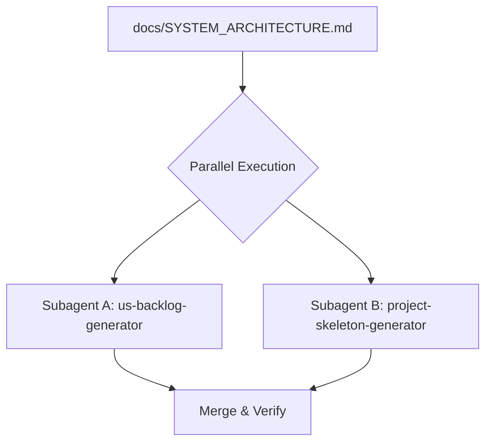

# Phase 2 — Parallel Scaffold & Backlog Generation

**Skills used:** [plan-us-backlog-generator](../../plan-us-backlog-generator/SKILL.md), [plan-project-skeleton-generator](../../plan-project-skeleton-generator/SKILL.md), [dev-db-designer](../../dev-db-designer/SKILL.md)

Prerequisite: `docs/SYSTEM_ARCHITECTURE.md` from [Phase 1](phase-1-architecture.md).

Run both subagents **IN PARALLEL** using the **spawn-subagents** capability ([agent-tool-mapping](../../../resources/agent-tool-mapping.md); `Agent`/`Task` in Claude Code).

## Subagent A — Backlog Generator
- **Role:** Requirements Backlog Agent
- **Skill:** [plan-us-backlog-generator](../../plan-us-backlog-generator/SKILL.md)
- **Task:** Read `docs/SYSTEM_ARCHITECTURE.md`, draft the User Stories, present them in a Markdown table.
- **Gate:** Obtain explicit user approval **before** populating the backlog via `./harness add`.

## Subagent B — Skeleton Scaffold
- **Role:** Repository Architect Agent
- **Skill:** [plan-project-skeleton-generator](../../plan-project-skeleton-generator/SKILL.md) (consult [dev-db-designer](../../dev-db-designer/SKILL.md) for schema/migrations when a DB is defined)
- **Task:** Read `docs/SYSTEM_ARCHITECTURE.md` and create the directory structure, config files (`docker-compose.yml`, `.gitignore`, `.env.example`), and baseline smoke tests.

## Merge & Verify
- Confirm the backlog in `.harness/features.json` and the scaffold on disk are consistent with the architecture doc.
- Resolve any conflicts (e.g. a story with no corresponding scaffold) before Phase 3.
