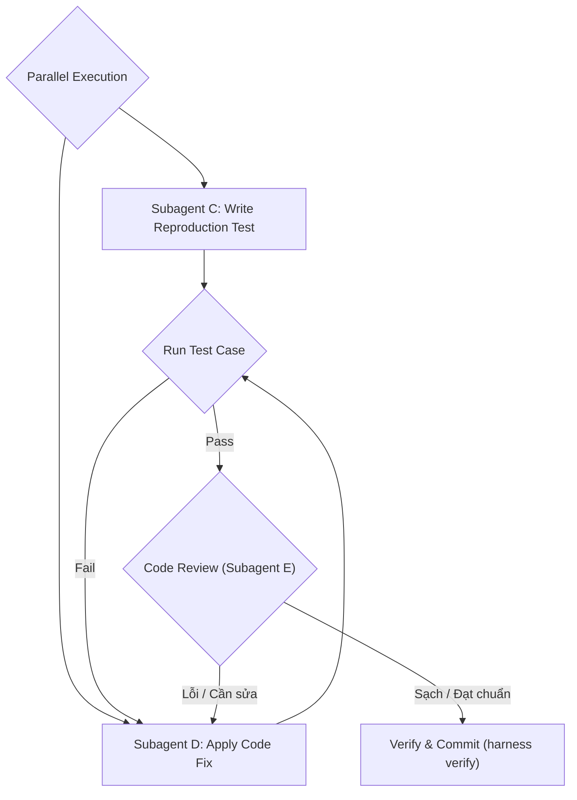

Bug report: $ARGUMENTS

Multi-agent bug investigation workflow. Run the following steps to coordinate diagnostic and correction tasks.

---

## Step 1: Parallel Investigation & Analysis (Subagents)
Use the `invoke_subagent` tool to run the following tasks **IN PARALLEL**:
* **Subagent A — Root Cause Investigator**:
  * **Role**: Codebase Debugger
  * **Task**: Search the codebase for all code paths related to the reported bug. Trace the data flow. Use the [skill explain/SKILL.md](file:///home/zrik/workspace/projs/harness/.agents/skills/explain/SKILL.md) skill to inspect code logic.
  * **Output**: Locate the exact line(s) where the bug originates and write a diagnostic context.
* **Subagent B — Impact Analyst**:
  * **Role**: Regression Analyst
  * **Task**: Find all callers, tests, and related code that could be affected by a fix. Check git logs for recent changes. If database-related, consult [skill db-designer/SKILL.md](file:///home/zrik/workspace/projs/harness/.agents/skills/db-designer/SKILL.md).
  * **Output**: Produce a regression risk assessment and list of impacted code components.

Once both subagents complete, present their findings to the user and align on a fix proposal.

---

## Step 2: Implement, Test & Review Loop (Iterative Refinement)



#### 2.1. Implement Fix & Test (Parallel Execution)
Invoke two subagents in parallel to ensure the bug is verified by a failing test first:
* **Subagent C (Test Writer)**:
  * **Role**: QA Engineer
  * **Task**: Write a regression test case using the [skill test-gen/SKILL.md](file:///home/zrik/workspace/projs/harness/.agents/skills/test-gen/SKILL.md) skill that triggers the bug condition and asserts corrected behavior. It must fail initially before the fix is applied.
* **Subagent D (Bug Fixer)**:
  * **Role**: Code Fixer
  * **Task**: Implement the minimal code fix using [skill fix/SKILL.md](file:///home/zrik/workspace/projs/harness/.agents/skills/fix/SKILL.md). If component-specific, apply [skill fe-developer/SKILL.md](file:///home/zrik/workspace/projs/harness/.agents/skills/fe-developer/SKILL.md), [skill be-developer/SKILL.md](file:///home/zrik/workspace/projs/harness/.agents/skills/be-developer/SKILL.md), or [skill batch-developer/SKILL.md](file:///home/zrik/workspace/projs/harness/.agents/skills/batch-developer/SKILL.md).

#### 2.2. Regression Test Run
Run the test case written by Subagent C against the code written by Subagent D.
* **If it fails**: direct Subagent D to modify the code until the test passes.

#### 2.3. Code Review (Subagent E)
Invoke **Subagent E (Code Reviewer)** to analyze the git diff using [skill code-review/SKILL.md](file:///home/zrik/workspace/projs/harness/.agents/skills/code-review/SKILL.md).
* **If issues are found**: Go back to step 2.1 to correct the code.

---

## Step 3: Verification & Checkpoint (Definition of Done)
Once tests pass and the review is clean:
1. Run the project verification suite using the [skill qa/SKILL.md](file:///home/zrik/workspace/projs/harness/.agents/skills/qa/SKILL.md) skill.
2. Execute the Harness verify check:
   ```bash
   ./harness verify <feature_id>
   ```
3. Report: root cause explanation, fix details, test added, and regression risk assessment.
