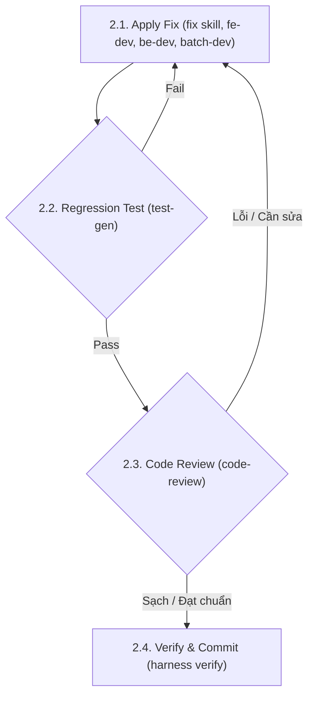

Bug report: $ARGUMENTS

Multi-agent bug investigation workflow. Run the following agents IN PARALLEL:

**Agent 1 — Root cause investigator**: 
* Search the codebase for all code paths related to the reported bug. Trace the data flow. Use the [skill explain/SKILL.md](file:///home/zrik/workspace/projs/harness/.agents/skills/explain/SKILL.md) skill to inspect code logic.
* Identify the exact line(s) where the bug originates and why it happens.

**Agent 2 — Impact analyst**: 
* Find all callers, tests, and related code that could be affected by a fix.
* Identify regression risk areas. Check git log for related recent changes.
* If the bug is database-related, consult the [skill db-designer/SKILL.md](file:///home/zrik/workspace/projs/harness/.agents/skills/db-designer/SKILL.md) guidelines for safe alterations.

---

## Execution Sequence

### Step 1: Alignment & Fix Proposal
1. Present the root cause and impact analysis.
2. Propose the minimal fix using the [skill fix/SKILL.md](file:///home/zrik/workspace/projs/harness/.agents/skills/fix/SKILL.md) skill guidelines — change only what's needed to fix the root cause.
3. Get user approval before applying.

### Step 2: Implement, Test & Review Loop (Iterative Refinement)
Apply and verify the fix iteratively until all tests and reviews pass cleanly:



#### 2.1. Apply Fix
Implement the code fix carefully. If modifying specific component domains:
* Use [skill fe-developer/SKILL.md](file:///home/zrik/workspace/projs/harness/.agents/skills/fe-developer/SKILL.md) for UI errors.
* Use [skill be-developer/SKILL.md](file:///home/zrik/workspace/projs/harness/.agents/skills/be-developer/SKILL.md) for API or server logic errors.
* Use [skill batch-developer/SKILL.md](file:///home/zrik/workspace/projs/harness/.agents/skills/batch-developer/SKILL.md) for ETL pipeline logic failures.

#### 2.2. Regression Test Execution
Write a regression test case (using [skill test-gen/SKILL.md](file:///home/zrik/workspace/projs/harness/.agents/skills/test-gen/SKILL.md)) that triggers the bug condition and asserts the correct behavior.
* Run the tests. **If any test fails**: Go back to **step 2.1 (Apply Fix)** to adjust the code. Repeat until all tests pass.

#### 2.3. Code Review
Analyze the git diff using the [skill code-review/SKILL.md](file:///home/zrik/workspace/projs/harness/.agents/skills/code-review/SKILL.md) skill.
* **If the reviewer flags issues** (such as potential regression risks, side-effects, security vulnerabilities): Go back to **step 2.1 (Apply Fix)** to correct the code, and then **re-run tests (step 2.2)**.

---

### Step 3: Verification & Checkpoint (Definition of Done)
Once the refinement loop finishes with clean reviews and passing tests:
1. Run the project verification suite using the [skill qa/SKILL.md](file:///home/zrik/workspace/projs/harness/.agents/skills/qa/SKILL.md) skill.
2. Execute the Harness verify check:
   ```bash
   ./harness verify <feature_id>
   ```
3. Report: root cause explanation, fix details, test added, and regression risk assessment.
