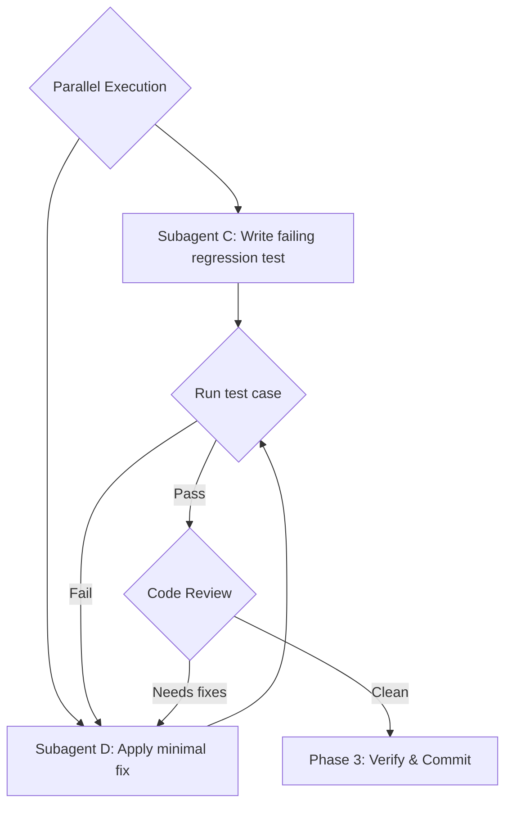

# Phase 2 — Implement · Test · Review Loop

**Skills used:** [check-test-gen](../../check-test-gen/SKILL.md), [core-fix](../../core-fix/SKILL.md), [dev-fe-developer](../../dev-fe-developer/SKILL.md), [dev-be-developer](../../dev-be-developer/SKILL.md), [dev-batch-developer](../../dev-batch-developer/SKILL.md), [check-code-review](../../check-code-review/SKILL.md)

## 2.1 Implement fix & test (parallel)
- **Subagent C — Test Writer:** write a regression test via [check-test-gen](../../check-test-gen/SKILL.md) that triggers the bug and asserts corrected behavior. It **must fail** before the fix.
- **Subagent D — Bug Fixer:** implement the minimal root-cause fix via [core-fix](../../core-fix/SKILL.md); for component-specific work use [dev-fe-developer](../../dev-fe-developer/SKILL.md), [dev-be-developer](../../dev-be-developer/SKILL.md), or [dev-batch-developer](../../dev-batch-developer/SKILL.md).

## 2.2 Regression test run
Run Subagent C's test against Subagent D's code.
- **Fails** → send Subagent D back to modify the fix until it passes.

## 2.3 Code review
Invoke a **Code Reviewer** to analyze the git diff via [check-code-review](../../check-code-review/SKILL.md).
- **Issues found** → back to 2.1.
- **Clean** → proceed to [Phase 3](phase-3-verify-checkpoint.md).

## Iteration cap (cost guard)
The fix → test → review loop has a hard **iteration cap of 5** (override with `HARNESS_LOOP_MAX`); track the count in the task-state file. If the bug is not fixed-and-clean by the cap, stop looping: write `docs/design-docs/<id>/loop-report.md`, `./harness block <id> --reason "Hit loop cap (5): ..."`, surface to the user, and STOP. In `auto` mode this is a mandatory stop.
