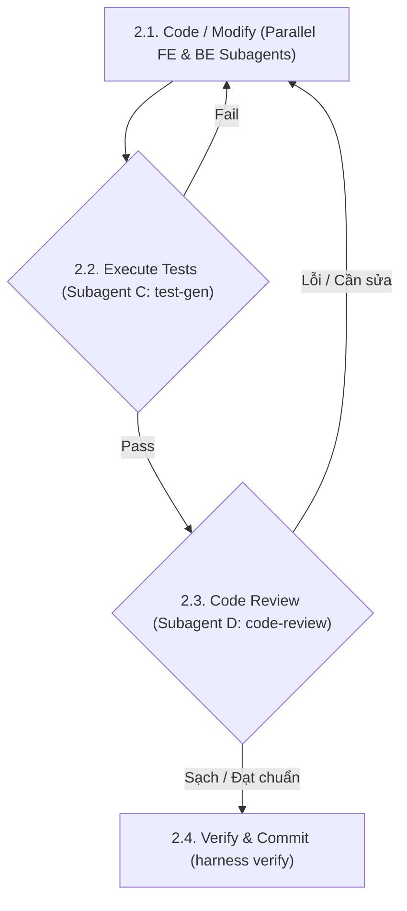

Feature request: $ARGUMENTS

This is a multi-agent feature development workflow. Run the following steps to coordinate analysts, developers, and testers.

---

## Step 1: Feature Confirmation, Analysis & Planning (Subagents)
1. **Confirm Target Feature**: First, inspect `.harness/features.json` (or `./harness status`) and identify the single highest-priority unfinished feature. Ask the user for explicit confirmation to work on this specific feature. You MUST only work on one feature at a time (WIP = 1).
2. **Execute Analysis in Parallel**: Once the user approves the target feature, use the `invoke_subagent` tool to run the following tasks **IN PARALLEL**:
   * **Subagent A — Requirements Analyst**:
     * **Role**: Technical Analyst
     * **Task**: Read the codebase structure, existing patterns, and related code using the [skill explain/SKILL.md](file:///home/zrik/workspace/projs/harness/.agents/skills/explain/SKILL.md) skill. Coordinate with [skill db-designer/SKILL.md](file:///home/zrik/workspace/projs/harness/.agents/skills/db-designer/SKILL.md) if DB changes are needed.
     * **Output**: Produce (1) list of files to change, (2) questions to answer, (3) risks/constraints.
   * **Subagent B — Test Strategist**:
     * **Role**: Test Planner
     * **Task**: Find existing tests and identify frameworks. Plan required tests using the [skill test-gen/SKILL.md](file:///home/zrik/workspace/projs/harness/.agents/skills/test-gen/SKILL.md) guidelines.
     * **Output**: Produce a test plan outlining required test cases (happy path, edge cases).

3. **Present Analysis & Approve Plan**: Once both subagents complete, present their findings to the user, align on open questions, draft the implementation plan, and get user approval.
4. **MANDATORY UI Design Confirmation**: If the feature contains UI elements, you MUST present a layout wireframe or a visual mockup (e.g. static HTML or image) to the user first. Obtain explicit approval of the design BEFORE starting any implementation code.

---

## Step 2: Code, Test & Review Refinement Loop (Iterative Cycle)



#### 2.1. Code / Modify (Parallel Execution for Medium/Large Projects)
For features spanning multiple components (e.g., Full-stack UI & API), invoke **PARALLEL Subagents** to write the code:
* **Subagent 1 (Backend Developer)**:
  * **Role**: Backend Developer
  * **Task**: Implement database changes via [skill db-designer/SKILL.md](file:///home/zrik/workspace/projs/harness/.agents/skills/db-designer/SKILL.md) and server logic via [skill be-developer/SKILL.md](file:///home/zrik/workspace/projs/harness/.agents/skills/be-developer/SKILL.md).
* **Subagent 2 (Frontend Developer)**:
  * **Role**: Frontend Developer
  * **Task**: Build the user interface and components using [skill fe-developer/SKILL.md](file:///home/zrik/workspace/projs/harness/.agents/skills/fe-developer/SKILL.md), mocking the API endpoints if the Backend is not yet completed.

*(Note: For simple single-component tasks, a single agent may write the code using [skill cli-tool-developer/SKILL.md](file:///home/zrik/workspace/projs/harness/.agents/skills/cli-tool-developer/SKILL.md) or [skill batch-developer/SKILL.md](file:///home/zrik/workspace/projs/harness/.agents/skills/batch-developer/SKILL.md)).*

#### 2.2. Test Execution (Subagent C)
Invoke **Subagent C (Test Writer)** to write and run unit/integration tests using the [skill test-gen/SKILL.md](file:///home/zrik/workspace/projs/harness/.agents/skills/test-gen/SKILL.md) skill.
* **If any test fails**: Direct the developers (Subagent 1 or 2) to fix the code and go back to step 2.1.

#### 2.3. Code Review (Subagent D)
Invoke **Subagent D (Code Reviewer)** to analyze git diffs using the [skill code-review/SKILL.md](file:///home/zrik/workspace/projs/harness/.agents/skills/code-review/SKILL.md) skill.
* **If review fails**: Direct developers to correct the code and re-test.

---

## Step 3: Verification & Checkpoint (Definition of Done)
Once the loop completes successfully:
1. Run the project verification suite via the [skill qa/SKILL.md](file:///home/zrik/workspace/projs/harness/.agents/skills/qa/SKILL.md) skill.
2. Execute the Harness verify check:
   ```bash
   ./harness verify <feature_id>
   ```
   *Note: This automatically stages and commits a git checkpoint on success.*
3. Run the session stop command:
   ```bash
   ./harness session stop
   ```
4. Run cleanup:
   ```bash
   ./harness clean
   ```
5. Summarize the session: files changed, tests added, and any deferred items.
6. **STOP WORK IMMEDIATELY**: Do not start any other features or process new tasks in this session. Return control to the user, allowing other developers or agents to participate.
