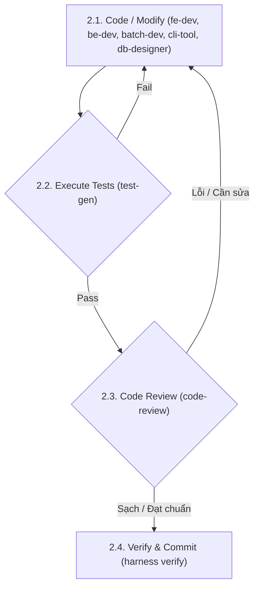

Feature request: $ARGUMENTS

This is a multi-agent feature development workflow. Run the following agents IN PARALLEL:

**Agent 1 — Requirements analyst**: 
* Read the codebase structure, existing patterns, and related code. Use the [skill explain/SKILL.md](file:///home/zrik/workspace/projs/harness/.agents/skills/explain/SKILL.md) skill to query core components.
* If database changes are needed, coordinate with the [skill db-designer/SKILL.md](file:///home/zrik/workspace/projs/harness/.agents/skills/db-designer/SKILL.md) skill.
* Produce: (1) list of files that will need to change, (2) list of questions that must be answered before implementation, (3) risks or constraints to be aware of.

**Agent 2 — Test strategist**: 
* Find existing tests, identify the test framework and conventions.
* Plan required tests using the [skill test-gen/SKILL.md](file:///home/zrik/workspace/projs/harness/.agents/skills/test-gen/SKILL.md) guidelines.
* Produce: a test plan describing what test cases are needed (happy path, edge cases) and how to structure them.

---

## Execution Sequence

### Step 1: Alignment & Implementation Plan
1. Present Agent 1 and 2 findings to the user and resolve any open questions.
2. Draft a precise implementation plan (which files change, in what order, what each change does).
3. Get user approval on the plan.

### Step 2: Code, Test & Review Refinement Loop (Iterative Cycle)
Implement and verify the feature iteratively. Repeat the following steps until all tests and review criteria pass cleanly:



#### 2.1. Code / Modify
Write or modify the source code according to the SPEC and architectural constraints. Delegate to:
* **UI/Frontend**: Use [skill fe-developer/SKILL.md](file:///home/zrik/workspace/projs/harness/.agents/skills/fe-developer/SKILL.md).
* **Server API/Web Server**: Use [skill be-developer/SKILL.md](file:///home/zrik/workspace/projs/harness/.agents/skills/be-developer/SKILL.md).
* **Batch Jobs/ETL**: Use [skill batch-developer/SKILL.md](file:///home/zrik/workspace/projs/harness/.agents/skills/batch-developer/SKILL.md).
* **CLI Command Tools**: Use [skill cli-tool-developer/SKILL.md](file:///home/zrik/workspace/projs/harness/.agents/skills/cli-tool-developer/SKILL.md).
* **Database / Migrations**: Use [skill db-designer/SKILL.md](file:///home/zrik/workspace/projs/harness/.agents/skills/db-designer/SKILL.md).

#### 2.2. Test Execution
Generate and run unit/integration tests using the [skill test-gen/SKILL.md](file:///home/zrik/workspace/projs/harness/.agents/skills/test-gen/SKILL.md) skill.
* **If any test fails**: Analyze the traceback, locate the bug, and **go back to step 2.1 (Code)** to apply the fix. Repeat until all tests pass.

#### 2.3. Code Review
Analyze the git diff using the [skill code-review/SKILL.md](file:///home/zrik/workspace/projs/harness/.agents/skills/code-review/SKILL.md) skill.
* **If review finds issues** (logic errors, security vulnerabilities, formatting issues): **Go back to step 2.1 (Code)** to remediate the code, and then **re-run tests (step 2.2)**.

---

### Step 3: Verification & Checkpoint (Definition of Done)
Once the loop completes successfully (all tests pass and code review is clean):
1. Run the project verification suite via the [skill qa/SKILL.md](file:///home/zrik/workspace/projs/harness/.agents/skills/qa/SKILL.md) skill.
2. Execute the Harness verify check:
   ```bash
   ./harness verify <feature_id>
   ```
   *Note: This automatically stages and commits a git checkpoint on success.*
3. Summarize the session: files changed, tests added, and any deferred items.
