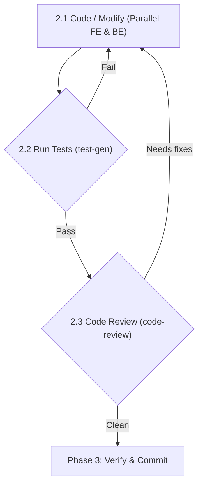

# Phase 2 — Code · Test · Review Refinement Loop

**Skills used:** [dev-be-developer](../../dev-be-developer/SKILL.md), [dev-fe-developer](../../dev-fe-developer/SKILL.md), [dev-cli-tool-developer](../../dev-cli-tool-developer/SKILL.md), [dev-batch-developer](../../dev-batch-developer/SKILL.md), [dev-db-designer](../../dev-db-designer/SKILL.md), [check-test-gen](../../check-test-gen/SKILL.md), [check-code-review](../../check-code-review/SKILL.md)



## 2.1 Code / Modify
For multi-component features, invoke **parallel subagents**:
- **Backend Developer** — DB via [dev-db-designer](../../dev-db-designer/SKILL.md), server logic via [dev-be-developer](../../dev-be-developer/SKILL.md).
- **Frontend Developer** — UI/components via [dev-fe-developer](../../dev-fe-developer/SKILL.md), mocking API endpoints if the backend isn't ready.

For a simple single-component task, one agent implements via [dev-cli-tool-developer](../../dev-cli-tool-developer/SKILL.md) or [dev-batch-developer](../../dev-batch-developer/SKILL.md).

## 2.2 Test execution
Invoke a **Test Writer** subagent to write and run unit/integration tests via [check-test-gen](../../check-test-gen/SKILL.md).
- **Any test fails** → send developers back to 2.1.

## 2.3 Code review
Invoke a **Code Reviewer** subagent to analyze the git diff via [check-code-review](../../check-code-review/SKILL.md).
- **Review finds issues** → send developers back to 2.1 and re-test.
- **Clean** → proceed to [Phase 3](phase-3-verify-checkpoint.md).

## Phase checkpoint (every iteration)
At the end of **each** loop iteration, update `.harness/tasks/<feature_id>.md` (iteration counter, last report paths, next step) and commit the working code plus the state file:
```bash
git add -A
git commit -m "phase-checkpoint: <feature_id> phase 2 iteration <n>"
```
A crash mid-loop then resumes at the last finished iteration instead of restarting the phase.

## Blocked?
If the loop cannot proceed (missing dependency, undecided requirement, external breakage), record it on the feature instead of leaving it silently stuck:
```bash
./harness block <feature_id> --reason "<what is blocking and what is needed to unblock>"
```
This moves the feature to `blocked` with a documented reason (per AGENTS.md). Surface the blocker to the user and stop — do not start another feature (WIP = 1).
